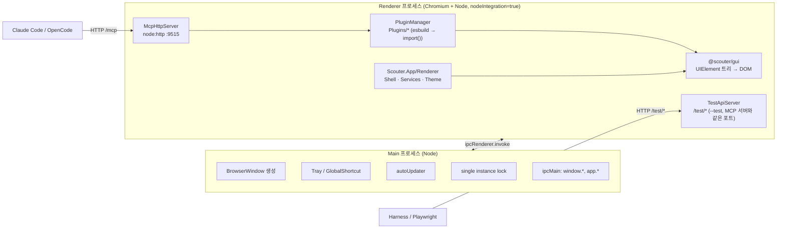
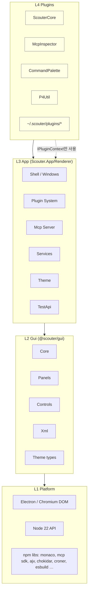
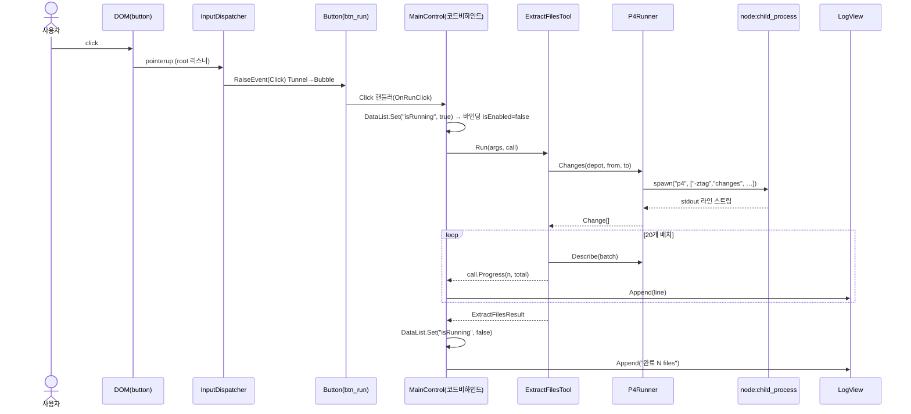
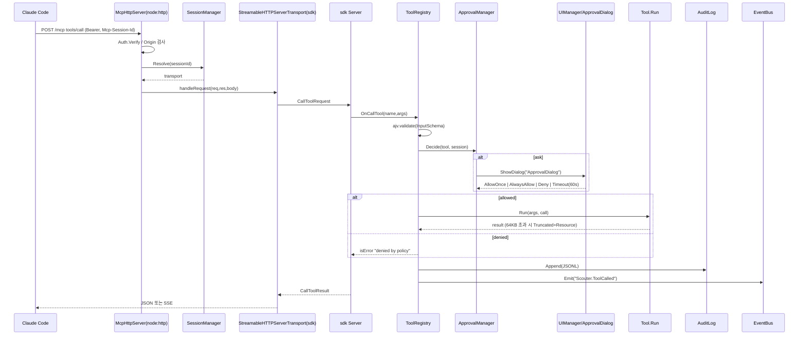

# 01. 개요 · 아키텍처

> 이 문서는 "전체 그림"이다. 세부 구현은 02~21에 있고, 여기서는 계층·프로세스·데이터 흐름·전체 기술 스택을 한 번에 본다.

## 1.1 목표와 비목표

| 목표 | 설명 |
|---|---|
| 개발자 개인 유틸리티 허브 | Perforce 유틸, 로그 감시, 스니펫 등 반복 작업을 Plugin으로 모아 한 창에서 |
| AI 도구의 손발 | 같은 기능을 MCP Tool로 노출. Claude Code / OpenCode / Cursor가 Scouter를 서버로 붙여 사용 |
| WPF 감각의 UI 개발 | XML(XAML 이름) + 코드비하인드(`FindName`) + RoutedEvent. sgcl `sgui` 문법 호환(D-02) |
| AI가 스스로 검증 | Test API/하네스로 Linux 샌드박스에서 클릭·스크린샷·트리 검사(D-16) |

| 비목표 | 이유 |
|---|---|
| 인앱 채팅 | D-01. 클라이언트 도구가 더 잘한다 |
| 다중 창(BrowserWindow 여러 개) | `UILayer`(Dialog/Popup/Toast)로 대체. 모니터 분리는 보류 |
| 보안 샌드박스 | D-11. 로컬 신뢰 환경. Plugin 설치 = 신뢰 |
| React/Vue | D-04. 객체 트리 모델과 충돌, 의존성 0 유지 |

## 1.2 용어

| 용어 | 정의 |
|---|---|
| **UIElement** | DOM 엘리먼트 1개를 소유하는 객체. WPF `FrameworkElement` 역할. 모든 컨트롤·패널의 루트 |
| **UIProperty** | XML 속성 ↔ TS 프로퍼티 매핑 레지스트리 항목(파서·기본값·변경 콜백) |
| **RoutedEvent** | Tunnel(Preview) → Direct → Bubble로 논리 트리를 타는 이벤트 |
| **Window** | `UIManager`가 레이어에 띄우는 최상위 화면(`ContentControl`). `Layout/*.xml` 1개와 짝 |
| **UserControl** | Shell 콘텐츠 영역에 끼워지는 조각. Plugin 메인 화면(D-13) |
| **DataList** | XML 루트의 `<DataList>`; 바인딩 소스 `{@key}` |
| **Plugin** | `Plugin.json` + `Index.ts` + `Layout/*.xml` 폴더. Tool/Command/Window/Resource를 등록 |
| **Tool** | MCP `tools/call`로 호출되는 함수. `{PluginId}__{Name}` |
| **Theme** | opencode 포맷 JSON(256 토큰) → CSS 변수. 컨트롤 CSS는 `var(--token)`만 사용(D-09) |
| **Service** | Renderer 전역 싱글턴(Settings, EventBus, CommandRegistry …). Plugin에는 `IPluginContext`로 스코프된 뷰가 주어짐 |

## 1.3 프로세스 모델



- **Main은 최소**(D-11): 창·트레이·업데이트·단일 인스턴스·창 제어 IPC(`window:minimize` 등)만. 상세는 03 §3.6, 21.
- **Renderer가 전부**: UI, 서비스, Plugin, MCP 서버, Test API. `nodeIntegration: true`, `contextIsolation: false`, `sandbox: false` — Renderer에서 `node:http`, `node:child_process`, `fs`를 직접 쓴다.
- Plugin은 Renderer와 같은 프로세스(D-17). 무거운 작업만 `ctx.Worker`(Web Worker).

## 1.4 계층



의존 규칙:
1. `@scouter/gui`는 Electron/Node를 **모른다**(DOM만). 창 제어·외부 링크 등은 `INavigationService`로 App이 주입 → 브라우저/happy-dom에서 단위 테스트 가능.
2. Plugin은 `@scouter/gui` + `@scouter/plugin-api`(타입) + `IPluginContext`만 import. App 내부 클래스 직접 참조 금지(ESLint `no-restricted-imports`).
3. Services는 서로 생성자 주입. 전역 싱글턴은 `ThemeManager.Instance`, `UIManager.Instance`, `Log`만 허용.

## 1.5 전체 기술 스택 — 어떤 기능을 어떤 라이브러리로

각 행의 상세(사용 API·코드·대안·주의)는 해당 문서의 `§ 라이브러리` 절에 있다. 전체 매트릭스는 A1.

| 기능 | 라이브러리 / 플랫폼 API | 문서 |
|---|---|---|
| 데스크톱 셸, 창, 트레이, IPC | `electron` (LTS, P0에서 고정) | 03, 10, 21 |
| 번들·빌드 | `webpack@5` + `ts-loader` + `css-loader`/`style-loader` + `monaco-editor-webpack-plugin` + `copy-webpack-plugin` | 03 |
| 언어·타입 | `typescript@5` strict, `@types/node` | 02, 03 |
| 린트 | `eslint@9`(flat config) + `typescript-eslint` + 자체 플러그인 `Scripts/EslintPlugin` | 02 |
| UI 렌더링 | 바닐라 DOM: `document.createElement`, CSS Grid/Flex, `ResizeObserver`, `WeakMap`, `PointerEvent`, `queueMicrotask` | 04, 05 |
| XML 파싱 (Renderer) | `DOMParser`(Chromium 내장) | 07 |
| XML 파싱 (Node: Lint·CLI) | `@xmldom/xmldom` | 07 |
| 바인딩 식 | 자체 토크나이저/파서/평가기(의존성 없음) | 07 |
| JSON 스키마 검증 | `ajv@8` + `ajv-formats` (Settings, Plugin.json, Theme, Tool InputSchema) | 08, 13, 14, 15 |
| 파일 감시 | `chokidar@4` (Layout/Plugin/Theme 핫리로드) | 07, 13, 14 |
| 스케줄 | `croner@9` (`ctx.Schedule.Cron`) | 08 |
| 외부 프로세스 | `node:child_process.spawn` + 자체 라인 스트리머 | 08, 19 |
| 시크릿 | `electron.safeStorage` | 08 |
| 클립보드 | `electron.clipboard` | 08 |
| 코드 에디터 | `monaco-editor` (지연 `import()`, 웹워커는 webpack 플러그인이 구성) | 12 |
| 마크다운 | `marked@15` + `dompurify@3` | 12 |
| 아이콘 | 자체 SVG 스프라이트(`lucide-static`에서 선별 복사, 빌드 시 `svgo`) | 09 |
| 테마 | opencode 포맷 JSON 37개 이식, `matchMedia('(prefers-color-scheme)')` | 13 |
| Plugin 로드 | `esbuild` (개발 시 온더플라이 번들) → `import(file://)` | 14 |
| MCP 서버 | `@modelcontextprotocol/sdk` (`Server` 저수준 API + `StreamableHTTPServerTransport`) + `node:http` + `zod`(sdk peer) | 15 |
| MCP 업스트림 클라이언트 | `@modelcontextprotocol/sdk` `Client` + `StdioClientTransport`/`StreamableHTTPClientTransport` | 15 |
| 감사 로그 | `node:fs` append JSONL + 자체 회전 | 15 |
| 단위 테스트 | `node:test` + `node:assert/strict` + `happy-dom` + `c8`(커버리지) | 20 |
| E2E | `playwright` (`_electron.launch`) + `xvfb-run` | 20 |
| 자동 업데이트·패키징 | `electron-updater@6` + `electron-builder` (NSIS) | 21 |
| 자동 시작 | `app.setLoginItemSettings` | 21 |
| 퍼지 검색 | 자체 60줄(Command Palette) | 18 |

**의도적으로 쓰지 않는 것**: express/fastify(`node:http`로 충분), electron-store(자체 Settings — 스키마·바인딩 연동 필요), electron-log(자체 LogBuffer), prettier(D-08 Allman), vite(D-05), react(D-04), iconv-lite(`P4CHARSET=utf8` 강제), lodash.

## 1.6 두 가지 대표 요청 흐름

### A. UI 클릭 → Plugin → 외부 프로세스 → 화면



### B. 외부 AI → MCP → 승인 → Tool → 감사



## 1.7 디렉터리 (최종 형태)

```
Scouter/
├─ package.json                      # npm workspaces: Source/*, Plugins/*
├─ tsconfig.base.json
├─ eslint.config.mjs
├─ Scripts/
│   ├─ Build.ps1  StartUpDebugging.ps1
│   ├─ LayoutLint.mjs  ThemeLint.mjs  GenLayoutSchema.mjs  GenIcons.mjs
│   └─ EslintPlugin/ (function-separator, file-header, no-loop-i, member-groups)
├─ Source/
│   ├─ Scouter.Gui/            # @scouter/gui   (04,05,06,07,09,11,12,13-types)
│   │   ├─ Core/  Panels/  Controls/  Controls/Scouter/  Xml/  Theme/  Host/  Styles/  Index.ts
│   ├─ Scouter.PluginApi/      # @scouter/plugin-api (타입만: IPluginContext, ITool …)
│   ├─ Scouter.App/            # @scouter/app
│   │   ├─ Main/   (Main.ts, WindowFactory.ts, TrayController.ts, Updater.ts, Ipc.ts)
│   │   ├─ Renderer/ (Index.html, Bootstrap.ts, Layout/, Shell/, Plugin/, Mcp/, Services/, TestApi/, Theme/, BuiltIn/)
│   │   └─ Config/ (Settings.schema.json, Plugin.schema.json, Theme.schema.json, ConnectSnippets.json, Defaults.json)
│   ├─ Scouter.Harness/        # @scouter/harness (20)
│   └─ Scouter.Tests/          # Unit/, Integration/, E2E/, Setup.ts
├─ Plugins/
│   └─ P4Util/                 # 외부형 Plugin 예제 (19)
└─ webpack/ (main.cjs, renderer.cjs, common.cjs)

~/.scouter/
├─ settings.json   mcp-token   connect-snippets.json(선택)
├─ plugins/{Id}/ (storage.json, 설치된 Plugin)
├─ themes/*.json
└─ logs/ (app-YYYYMMDD.log, mcp-audit.jsonl)
```

## 1.8 실행 플래그·환경

| 플래그 | 효과 | 문서 |
|---|---|---|
| `--test` | Test API 라우트 등록, userData 임시 폴더, 트레이/업데이터 off | 20 |
| `--no-auth` | MCP Bearer 검사 생략(개발) | 15 |
| `--hidden` | 창 숨김 상태로 기동(렌더링은 됨) | 20 |
| `--safe` | 내장 Plugin만 | 14 |
| `--layout-dir <dir>` | XML을 파일시스템에서 로드 + 핫리로드 | 07 |
| `--plugin-dir <dir>` | 추가 Plugin 검색 경로 | 14 |
| `--port <n>` | `Mcp.Port` 임시 재정의 | 15 |
| `SCOUTER_LOG=debug` | 로그 레벨 | 08 |

## 1.9 설정 키 총람(문서별 상세)

| 접두 | 문서 |
|---|---|
| `Ui.*` | 10 |
| `Theme.*` | 13 |
| `Mcp.*` | 15 |
| `App.*` | 21 |
| `Plugins.{Id}.*` | 14, 각 Plugin |
| `Log.*` | 08 |
