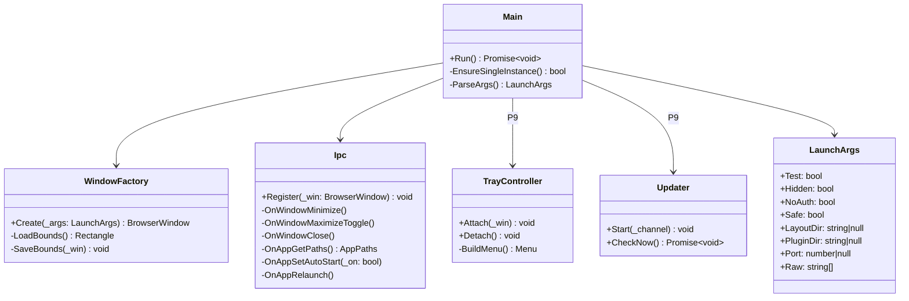
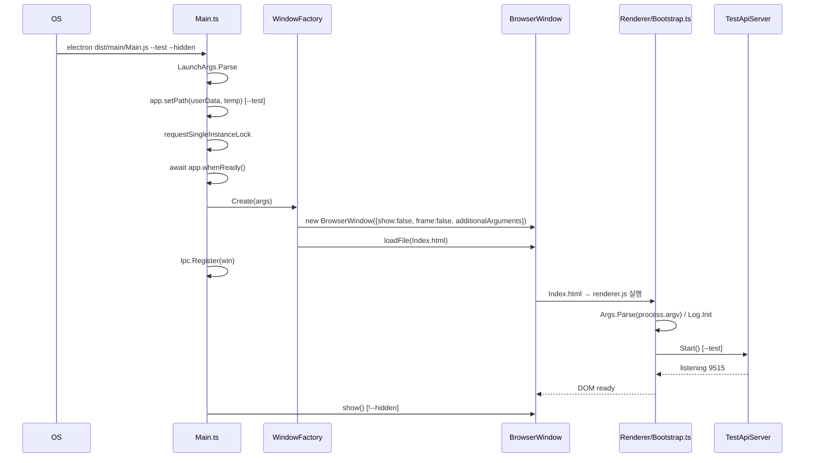
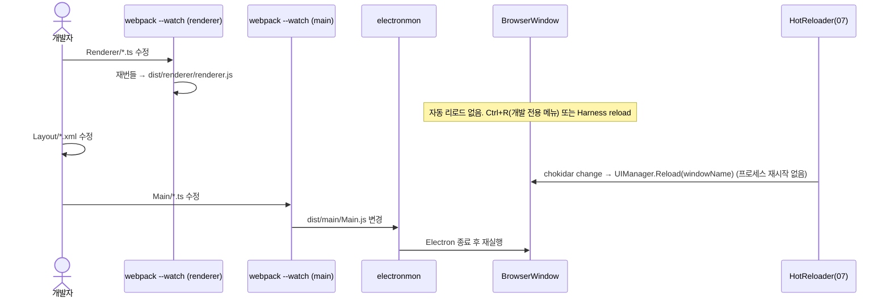

# 03. 프로젝트 골격 · 빌드 · 툴체인 · Main 프로세스 최소

> 구현 Phase **P0 (1일)**. 이 문서가 끝나면 "빈 Electron 창이 뜨고, `npm run dev`로 Renderer 핫리로드가 되고, `--test`로 Test API `/test/ping`이 응답하고, CI가 lint/typecheck/unit을 돌린다". 이후 모든 Phase가 이 골격 위에 쌓인다.

## 3.1 라이브러리

| 패키지 | 버전 | 용도 | 사용 API / 설정 | 대안·기각 이유 |
|---|---|---|---|---|
| `electron` | LTS(P0에 고정, 2026-09 기준 최신 안정) | 셸 | `app`, `BrowserWindow`, `ipcMain`, `Tray`, `globalShortcut`, `safeStorage`, `clipboard`, `shell` | — |
| `webpack` | ^5.9x | Main/Renderer 2개 번들 | `target: "electron-main"` / `"electron-renderer"`, `externals`, `devServer` 사용 안 함(watch만) | Vite: Electron+CJS externals+Monaco worker 설정이 번거롭(D-05) |
| `ts-loader` | ^9 | TS 컴파일 | `transpileOnly: true` + 별도 `tsc --noEmit`(별도 typecheck) | esbuild-loader: 데코레이터 지원 불안 |
| `css-loader` + `style-loader` | ^7 / ^4 | `Styles/*.css` import | Gui.css/Tokens.css를 JS에서 import하여 `<style>` 삽입 | — |
| `monaco-editor-webpack-plugin` | ^7 | Monaco 워커 번들 | `languages: ["typescript","javascript","json","xml","markdown","cpp","csharp","powershell","shell"]`, `features` 최소 | 수동 worker 설정 |
| `copy-webpack-plugin` | ^12 | `Layout/*.xml`, `Themes/*.json`, `Config/*.json`, `Icons.svg`를 dist로 | `patterns` | — |
| `html-webpack-plugin` | ^5 | `Index.html` 생성 | `template`, `csp` meta | — |
| `electron-builder` | ^25 | NSIS 패키징(21) | `electron-builder.yml` | electron-forge: builder의 NSIS/updater 통합이 더 간단 |
| `concurrently` | ^9 | dev 루프에서 webpack watch 2개 + electron 동시 | `-k -n main,renderer,app` | — |
| `electronmon` | ^2 | Main 번들 변경 시 Electron 재시작 | `electronmon dist/main/Main.js` | nodemon: Electron 종료 처리가 어색함 |
| `cross-env` | ^7 | Windows/Linux 공통 env | `cross-env NODE_ENV=development` | — |
| `rimraf` | ^6 | clean | — | — |

### npm workspaces

```json
{
	"name": "scouter",
	"private": true,
	"workspaces": ["Source/*", "Plugins/*"],
	"scripts":
	{
		"clean": "rimraf Source/*/dist dist",
		"typecheck": "tsc -b Source/Scouter.Gui Source/Scouter.PluginApi Source/Scouter.App Source/Scouter.Harness Plugins/P4Util",
		"lint": "eslint . --max-warnings 0",
		"lint:layout": "node Scripts/LayoutLint.mjs Source/Scouter.App/Renderer/Layout Plugins/*/Layout",
		"lint:theme": "node Scripts/ThemeLint.mjs Source/Scouter.App/Renderer/Theme/Themes",
		"build:main": "webpack -c webpack/main.cjs",
		"build:renderer": "webpack -c webpack/renderer.cjs",
		"build": "npm run build:main && npm run build:renderer",
		"dev": "concurrently -k -n main,renderer,app \"webpack -c webpack/main.cjs --watch\" \"webpack -c webpack/renderer.cjs --watch\" \"wait-on dist/main/Main.js dist/renderer/Index.html && electronmon dist/main/Main.js -- --no-auth --layout-dir Source/Scouter.App/Renderer/Layout\"",
		"start": "electron dist/main/Main.js",
		"test": "npm run test:unit",
		"test:unit": "node --import tsx --import ./Source/Scouter.Tests/Setup.ts --test --test-reporter spec 'Source/**/Unit/**/*.test.ts' 'Source/**/Integration/**/*.test.ts'",
		"test:cov": "c8 -r text -r lcov npm run test:unit",
		"test:e2e": "node --import tsx --test --test-reporter spec 'Source/Scouter.Tests/E2E/**/*.test.ts'",
		"pack": "electron-builder --win nsis --x64",
		"harness": "node Source/Scouter.Harness/dist/Cli.js"
	},
	"devDependencies": { "electron": "<LTS>", "webpack": "^5.9", "webpack-cli": "^6", "ts-loader": "^9", "css-loader": "^7", "style-loader": "^4", "monaco-editor-webpack-plugin": "^7", "copy-webpack-plugin": "^12", "html-webpack-plugin": "^5", "electron-builder": "^25", "concurrently": "^9", "electronmon": "^2", "wait-on": "^8", "cross-env": "^7", "rimraf": "^6", "typescript": "^5.6", "eslint": "^9", "typescript-eslint": "^8", "@stylistic/eslint-plugin": "^3", "c8": "^10", "tsx": "^4", "happy-dom": "^17", "playwright": "^1.5", "@types/node": "^22" }
}
```

테스트 런너는 `node --test` + `tsx`로 고정한다(`node --import tsx --import ./Source/Scouter.Tests/Setup.ts --test`). Node 22의 `--experimental-strip-types`는 데코레이터(`@RegisterElement`, `@RegisterWindow`)를 지원하지 않아 사용하지 않는다(D-25, 20 §20.1).

## 3.2 리포지터리 구조(P0 생성 대상)

```
Scouter/
├─ package.json  tsconfig.base.json  eslint.config.mjs  electron-builder.yml  .editorconfig  .gitignore
├─ webpack/  common.cjs  main.cjs  renderer.cjs
├─ Scripts/  Build.ps1  StartUpDebugging.ps1  EslintPlugin/  LayoutLint.mjs(P2)  ThemeLint.mjs(P5)
├─ Source/
│   ├─ Scouter.Gui/          package.json(name @scouter/gui)  tsconfig.json  Index.ts  Core/ Panels/ Controls/ Xml/ Theme/ Styles/
│   ├─ Scouter.PluginApi/    package.json(@scouter/plugin-api)  Index.ts
│   ├─ Scouter.App/          package.json(@scouter/app)  Main/  Renderer/  Config/
│   ├─ Scouter.Harness/      package.json(@scouter/harness)
│   └─ Scouter.Tests/        Setup.ts  Unit/  Integration/  E2E/
├─ Plugins/P4Util/           package.json  Plugin.json  Index.ts  Layout/
└─ .github/workflows/ci.yml
```

## 3.3 webpack 설정

```js
// webpack/common.cjs
const path = require("node:path");
module.exports = (_isDev) => ({
	mode: _isDev ? "development" : "production",
	devtool: _isDev ? "eval-cheap-module-source-map" : "source-map",
	resolve:
	{
		extensions: [".ts", ".js"],
		alias:
		{
			"@scouter/gui": path.resolve(__dirname, "../Source/Scouter.Gui/Index.ts"),
			"@scouter/plugin-api": path.resolve(__dirname, "../Source/Scouter.PluginApi/Index.ts"),
		},
	},
	module: { rules: [{ test: /\.ts$/, loader: "ts-loader", options: { transpileOnly: true, configFile: path.resolve(__dirname, "../tsconfig.base.json") } }] },
	stats: "errors-warnings",
});
```

```js
// webpack/renderer.cjs
const path = require("node:path");
const MonacoWebpackPlugin = require("monaco-editor-webpack-plugin");
const CopyPlugin = require("copy-webpack-plugin");
const HtmlPlugin = require("html-webpack-plugin");
const common = require("./common.cjs");

module.exports = (_env, _argv) =>
{
	const isDev = _argv.mode !== "production";
	const base = common(isDev);
	return {
		...base,
		target: "electron-renderer",
		entry: { renderer: "./Source/Scouter.App/Renderer/Bootstrap.ts" },
		output: { path: path.resolve(__dirname, "../dist/renderer"), filename: "[name].js", chunkFilename: "[name].[contenthash].js", clean: true, publicPath: "./" },
		module: { rules: [...base.module.rules, { test: /\.css$/, use: ["style-loader", "css-loader"] }, { test: /\.ttf$/, type: "asset/resource" }] },
		externals: { esbuild: "commonjs esbuild" },      // 바이너리 포함 패키지는 번들 안 함
		plugins:
		[
			new HtmlPlugin({ template: "./Source/Scouter.App/Renderer/Index.html", filename: "Index.html" }),
			new MonacoWebpackPlugin({ languages: ["typescript", "javascript", "json", "xml", "markdown", "cpp", "csharp", "powershell", "shell", "yaml"], features: ["find", "folding", "bracketMatching", "wordHighlighter", "clipboard", "contextmenu"], filename: "monaco/[name].worker.js" }),
			new CopyPlugin({ patterns: [
				{ from: "Source/Scouter.App/Renderer/Layout", to: "Layout" },
				{ from: "Source/Scouter.App/Renderer/Theme/Themes", to: "Themes" },
				{ from: "Source/Scouter.App/Config", to: "Config" },
				{ from: "Source/Scouter.Gui/Styles/Icons.svg", to: "Icons.svg" },
				{ from: "Source/Scouter.App/Renderer/BuiltIn/*/Layout/*", to: "BuiltIn/[path][name][ext]" },
			] }),
		],
	};
};
```

`main.cjs`는 `target: "electron-main"`, entry `Main/Main.ts`, output `dist/main/Main.js`, `externals: ["electron"]`, `node: { __dirname: false }`.

**XML 레이아웃은 번들하지 않고 복사한다**: `ILayoutProvider`(07)가 `fetch("./Layout/Shell.xml")` 또는 `fs.readFile`로 로드. `require.context`를 쓰면 핫리로드 경로와 이중화되므로 파일 하나로 통일(v4의 require.context 단계 삭제).

## 3.4 Renderer 진입점

```html
<!-- Source/Scouter.App/Renderer/Index.html -->
<!doctype html>
<html lang="ko" data-theme="oc-2" data-scheme="dark">
<head>
	<meta charset="utf-8" />
	<meta http-equiv="Content-Security-Policy" content="default-src 'self'; script-src 'self' 'unsafe-eval'; style-src 'self' 'unsafe-inline'; img-src 'self' data: file:; font-src 'self' data:; worker-src 'self' blob:; connect-src 'self' http://127.0.0.1:*" />
	<title>Scouter</title>
</head>
<body><div id="root"></div></body>
</html>
```

`'unsafe-eval'`은 esbuild로 번들한 Plugin을 `import(file://)`로 로드할 때는 필요 없지만, 바인딩 평가기가 `new Function`을 쓰지 않도록 설계했으므로(07) 제거 가능. Monaco가 `unsafe-eval`을 필요로 하지 않음을 P4에서 확인 후 제거한다.

```ts
// Renderer/Bootstrap.ts (P0 버전 — 이후 Phase에서 단계가 추가된다. 최종본은 10 §10.7)
import "@scouter/gui/Styles/Tokens.css";
import "@scouter/gui/Styles/Gui.css";
import { Log } from "./Services/Log";
import { Args } from "./Services/Args";
import { McpHttpServer } from "./Mcp/McpHttpServer";   // P0: node:http + Router 골격만(15). /mcp 라우트는 P7에서 추가
import { TestApiServer } from "./TestApi/TestApiServer";

//////////////////////////////////////////////////////////////////////////////////////////
// Renderer 진입점. 단계 순서는 10 §10.7 부트스트랩 참조.
async function Main(): Promise<void>
{
	Args.Parse(process.argv);                                          // 08 Args(static): IsTest/Port/...
	Log.Init({ Level: process.env["SCOUTER_LOG"] ?? "info" });
	const root = document.getElementById("root");
	if (root === null)
		throw new Error("[Bootstrap] #root 없음");
	root.textContent = "Scouter P0";
	await McpHttpServer.StartAsync(Args.Port ?? 9515);                 // P0: node:http + Router만. /mcp는 P7(15)
	if (Args.IsTest)
		TestApiServer.Attach(McpHttpServer);                            // 같은 서버의 `/test/*` 라우트(20 §20.4)
	Log.Info("[Bootstrap] ready");
}
void Main();
```

## 3.5 클래스 구조 — Main 프로세스



P0에서는 `Main`, `WindowFactory`, `Ipc`, `LaunchArgs`만. `TrayController`, `Updater`는 21(P9).

```ts
// Main/Main.ts
import { app, BrowserWindow } from "electron";
import { WindowFactory } from "./WindowFactory";
import { Ipc } from "./Ipc";
import { LaunchArgs } from "./LaunchArgs";

const args = LaunchArgs.Parse(process.argv);
if (args.Test)
	app.setPath("userData", `${app.getPath("temp")}/scouter-test-${process.pid}`);

if (!app.requestSingleInstanceLock() && !args.Test)
{
	app.quit();
}
else
{
	app.on("second-instance", () => { WindowFactory.Current?.show(); WindowFactory.Current?.focus(); });
	void app.whenReady().then(() =>
	{
		const win = WindowFactory.Create(args);
		Ipc.Register(win);
		if (!args.Hidden)
			win.show();
	});
	app.on("window-all-closed", () => { app.quit(); });     // P9에서 트레이 모드로 변경
}
```

```ts
// Main/WindowFactory.ts (발췌)
public static Create(_args: LaunchArgs): BrowserWindow
{
	const bounds = WindowFactory.LoadBounds();
	const win = new BrowserWindow(
	{
		...bounds, minWidth: 800, minHeight: 500, show: false,
		frame: false, titleBarStyle: "hidden",                  // Ui.NativeFrame=true이면 frame:true (Renderer가 relaunch 요구)
		backgroundColor: "#1e1e1e",
		webPreferences: { nodeIntegration: true, contextIsolation: false, sandbox: false, webviewTag: false, spellcheck: false, additionalArguments: _args.Raw },
	});
	void win.loadFile(path.join(__dirname, "../renderer/Index.html"));
	win.on("close", () => { WindowFactory.SaveBounds(win); });
	WindowFactory.s_current_ = win;
	return win;
}
```

`additionalArguments`로 Main의 argv를 Renderer에 전달 → Renderer의 `Args.Parse(process.argv)`가 같은 플래그를 본다.

### IPC 채널 (Main ↔ Renderer 계약)

| 채널 | 방향 | 인자 → 반환 | 사용처 |
|---|---|---|---|
| `window:minimize` | R→M invoke | — | TitleBar(12), IpcWindowChrome(10) |
| `window:maximize-toggle` | R→M invoke | → `boolean`(isMaximized) | TitleBar |
| `window:close` | R→M invoke | — | TitleBar (트레이 모드는 hide) |
| `window:is-maximized` | R→M invoke | → `boolean` | TitleBar 아이콘 갱신 |
| `window:maximized-changed` | M→R send | `boolean` | TitleBar |
| `app:get-paths` | R→M invoke | → `{ UserData, Home, Exe, Resources, Logs, Temp, Version, IsPackaged, Args }` | Paths 서비스(08) |
| `app:set-auto-start` | R→M invoke | `boolean` | Settings `App.AutoStart`(21) |
| `app:relaunch` | R→M invoke | — | `Ui.NativeFrame` 변경, 업데이트 설치 |
| `app:update-check` / `app:update-status` | R→M / M→R | — / `UpdateStatus` | 21 |
| `tray:set-tooltip` | R→M send | `string` | 21 |
| `window:toggle-devtools` | R→M invoke | — | `Shell.ToggleDevTools`(10, dev) |
| `window:attention` | R→M send | `{Flash?, Notify?}` | ApprovalDialog(12, 15) |
| `app:capture-page` | R→M invoke | `{Rect?}` → `{Png}` | Test API screenshot(20), `ScouterCore__Screenshot`(16) |
| `app:show-item` | R→M send | `{Path}` | About(21), McpInspector btn_audit(17) |
| `dialog:open` / `dialog:save` | R→M invoke | Electron 옵션 → 경로 | PropertyGrid PathEditor(12), 설정 내보내기(21) |

P0에서는 위 표 중 `window:*`(devtools 제외)와 `app:get-paths`만 구현하고, 나머지는 해당 문서의 Phase에서 추가한다. 전체 확정 목록은 21 §21.5.

```ts
// Main/Ipc.ts (발췌)
public static Register(_win: BrowserWindow): void
{
	ipcMain.handle("window:minimize", () => { _win.minimize(); });
	ipcMain.handle("window:maximize-toggle", () => { _win.isMaximized() ? _win.unmaximize() : _win.maximize(); return _win.isMaximized(); });
	ipcMain.handle("window:is-maximized", () => _win.isMaximized());
	ipcMain.handle("window:close", () => { _win.close(); });
	ipcMain.handle("app:get-paths", () => ({ UserData: app.getPath("userData"), Home: app.getPath("home"), Exe: app.getPath("exe"), Resources: process.resourcesPath, Logs: app.getPath("logs"), Temp: app.getPath("temp"), Version: app.getVersion(), IsPackaged: app.isPackaged, Args: process.argv }));
	_win.on("maximize", () => { _win.webContents.send("window:maximized-changed", true); });
	_win.on("unmaximize", () => { _win.webContents.send("window:maximized-changed", false); });
}
```

## 3.6 시퀀스

### 앱 시작 (P0 시점)



### dev 루프 (핫리로드)



Renderer 자동 리로드는 의도적으로 제거(MCP 세션을 끊으므로). 개발 중에는 `Ctrl+R`(dev 모드에서만 `globalShortcut` 등록) 또는 Harness `POST /test/reload`.

## 3.7 개발 스크립트(Windows)

```powershell
# Scripts/StartUpDebugging.ps1 — sgcl AGENTS.md의 배치 관례와 맞춤
param([switch]$Test, [switch]$Hidden, [string]$LayoutDir = "Source/Scouter.App/Renderer/Layout")
$ErrorActionPreference = "Stop"
Set-Location "$PSScriptRoot/.."
npm run build
$flags = @("--no-auth", "--layout-dir", $LayoutDir)
if ($Test)   { $flags += "--test" }
if ($Hidden) { $flags += "--hidden" }
npx electron dist/main/Main.js @flags
```

`Scripts/Build.ps1`: `npm ci` → `npm run lint` → `npm run typecheck` → `npm run build` → `npm run test:unit`. 실패 시 exit code 전파.

## 3.8 CI (`.github/workflows/ci.yml`) — P0 버전

| Job | 런너 | 단계 |
|---|---|---|
| static | ubuntu | `npm ci`, `lint`, `typecheck`, `lint:layout`(P2부터), `lint:theme`(P5부터) |
| unit | ubuntu | `test:cov`, lcov 아티팩트 |
| e2e-linux | ubuntu | `build`, `xvfb-run -a npm run test:e2e` (P1부터) |
| e2e-windows | windows | `build`, `test:e2e` (P3부터, 실제 프레임없는 창 검증) |
| package | windows, tag 시 | `pack` → NSIS 아티팩트 (P9) |

## 3.9 P0에서 고정할 버전 (기록 위치: `package.json` + A1)

Electron LTS, Node(Electron 내장 버전 확인 → `@types/node` 맞추기), TypeScript, webpack, monaco-editor(webpack 플러그인이 지원하는 버전 범위 확인), `@modelcontextprotocol/sdk`(1.x 마지막 — Streamable HTTP 포함), ajv, chokidar, croner, esbuild, electron-updater, happy-dom, playwright. **고정 후 `npm ci`만 사용**(lockfile 신뢰).

## 3.10 구현 체크리스트 (P0)

- [ ] `npm run dev` → 프레임없는 빈 창에 "Scouter P0" 표시
- [ ] `--test --hidden` 실행 후 `curl 127.0.0.1:9515/test/ping` → `{"Ready":true, ...}` (20 §20.4 상세)
- [ ] `npm run lint`, `typecheck`, `test:unit`(더미 테스트 1개) 통과
- [ ] `additionalArguments`로 Renderer가 `--test` 감지
- [ ] IPC `window:minimize/maximize-toggle/close/is-maximized` 동작(devtools에서 `ipcRenderer.invoke` 수동 확인)
- [ ] CI static/unit 색상 녹색
- [ ] Monaco 워커 청크가 dist/renderer/monaco/*.worker.js로 출력(아직 로드는 안 함)
