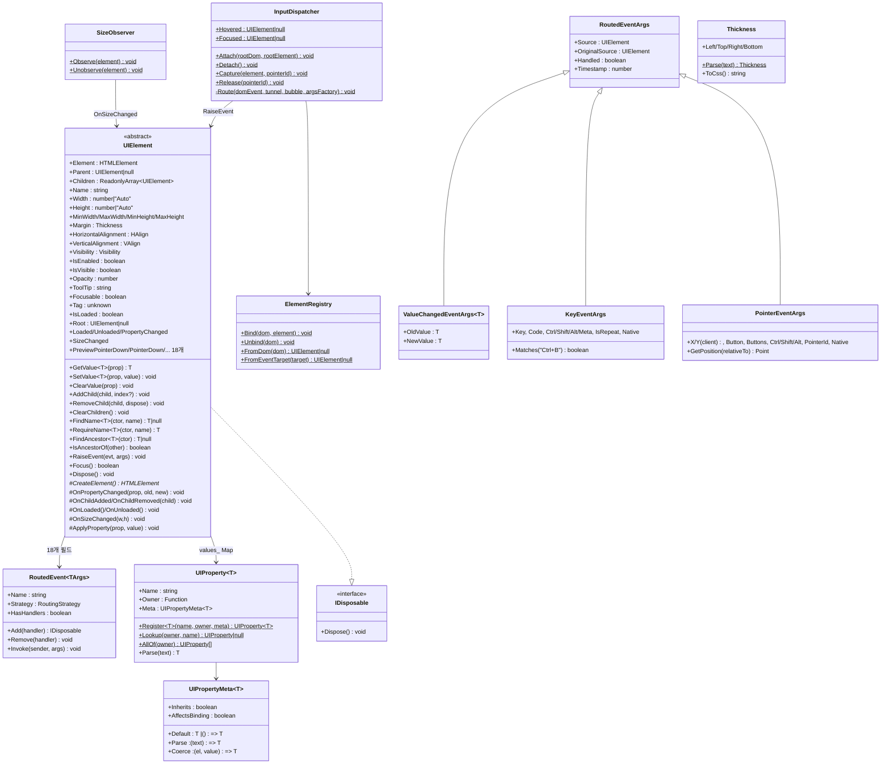
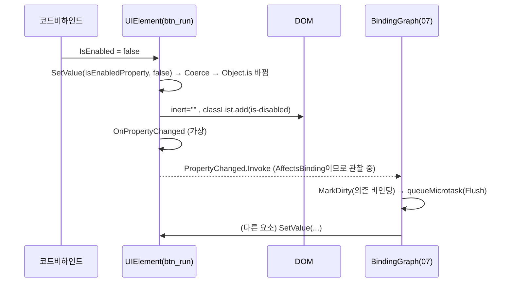
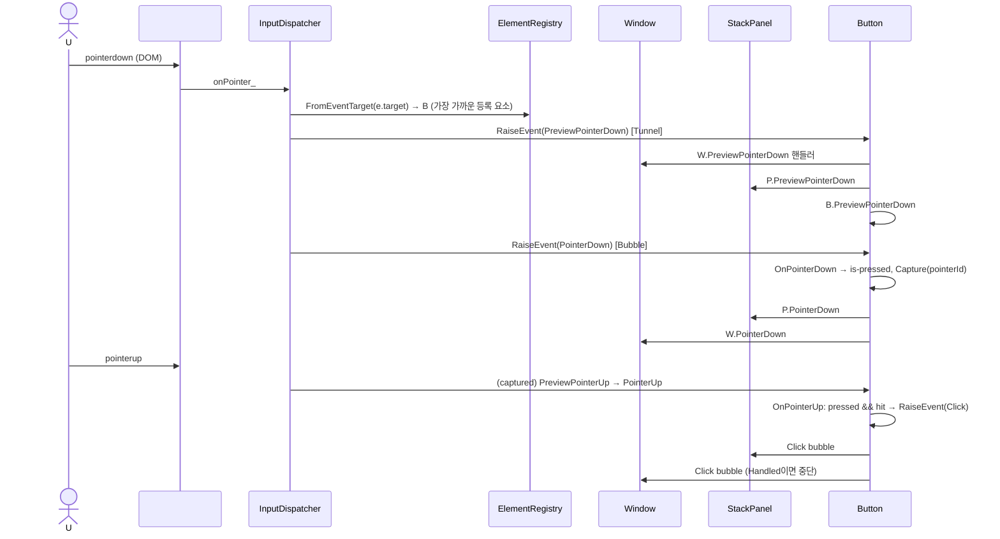
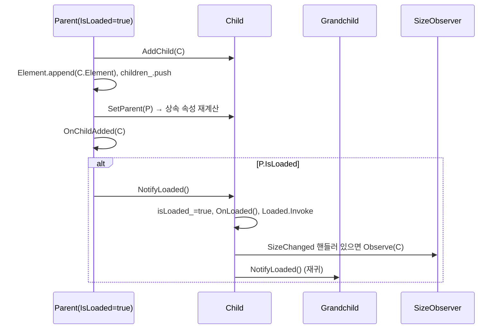
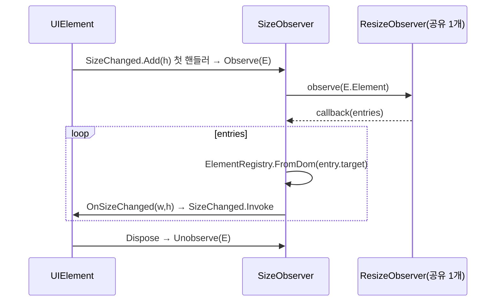

# 04. Gui Core — UIElement · UIProperty · RoutedEvent · InputDispatcher

> 구현 Phase **P1**. 모든 컨트롤·패널·로더가 이 문서의 네 클래스 위에 서있다. Electron·Node 의존 없음. Harness(20)에서 바닐라 브라우저로 바로 볼 수 있어야 한다.

## 4.1 설계 원칙

1. **요소 1 = DOM 노드 1.** `UIElement.Element`는 생성자에서 만들고 생애 내내 바꾸지 않는다. 자식 추가/제거 = DOM `append/remove`.
2. **레이아웃은 CSS가 한다(D-06).** Measure/Arrange 없음. 크기가 필요하면 `ResizeObserver`로 읽는다.
3. **속성은 등록된 메타를 가진다.** XML 로더가 문자열을 파싱하고 바인딩 그래프가 변경을 관찰하려면 `UIProperty.Register`를 통해야 한다.
4. **이벤트는 논리 트리로 라우팅.** DOM 이벤트는 루트에서 한 번 잡고(`InputDispatcher`), `Preview*`(Tunnel) → `*`(Bubble)로 요소 트리를 탄다. 컨트롤은 DOM 리스너를 직접 달지 않는다(네이티브 `<input>` 내부 `input` 이벤트 등 예외는 09).
5. **이름은 그대로 테스트 ID.** `Name` 설정 = `data-testid`(D-03).
6. **폐기는 명시적.** `Dispose()`가 관찰자·바인딩·자식을 연쇄 해제. 부모 `RemoveChild(_child, _dispose = true)`.

## 4.2 라이브러리

| 기능 | 사용 | 방식 |
|---|---|---|
| 요소 렌더 | 바닐라 DOM (`document.createElement`, `classList`, `dataset`, `style.setProperty`) | 프레임워크 없음(D-04) |
| DOM ↔ 요소 역참조 | `WeakMap<Element, UIElement>` (`ElementRegistry`) | DOM 이벤트 target에서 요소 찾기. GC 친화 |
| 크기 관찰 | `ResizeObserver` 1개 공유 (`SizeObserver`) | 요소마다 생성하지 않고 `observe/unobserve` |
| 입력 | `PointerEvent`(mouse/touch 통합), `setPointerCapture`, `KeyboardEvent`, `wheel`, `focusin/focusout` | 루트 `#root`에 capture 리스너 |
| 배치 처리 | `queueMicrotask` | 속성 변경 연쇄를 프레임 내 한 번에 |
| 포커스 | `tabIndex`, `element.focus({preventScroll})`, `:focus-visible` | `Focusable=true` → `tabIndex=0` |
| 접근성 | `role`, `aria-disabled`, `aria-pressed` 등 컨트롤별 | 테스트 선택자를 위해서도 유용 |
| 비활성 처리 | `inert` 속성 | `IsEnabled=false` 서브트리 입력·포커스 무효. Chromium 지원 |
| 테스트 환경 | `happy-dom ^17` + `Setup.ts` 스텁(ResizeObserver, PointerEvent, matchMedia, rAF) | 20 |

## 4.3 클래스 구조 (C4-1)



| 파일 | 내용 |
|---|---|
| `Core/UIElement.ts` | 추상 기본 요소. 15개 등록 속성, 트리 조작, 이벤트 라우팅 |
| `Core/UIProperty.ts` | 속성 등록·조회·파싱 |
| `Core/RoutedEvent.ts` | `RoutedEvent`, `RoutingStrategy`, `RoutedEventArgs` 파생 3개 |
| `Core/InputDispatcher.ts` | 루트 DOM 리스너 → 라우팅 |
| `Core/ElementRegistry.ts` | `WeakMap` 역참조 |
| `Core/SizeObserver.ts` | 공유 `ResizeObserver` |
| `Core/UITypes.ts` | `Visibility`, `HAlign`, `VAlign`, `Orientation`, `Dock`, `Point`, `Size`, `Thickness` |
| `Core/Disposable.ts` | `IDisposable`, `DisposableBag` |
| `Core/Gui.ts` | `Gui.RegisterBuiltInElements()`, `Gui.Version`, 요소 팩토리 맵(`ElementFactory`, 07이 사용) |

## 4.4 UIProperty

```ts
export type UIPropertyMeta<T> =
{
	Default: T | (() => T);
	Parse?: (_text: string) => T;                       // XML 문자열 → T. 없으면 타입 추론(number/boolean/string)
	Inherits?: boolean;                                 // IsEnabled, FontSize 등 자식으로 전파
	AffectsBinding?: boolean;                           // true면 변경 시 BindingGraph.MarkDirty (07)
	Coerce?: (_element: UIElement, _value: T) => T;    // Min/Max 범위 강제 등
};

export class UIProperty<T>
{
	private static readonly s_registry_ = new Map<Function, Map<string, UIProperty<unknown>>>();

	//////////////////////////////////////////////////////////////////////////////////////
	// 속성을 등록한다. 같은 owner에 같은 이름이 있으면 throw(태그 충돌은 버그).
	public static Register<T>(_name: string, _owner: Function, _meta: UIPropertyMeta<T>): UIProperty<T>
	{
		let map = UIProperty.s_registry_.get(_owner);
		if (map === undefined)
		{
			map = new Map();
			UIProperty.s_registry_.set(_owner, map);
		}
		if (map.has(_name))
			throw new Error(`[UIProperty] 중복 등록: ${_owner.name}.${_name}`);

		const prop = new UIProperty<T>(_name, _owner, _meta);
		map.set(_name, prop as UIProperty<unknown>);
		return prop;
	}

	//////////////////////////////////////////////////////////////////////////////////////
	// owner의 프로토타입 체인을 거슬러 이름으로 속성을 찾는다. XML 로더가 사용.
	public static Lookup(_owner: Function, _name: string): UIProperty<unknown> | null
	{
		let ctor: Function | null = _owner;
		while (ctor !== null && ctor !== Function.prototype)
		{
			const found = UIProperty.s_registry_.get(ctor)?.get(_name);
			if (found !== undefined)
				return found;
			ctor = Object.getPrototypeOf(ctor) as Function | null;
		}
		return null;
	}
}
```

`UIElement.SetValue`:

```ts
public SetValue<T>(_prop: UIProperty<T>, _value: T): void
{
	const coerced = _prop.Meta.Coerce !== undefined ? _prop.Meta.Coerce(this, _value) : _value;
	const old = this.GetValue(_prop);
	if (Object.is(old, coerced))
		return;

	this.values_.set(_prop as UIProperty<unknown>, coerced);
	this.ApplyProperty(_prop, coerced);                     // DOM 반영(아래 표)
	this.OnPropertyChanged(_prop, old, coerced);            // 확장점
	if (this.PropertyChanged.HasHandlers)
		this.PropertyChanged.Invoke(this, new PropertyChangedEventArgs(_prop, old, coerced));
	if (_prop.Meta.Inherits === true)
		this.PropagateInherited(_prop);
}
```

접근자는 얻은 값을 `SetValue`로 흐른다: `public set Width(_v) { this.SetValue(UIElement.WidthProperty, _v); }`. 직접 필드를 쓰지 않는 이유는 바인딩 그래프가 `PropertyChanged` 하나만 관찰하면 되기 때문.

### 기본 속성 → DOM 반영

| 속성 | DOM |
|---|---|
| `Name` | `data-testid="{name}"`, `id`는 사용 안 함(중복 가능) |
| `Width/Height` | `style.width/height = px`; `"Auto"` → 제거 |
| `Min*/Max*` | `style.minWidth` 등 |
| `Margin` | `style.margin` (부모 패널이 flex/grid에서도 유효) |
| `HorizontalAlignment` | `data-halign="Left|Center|Right|Stretch"` → 패널 CSS가 `justify-self`/`align-self` 변환(05) |
| `Visibility` | `Collapsed` → `display:none` 클래스 `is-collapsed`; `Hidden` → `visibility:hidden` `is-hidden` |
| `IsEnabled` | false → `inert` 속성 + `is-disabled` 클래스 + `aria-disabled` |
| `Opacity` | `style.opacity` |
| `ToolTip` | `data-tooltip`(ToolTip 서비스가 hover 시 표시, 11) |
| `Focusable` | `tabIndex = 0 / -1` |
| `Tag` | 없음(논리 전용) |

## 4.5 RoutedEvent

```ts
export enum RoutingStrategy { Tunnel, Bubble, Direct }

public RaiseEvent<TArgs extends RoutedEventArgs>(_event: RoutedEvent<TArgs>, _args: TArgs): void
{
	if (_event.Strategy === RoutingStrategy.Direct)
	{
		_event.Invoke(this, _args);
		return;
	}
	const path: UIElement[] = [];
	for (let node: UIElement | null = this; node !== null; node = node.Parent)
		path.push(node);
	if (_event.Strategy === RoutingStrategy.Tunnel)
		path.reverse();                                     // root → self
	for (const node of path)
	{
		const target = node.GetEventInstance(_event);       // 같은 이름의 이벤트 필드를 가진 요소만
		if (target === null || !target.HasHandlers)
			continue;
		target.Invoke(node, _args);
		if (_args.Handled)
			break;
	}
}
```

`RoutedEvent` 인스턴스는 **요소마다** 있다(`public readonly Click = new RoutedEvent<...>("Click", Bubble)`). 핸들러 배열은 요소별. `GetEventInstance`는 `(this as Record<string, unknown>)[_event.Name]`로 동일 이름 필드를 찾는다 — 이름 일치가 계약.

### 표준 이벤트 (UIElement 정의)

| Tunnel | Bubble | Args |
|---|---|---|
| `PreviewPointerDown` | `PointerDown` | Pointer |
| `PreviewPointerUp` | `PointerUp` | Pointer |
| `PreviewPointerMove` | `PointerMove` | Pointer |
| — | `PointerEnter` / `PointerLeave` (Direct) | Pointer |
| `PreviewKeyDown` | `KeyDown` | Key |
| `PreviewKeyUp` | `KeyUp` | Key |
| `PreviewWheel` | `Wheel` | Wheel |
| — | `GotFocus` / `LostFocus` (Direct) | Routed |
| — | `Loaded` / `Unloaded` (Direct) | Routed |
| — | `SizeChanged` (Direct) | Size |
| — | `PropertyChanged` (Direct) | PropertyChanged |
| — | `ContextMenuOpening` (Bubble) | Pointer |

컨트롤이 정의하는 `Click`, `TextChanged`, `SelectionChanged` 등은 09/11.

## 4.6 InputDispatcher

```ts
public static Attach(_rootDom: HTMLElement, _root: UIElement): void
{
	InputDispatcher.s_root_ = _root;
	const opts: AddEventListenerOptions = { capture: true, passive: false };
	_rootDom.addEventListener("pointerdown", InputDispatcher.onPointer_, opts);
	_rootDom.addEventListener("pointerup", InputDispatcher.onPointer_, opts);
	_rootDom.addEventListener("pointermove", InputDispatcher.onPointer_, opts);
	_rootDom.addEventListener("pointerover", InputDispatcher.onHover_, opts);
	_rootDom.addEventListener("pointerout", InputDispatcher.onHover_, opts);
	_rootDom.addEventListener("keydown", InputDispatcher.onKey_, opts);
	_rootDom.addEventListener("keyup", InputDispatcher.onKey_, opts);
	_rootDom.addEventListener("wheel", InputDispatcher.onWheel_, opts);
	_rootDom.addEventListener("focusin", InputDispatcher.onFocus_, opts);
	_rootDom.addEventListener("focusout", InputDispatcher.onFocus_, opts);
	_rootDom.addEventListener("contextmenu", InputDispatcher.onContextMenu_, opts);
}

private static readonly onPointer_ = (_e: PointerEvent): void =>
{
	const captured = InputDispatcher.s_captures_.get(_e.pointerId);
	const target = captured ?? ElementRegistry.FromEventTarget(_e.target);
	if (target === null)
		return;
	const [preview, main] = InputDispatcher.PairFor(_e.type);      // "pointerdown" → [PreviewPointerDown, PointerDown]
	const args = new PointerEventArgs(target, _e);
	target.RaiseEvent(preview, args);
	if (!args.Handled)
		target.RaiseEvent(main, args);
	if (args.Handled && _e.cancelable)
		_e.preventDefault();
};
```

- **캡처**: `InputDispatcher.Capture(el, pointerId)`는 `el.Element.setPointerCapture(pointerId)`도 함께 호출. `pointerup`/`pointercancel`에서 자동 Release. GridSplitter·Slider·DataGrid 열 리사이즈가 사용.
- **Hover**: `pointerover/out`에서 공통 조상을 계산해 변화한 구간만 `PointerLeave` → `PointerEnter`. `Hovered` 갱신, `is-hover` 클래스는 쓰지 않고 CSS `:hover` 사용.
- **Key**: target은 `document.activeElement`의 요소(없으면 root). `KeyEventArgs.Matches("Ctrl+Shift+P")`는 08 Hotkeys가 사용.
- **inert**: `inert` 서브트리는 브라우저가 이벤트를 아예 보내지 않으므로 디스패쳐에 별도 검사 없음.
- **네이티브 요소**: `<input>`/`<textarea>` 내부 키 입력은 `KeyDown`이 라우팅되지만 `Handled`를 바꾸지 않으면 `preventDefault` 안 함 → 편집 정상.

## 4.7 시퀀스

### S4-1 속성 변경 → DOM → 바인딩 재평가



### S4-2 pointerdown → Tunnel/Bubble → Click



### S4-3 Loaded 생애주기



`Unloaded`는 그 반대(자식 방문 후 자기). `RemoveChild(_child, true)`는 Unloaded 후 `Dispose()`.

### S4-4 크기 관찰



## 4.8 테스트

| 파일 | 확인 |
|---|---|
| `UIProperty.test.ts` | Register 중복 throw, Lookup 프로토타입 체인, Parse number/boolean/Thickness, Default 함수형 |
| `UIElement.test.ts` | SetValue 동일값 무시, Coerce, DOM 반영 15개 속성, AddChild/RemoveChild DOM 일치, FindName 재귀, Inherits 전파, Dispose 연쇄 |
| `RoutedEvent.test.ts` | Tunnel 순서 root→self, Bubble self→root, Handled 중단, Direct, Add 반환 IDisposable로 제거 |
| `InputDispatcher.test.ts` | happy-dom `dispatchEvent(new PointerEvent)` → Preview/본 이벤트 순서, 캡처 시 target 고정, hover enter/leave 최소 구간, Key Matches |
| `SizeObserver.test.ts` | 스텁 `ResizeObserver.Trigger()` → OnSizeChanged |

## 4.9 P1 체크리스트

- [ ] 9개 파일, 모든 공개 메서드에 `////` 설명
- [ ] Harness에서 `new TestElement()` 100개 트리 생성/폐기 누수 없음(devtools memory)
- [ ] 테스트 5파일 통과, c8 라인 90%
- [ ] `Gui.RegisterBuiltInElements()`이 요소 팩토리 맵에 Core만 등록(패널·컨트롤은 05/09에서 추가)
