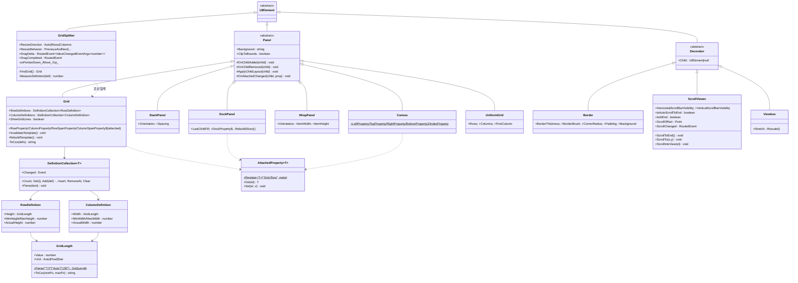
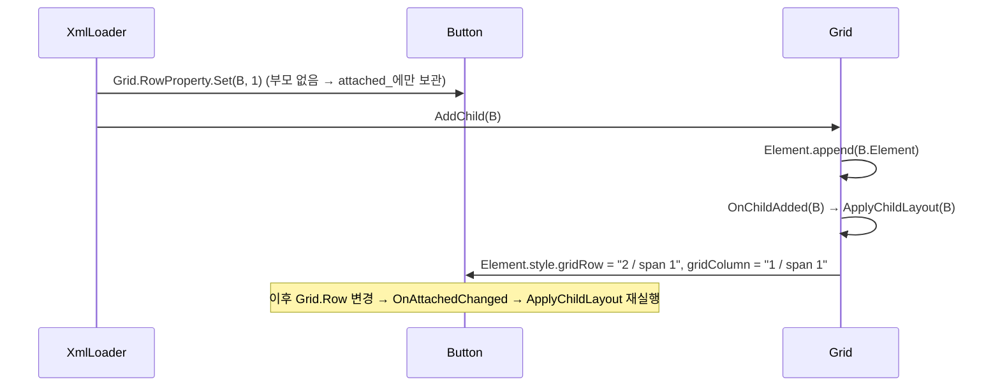
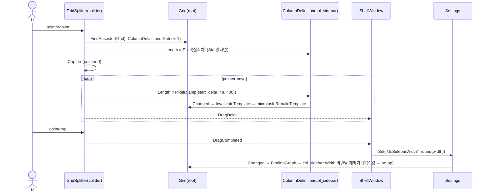
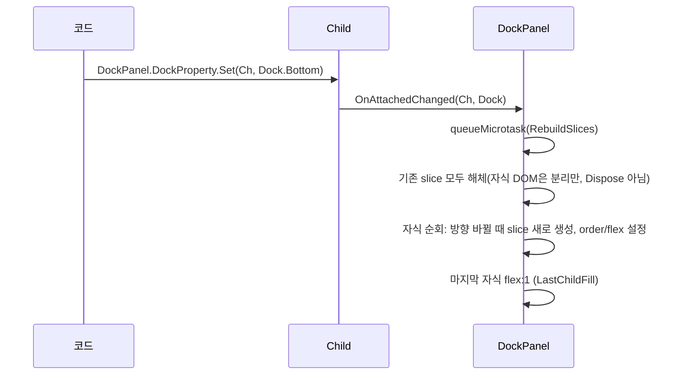
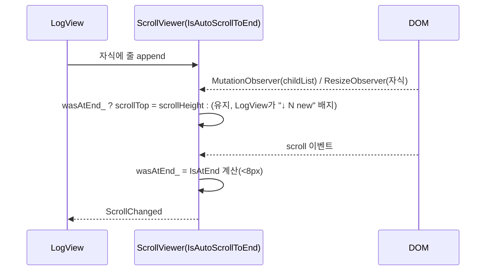

# 05. Gui Panels — Grid · StackPanel · DockPanel · ScrollViewer · GridSplitter

> 구현 Phase **P1**. 레이아웃 엔진은 쓰지 않고 WPF 패널 속성을 CSS로 번역한다(D-06). 이 문서의 핵심은 **번역 표**와 GridSplitter다.

## 5.1 라이브러리

| 패널 | CSS 기술 | 부가 |
|---|---|---|
| Grid | `display:grid`, `grid-template-rows/columns`, `grid-area` | `minmax(0, Nfr)`로 Star, `auto`, `px` |
| StackPanel | `display:flex`, `flex-direction`, `gap` | 자식 `flex: 0 0 auto` |
| DockPanel | `display:flex` 중첩 slice (방향이 바뀔 때마다 래퍼) | `LastChildFill` |
| WrapPanel | `display:flex; flex-wrap:wrap` | `ItemWidth/ItemHeight` |
| Canvas | `position:relative` + 자식 `position:absolute` | `Canvas.Left/Top/Right/Bottom/ZIndex` |
| UniformGrid | `display:grid; grid-template: repeat(R, 1fr) / repeat(C, 1fr)` | 자동 R/C 계산 |
| Border | `border`, `border-radius`, `padding`, `background` | 자식 1 |
| ScrollViewer | `overflow:auto|hidden|scroll`, `scrollTop`, `scrollend` 이벤트 | `IsAutoScrollToEnd` |
| Viewbox | `transform: scale()`, `ResizeObserver` | `Stretch=Uniform|Fill|UniformToFill|None` |
| GridSplitter | `PointerEvent` + `setPointerCapture`, `getBoundingClientRect` | 크기 `--gui-splitter-size: 4px` |

## 5.2 클래스 구조 (C5-1)



| 파일 | 내용 |
|---|---|
| `Panels/Panel.ts` | 추상. 자식 추가/제거 시 `ApplyChildLayout`, 붙임 속성 변경 수신 |
| `Panels/AttachedProperty.ts` | `Grid.Row` 같은 붙임 속성. 값은 요소의 `attached_` Map에 저장, 변경 시 부모 Panel에 알림 |
| `Panels/Grid.ts`, `GridDefinitions.ts` | Grid, Row/ColumnDefinition, GridLength, DefinitionCollection |
| `Panels/StackPanel.ts` `DockPanel.ts` `WrapPanel.ts` `Canvas.ts` `UniformGrid.ts` | |
| `Panels/Decorator.ts` `Border.ts` `ScrollViewer.ts` `Viewbox.ts` | 자식 1개 |
| `Panels/GridSplitter.ts` | |
| `Styles/Panels.css` | `.gui-grid`, `.gui-stack`, `.gui-dock`, `.gui-dock-slice`, `.gui-scroll`, `.gui-splitter` |

## 5.3 붙임 속성

```ts
export class Grid extends Panel
{
	public static readonly RowProperty = AttachedProperty.Register<number>("Grid.Row", { Default: 0, Parse: Number });
	public static readonly ColumnProperty = AttachedProperty.Register<number>("Grid.Column", { Default: 0, Parse: Number });
	public static readonly RowSpanProperty = AttachedProperty.Register<number>("Grid.RowSpan", { Default: 1, Parse: Number });
	public static readonly ColumnSpanProperty = AttachedProperty.Register<number>("Grid.ColumnSpan", { Default: 1, Parse: Number });
}

// XML: <Button Grid.Row="1" Grid.Column="2"/> → AttributeApplier(07)가 "Grid.Row" 룩업 → Grid.RowProperty.Set(button, 1)
// 자식은 부모가 Grid가 아니어도 값을 보관하고, Grid에 붙을 때 ApplyChildLayout이 읽는다.
```

`UIElement.SetAttached(prop, value)` → `attached_.set` → `Parent?.OnAttachedChanged(this, prop)` → Panel이 `ApplyChildLayout(child)` 재실행.

## 5.4 CSS 번역

### Grid

| WPF | CSS |
|---|---|
| `RowDefinitions="Auto,*,2*,150"` (축약 문법도 허용) | `grid-template-rows: auto minmax(0,1fr) minmax(0,2fr) 150px` |
| `Width="*" MinWidth="48" MaxWidth="400"` | `minmax(48px, 1fr)` → Max는 `minmax(48px, min(1fr, 400px))`이 불가하므로 `fit-content` 대신 **JS clamp**(GridSplitter에서) |
| `Grid.Row="1" Grid.RowSpan="2"` | `grid-row: 2 / span 2` (1-based) |
| `HorizontalAlignment="Right"` | `justify-self: end` (`data-halign` → `.gui-grid > [data-halign=Right]`) |
| `ShowGridLines` | `outline:1px dashed var(--border)` 자식마다(디버그) |

```ts
private ToCss(_defs: DefinitionCollection<RowDefinition | ColumnDefinition>): string
{
	const parts: string[] = [];
	for (let idx = 0; idx < _defs.Count; ++idx)
	{
		const def = _defs.Get(idx);
		parts.push(def.Length.ToCss(def.Min, def.Max));
	}
	return parts.join(" ");
}

// GridLength.ToCss
public ToCss(_min: number, _max: number): string
{
	switch (this.Unit)
	{
		case GridUnitType.Auto: return "auto";
		case GridUnitType.Pixel: return `${Math.min(Math.max(this.Value, _min), _max)}px`;
		case GridUnitType.Star: return `minmax(${_min}px, ${this.Value}fr)`;
		default: throw new Error("GridUnitType");
	}
}
```

정의 변경(`DefinitionCollection.Changed`)은 `InvalidateTemplate()` → `queueMicrotask(RebuildTemplate)`로 합쳐서 한 번만 `style.gridTemplateRows/Columns` 갱신. 사이드바 폭 바인딩(`Width="{$settings.Ui.SidebarWidth}"`)이 드래그 중 계속 바뀔 때도 프레임당 1회.

### StackPanel / WrapPanel / Canvas / UniformGrid

| WPF | CSS |
|---|---|
| `Orientation="Horizontal"` | `flex-direction: row` (`.gui-stack.is-horizontal`) |
| `Spacing="8"` | `gap: 8px` |
| 자식 | `flex: 0 0 auto`; `HorizontalAlignment="Stretch"`(수직 스택)이면 `align-self: stretch` |
| WrapPanel `ItemWidth` | 자식 `width: Npx` 강제 |
| Canvas `Left/Top` | `position:absolute; left/top`; `ZIndex` → `z-index` |
| UniformGrid `Rows/Columns=0` | 자식 수 n으로 `ceil(sqrt(n))` 계산, `OnChildAdded`에서 재계산 |

### DockPanel

CSS만으로는 WPF Dock 순서 의미(처리 순서대로 남은 공간을 나눔)를 바로 표현할 수 없어 **중첩 슬라이스**를 만든다: 자식을 순서대로 보며 Dock 방향이 바뀔 때마다 `div.gui-dock-slice`(flex, 방향 = Left/Right이면 row, Top/Bottom이면 column)를 하나 열고 그 안에 같은 방향의 자식들을 차례로 넣는다. 마지막 자식은 `LastChildFill`이면 `flex:1 1 0`. 자식의 DOM 부모가 슬라이스이지만 **논리 Parent는 DockPanel** — `ElementRegistry`는 슬라이스를 건너뛴다(등록 안 된 DOM은 조상으로 검색).

### ScrollViewer

| 속성 | 구현 |
|---|---|
| `VerticalScrollBarVisibility=Auto|Hidden|Visible|Disabled` | `overflow-y: auto|hidden|scroll|clip` |
| `IsAutoScrollToEnd` | 자식 `ResizeObserver` + `MutationObserver(childList)` → `IsAtEnd`였으면 `scrollTop = scrollHeight` |
| `IsAtEnd` | `scrollHeight - scrollTop - clientHeight < 8` (반올림 오차 허용) |
| `ScrollChanged` | DOM `scroll` 이벤트(passive) → `IsAtEnd` 갱신 → RaiseEvent |
| `ScrollIntoView(el)` | `el.Element.scrollIntoView({block:"nearest"})` |

스크롤바 스타일: `scrollbar-width: thin; scrollbar-color: var(--border-active) transparent`(Chromium 121+ 표준 속성).

### Viewbox

자식을 `position:absolute; transform-origin: 0 0`로 두고 자기 크기와 자식 `scrollWidth/Height`로 `scale = min(w/cw, h/ch)`(Uniform) 계산. `SizeObserver`로 자기·자식 둘 다 관찰.

## 5.5 GridSplitter

```ts
private readonly onPointerDown_ = (_s: UIElement, _a: PointerEventArgs): void =>
{
	const grid = this.FindAncestor(Grid);
	if (grid === null)
		return;
	this.grid_ = grid;
	const isCols = this.ResolveDirection(grid) === ResizeDirection.Columns;
	const index = isCols ? Grid.ColumnProperty.Get(this) : Grid.RowProperty.Get(this);
	this.prev_ = isCols ? grid.ColumnDefinitions.Get(index - 1) : grid.RowDefinitions.Get(index - 1);
	this.next_ = isCols ? grid.ColumnDefinitions.Get(index + 1) : grid.RowDefinitions.Get(index + 1);
	this.startPos_ = isCols ? _a.X : _a.Y;
	this.startPrev_ = this.MeasureDefinition(this.prev_, isCols);     // getBoundingClientRect 기반 실측치
	this.startNext_ = this.MeasureDefinition(this.next_, isCols);
	if (this.prev_.Length.Unit === GridUnitType.Star)
		this.prev_.Length = GridLength.Pixel(this.startPrev_);            // 드래그 시작 시 Star → Pixel 고정
	InputDispatcher.Capture(this, _a.PointerId);
	this.Element.classList.add("is-dragging");
	_a.Handled = true;
};

private readonly onPointerMove_ = (_s: UIElement, _a: PointerEventArgs): void =>
{
	if (this.grid_ === null || this.prev_ === null)
		return;
	const isCols = this.ResolveDirection(this.grid_) === ResizeDirection.Columns;
	const delta = (isCols ? _a.X : _a.Y) - this.startPos_;
	const size = Math.min(Math.max(this.startPrev_ + delta, this.prev_.Min), this.prev_.Max);   // Min/Max clamp
	this.prev_.Length = GridLength.Pixel(size);
	this.DragDelta.Invoke(this, new ValueChangedEventArgs(this.startPrev_, size));
	_a.Handled = true;
};

private readonly onPointerUp_ = (_s: UIElement, _a: PointerEventArgs): void =>
{
	InputDispatcher.Release(_a.PointerId);
	this.Element.classList.remove("is-dragging");
	this.DragCompleted.Invoke(this, new RoutedEventArgs(this));
	this.grid_ = null;
};
```

- 스플리터 자기 자리는 XML에서 자기 열/행을 `Width="Auto"`로 놓고 CSS `width: var(--gui-splitter-size)`; `cursor: col-resize|row-resize`; `:hover`/`.is-dragging`에 `background: var(--border-active)`.
- `PreviousAndNext` 만 1차 구현. next가 Star라면 자동으로 나머지를 차지하므로 next 변경 불필요.
- 더블클릭 → `prev_.Length`를 XML 원래 값으로 리셋(`GridLength.Original` 보관).

## 5.6 시퀀스

### S5-1 AddChild → 붙임 속성 → CSS



### S5-2 사이드바 스플리터 드래그 → 설정 저장



### S5-3 Dock 변경 → 슬라이스 재구성



### S5-4 ScrollViewer 자동 스크롤



## 5.7 테스트

| 파일 | 확인 |
|---|---|
| `GridLength.test.ts` | Parse 6종, ToCss, Pixel clamp |
| `Grid.test.ts` | 축약 문법 파싱, 자식 grid-area, 정의 변경 microtask 1회 반영 |
| `DockPanel.test.ts` | Left,Top,Right,Fill → slice 구조 스냅샷(DOM 문자열), 논리 Parent 유지 |
| `ScrollViewer.test.ts` | IsAtEnd 계산(happy-dom은 레이아웃 없으므로 scrollHeight 스텁), AutoScroll 조건 |
| `GridSplitter.test.ts` | pointer down/move/up 시뮬 → Length 변화, Min/Max clamp, DragCompleted 1회 |
| Harness 수동 | `Harness/Pages/Panels.xml`에서 8개 패널 시각 확인 |

## 5.8 P1 체크리스트

- [ ] 14개 파일 + `Panels.css`
- [ ] `Gui.RegisterBuiltInElements()`에 패널 10개 등록
- [ ] Grid Star + Min/Max가 스플리터와 함께 기대대로(48~400)
- [ ] DockPanel 5가지 순서 조합 Harness 스크린샷으로 확인
- [ ] 테스트 5파일 통과
