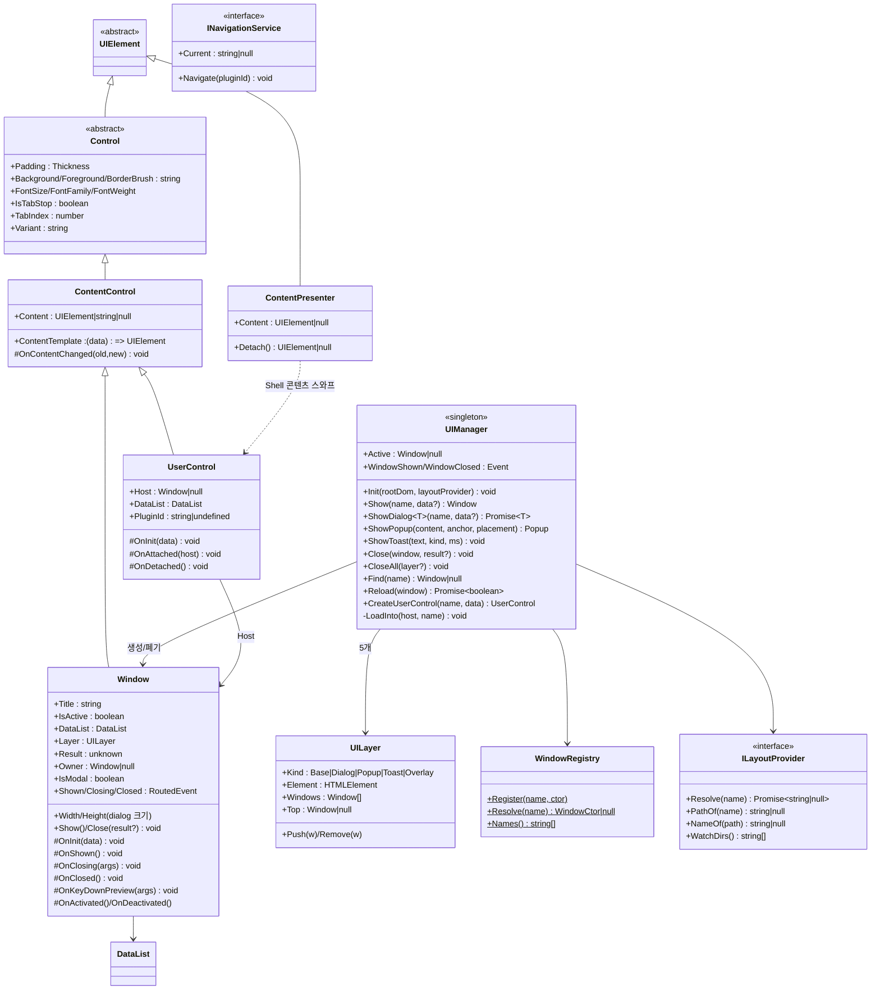
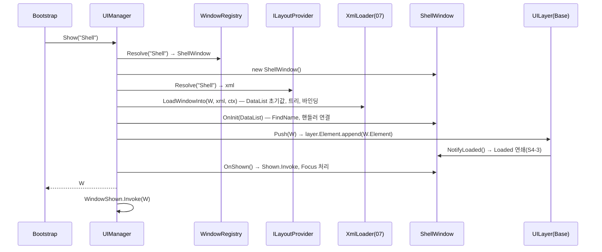
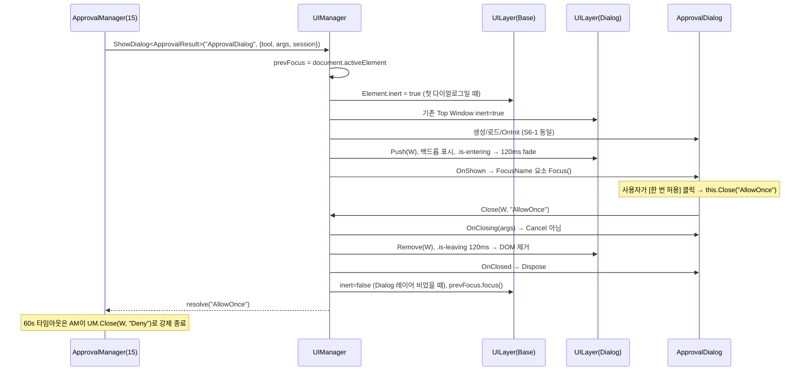
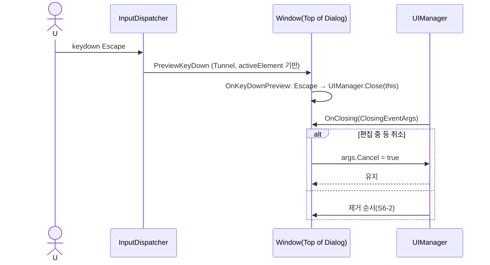
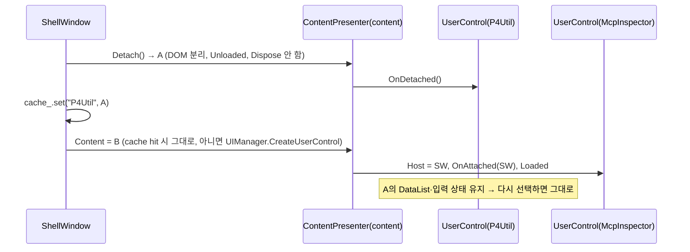
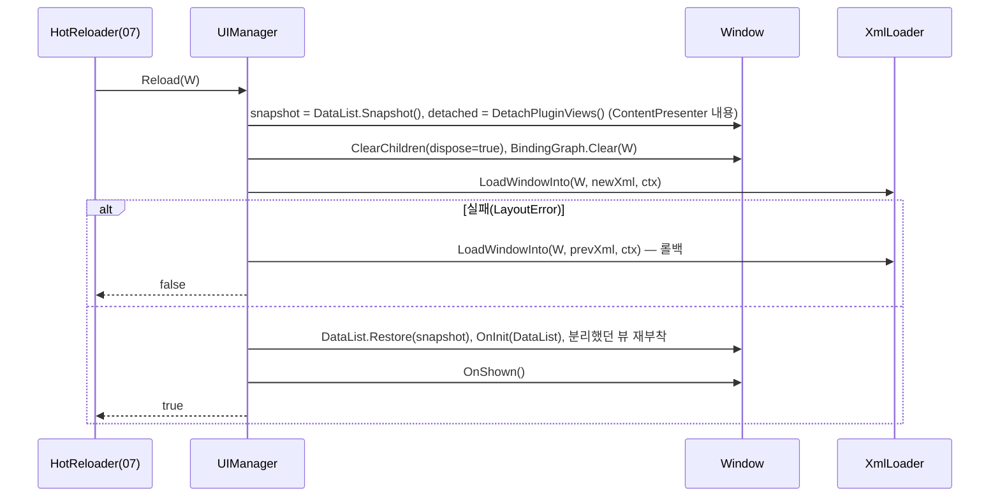

# 06. Window · UserControl · UIManager — 화면 단위와 레이어

> 구현 Phase **P1** 후반. XML 로더(07) 이전에 코드만으로 Window를 만들어 보이고 닫는 것까지 동작해야 한다.

## 6.1 라이브러리

| 기능 | 구현 |
|---|---|
| 레이어 | `#root > .gui-layer[data-layer=Base|Dialog|Popup|Toast|Overlay]` 5개 div, `z-index` 0/100/200/300/400, `position:absolute; inset:0`, Base 외에는 `pointer-events:none`(자식은 `auto`) |
| 모달 차단 | Dialog 표시 중 Base 레이어에 `inert` + `.gui-layer[data-layer=Dialog]::before` 반투명 백드롭 |
| 포커스 트랩 | `focusin` 모달 내부 확인, 벗어나면 첫/마지막 focusable로 되돌림(Tab 순환). `inert`가 대부분 처리, 트랩은 Popup 보조 |
| 창 등록 | TC39 데코레이터 `@RegisterWindow("Shell")` → `WindowRegistry` Map |
| 애니메이션 | CSS `opacity` 트랜지션 120ms + `transitionend`(타임아웃 200ms fallback). `prefers-reduced-motion`이면 0 |
| 레이아웃 제공 | `ILayoutProvider`(07) — UIManager는 이름 → XML 문자열만 요청 |

## 6.2 클래스 구조 (C6-1)



| 파일 | 내용 |
|---|---|
| `Controls/Control.ts` | 스타일 속성(폰트/색/패딩), `Variant` → `variant-*` 클래스 |
| `Controls/ContentControl.ts` | 자식 1개 또는 문자열. 문자열이면 내부 `TextBlock` 생성 |
| `Controls/ContentPresenter.ts` | 콘텐츠를 **Dispose 없이** 분리 가능. Shell이 Plugin 화면을 바꿀 때 사용 |
| `Host/Window.ts` | 화면 단위. `Window extends ContentControl`(D-07) |
| `Host/UserControl.ts` | Plugin 메인 화면(D-13). Host Window에 붙어야 보임 |
| `Host/UIManager.ts` | 창 생성·레이어·모달·토스트 |
| `Host/UILayer.ts` | 레이어 div + 스택 |
| `Host/WindowRegistry.ts`, `Host/RegisterWindow.ts` | 이름 → 클래스 |
| `Host/ILayoutProvider.ts`, `Host/INavigationService.ts` | 인터페이스 |
| `Styles/Layers.css` | 레이어, 다이얼로그 크롬(chrome), 백드롭, 토스트 |

## 6.3 UI 디자인

### 레이어

```
#root
├─ .gui-layer[data-layer=Base]    z0    Shell 1개 (inset 0)
├─ .gui-layer[data-layer=Dialog]  z100  모달 스택, 백드롭 rgba(0,0,0,.4), 중앙 정렬(flex center)
├─ .gui-layer[data-layer=Popup]   z200  ComboBox 드롭다운, ContextMenu, ToolTip (절대 좌표)
├─ .gui-layer[data-layer=Toast]   z300  우하단 세로 스택, gap 8, 마진 16
└─ .gui-layer[data-layer=Overlay] z400  드래그 고스트, 전역 진행 바, Reload 스피너
```

### 다이얼로그 크롬(chrome) (Window on Dialog layer)

```
┌─ .gui-window ────────────────────────────────┐  min-width 320, max-width 90vw, max-height 90vh
│ .gui-window__title  32px  [Title]        [×] │  배경 --background-panel, 하단 1px --border
├────────────────────────────────────────────┤
│ .gui-window__body   padding 12                 │  Content(XML 루트 자식) — overflow:auto
│                                               │
└────────────────────────────────────────────┘  radius --gui-radius, shadow var(--shadow)
```

- Base 레이어 Window(Shell)는 `data-chrome="none"` → 크롬(chrome) 없음(TitleBar 컨트롤이 대신).
- 버튼 포커스: `FocusName="btn_ok"` 속성 → Shown 시 해당 요소 `Focus()`. 없으면 첫 focusable.
- **ESC** → `Close(undefined)` (Closing에서 취소 가능). **Enter** → `IsDefault=true` Button Click.
- 백드롭 클릭은 닫지 **않음**(승인 다이얼로그 오조작 방지).

## 6.4 등록과 이름 해석

```ts
export function RegisterWindow(_name: string)
{
	return function <T extends WindowCtor>(_target: T, _context: ClassDecoratorContext): void
	{
		void _context;
		WindowRegistry.Register(_name, _target);
	};
}

@RegisterWindow("Shell")
export class ShellWindow extends Window { ... }

@RegisterWindow("P4Util/Main")           // Plugin: "{PluginId}/{Name}"
export class MainControl extends UserControl { ... }
```

이름 → 레이아웃 해석(`FsLayoutProvider`, 07): `--layout-dir/{Name}.xml` → `~/.scouter/layouts/{Name}.xml`(사용자 오버라이드) → 내장 `dist/renderer/Layout/{Name}.xml` → Plugin이면 `{PluginDir}/Layout/{Name}.xml`. 클래스가 등록되지 않았으나 XML이 있으면 `Window` 기본 클래스로 연다(코드비하인드 없는 정적 화면, About 등).

## 6.5 시퀀스

### S6-1 `UIManager.Show("Shell")`



### S6-2 `ShowDialog("ApprovalDialog")`



### S6-3 ESC / Closing 취소



### S6-4 ContentPresenter 스와프 (Plugin 전환)



### S6-5 `UIManager.Reload(window)` (핫리로드에서 사용)



## 6.6 생애주기 계약

| 순서 | Window | UserControl | 보증 |
|---|---|---|---|
| 1 | constructor | constructor | 자식 없음, DataList 미초기화 |
| 2 | (로더) 트리 생성, DataList 설정, 바인딩 1회 평가 | 동일 | `FindName` 가능 |
| 3 | `OnInit(data)` | `OnInit(data)` | DOM에 아직 안 붙음 → 크기 0 |
| 4 | `Loaded`(레이어 부착) | `OnAttached(host)` → `Loaded` | 크기 측정 가능 |
| 5 | `OnShown` | — | 포커스 |
| 6 | `OnClosing(args)` | `OnDetached` | 취소 가능(Window만) |
| 7 | `OnClosed` → Dispose | (캐시에 있으면 생존) | |

## 6.7 테스트

| 파일 | 확인 |
|---|---|
| `UIManager.test.ts` | Show/Close 레이어 DOM, ShowDialog resolve 값, inert 토글, prevFocus 복원, CloseAll |
| `Window.test.ts` | Closing Cancel, ESC, Enter→IsDefault, 생애주기 순서 로그 |
| `ContentPresenter.test.ts` | Detach 후 요소 생존, 재부착 시 Loaded 재발생 |
| `WindowRegistry.test.ts` | 데코레이터 등록, 중복 이름 throw |
| `Reload.test.ts` | 실패 시 롤백, 성공 시 DataList 복원 |

## 6.8 P1 체크리스트

- [ ] 코드만으로 `new Window()` + `AddChild(Button)` → `UIManager.Show` → Harness에서 보임
- [ ] ShowDialog → ESC 닫기 → 포커스 복원
- [ ] Toast 3개 동시 표시 → 순차 사라짐(3s/5s)
- [ ] 테스트 5파일 통과
