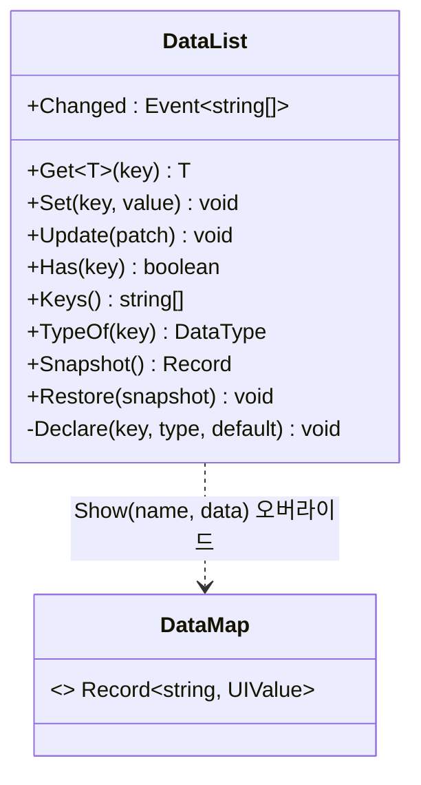
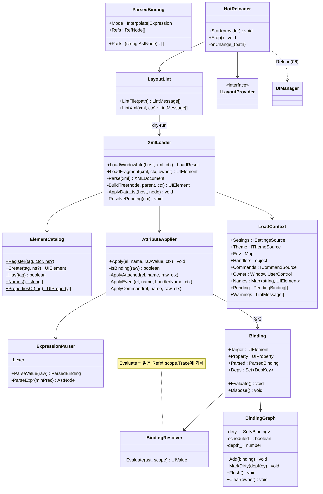

# 07. XML 레이아웃 — 문법 · 바인딩 · 로더 · 핫리로드 · 린트

> 구현 Phase **P2**. sgcl `sgui` XML(`ui_channel.xml`)과 문법 호환(D-02). 태그·속성은 WPF 이름, 바인딩은 `UIResolve` 문법. 이 문서가 끝나면 XML로 작성한 Window가 뜨고, 파일을 저장하면 재시작 없이 반영되고, `npm run lint:layout`이 오류를 잡는다.

## 7.1 라이브러리

| 기능 | 패키지 / API | 방식 |
|---|---|---|
| XML 파싱(renderer) | `DOMParser.parseFromString(xml, "application/xml")` | 브라우저 내장. `<parsererror>` 검사. 줄 번호는 에러 텍스트에서 정규식 추출 |
| XML 파싱(Node lint) | `@xmldom/xmldom ^0.9` `DOMParser` (D-20) | 옵션 `onError`로 줄/열 확보. Renderer와 같은 `XmlLoader` 코드를 그대로 실행(DOM 인터페이스 동일) |
| 식 파서 | 자체 Pratt 파서(~250줄) | 연산자 우선순위 테이블. jsep 등 외부 미사용(백틱·`{@}` 확장 필요) |
| 재평가 배치 | `queueMicrotask` | DataList.Update 한 번에 N개 키 변경 → Flush 1회 |
| 파일 감시 | `chokidar ^4` `watch(dirs, { awaitWriteFinish: { stabilityThreshold: 80 }, ignoreInitial: true })` | 에디터 저장 중 반쪽 파일 방지 |
| 레이아웃 읽기 | `node:fs/promises.readFile` (App `FsLayoutProvider`), `fetch` (Harness `HttpLayoutProvider`) | `ILayoutProvider` 구현체 2개 |
| 스키마 | `ajv ^8` (DataList 타입 검증), 자체 `LayoutSchema` (태그/속성 카탈로그) | `Scripts/GenLayoutSchema.mjs`가 `Layout.schema.json`을 생성 → Monaco XML 자동완성(16) |

## 7.2 XML 문법

```xml
<?xml version="1.0" encoding="UTF-8"?>
<Window xmlns="scouter/gui" Name="channel_select" Title="채널 선택" Width="{@winW}" Height="480">
	<DataList>
		<Data Key="winW" Type="Int" Value="900"/>
		<Data Key="pageCur" Type="Int" Value="1"/>
		<Data Key="pageMax" Type="Int" Value="1"/>
		<Data Key="isRunning" Type="Bool" Value="false"/>
	</DataList>

	<Grid ContentHost="true" Margin="24" RowDefinitions="Auto,*,Auto">
		<StackPanel Grid.Row="0" Name="server_list" Orientation="Horizontal" Spacing="8"/>
		<UniformGrid Grid.Row="1" Name="channel_list" Rows="2" Columns="5"/>
		<StackPanel Grid.Row="2" Orientation="Horizontal" HorizontalAlignment="Right" Spacing="8">
			<TextBlock Name="txt_page" Text="{@pageCur} / {@pageMax}" VerticalAlignment="Center"/>
			<Button Name="btn_refresh" Content="새로고침" IsEnabled="!{@isRunning}"/>
			<Button Name="btn_start" Content="시작" Variant="Primary" IsDefault="true"/>
		</StackPanel>
	</Grid>
</Window>
```

| 항목 | 규칙 | 린트 |
|---|---|---|
| 루트 | `<Window>` 또는 `<UserControl>`. `xmlns="scouter/gui"` 선택(자동완성용), 무시됨 | E001 |
| Plugin 요소 | `xmlns:p="scouter/plugin/P4Util"` → `<p:RecipeList/>` → Plugin 등록 태그 | E010 |
| `DataList` | 루트 직속 0~1개. `Data Key Type Value`. Type 정식 6종 `Bool Int Float String Array Map` + jc 별칭(§DataList 표) | E020, E021 |
| `ContentHost="true"` | 루트 직속 자식 중 정확히 1개. DataList 외 자식이 하나면 생략 가능 | E002 |
| 붙임 속성 | `Grid.Row`, `Canvas.Left`, `DockPanel.Dock`(또는 `Dock`) — `AttachedProperty.Lookup` | E012 |
| 속성 요소 | `<Grid.RowDefinitions>`, `<Button.ContextMenu>`, `<ListView.View>` — `부모태그.속성` 자식 | E011 |
| 자식 수 | ContentControl/Decorator 1, Panel N, 그 외 0 | E003 |
| 텍스트 노드 | `<Button>시작</Button>` → `Content`; `<TextBlock>글자</TextBlock>` → `Text` | |
| 테마 | `{$theme.token}` → `var(--token)`. 리터럴 `#hex` 허용하지만 경고 | W060 |
| 이벤트 속성 | `Click="OnStartClick"` → `ctx.Handlers["OnStartClick"]`(A-04). 없으면 경고 | W050 |
| Command | `Command="P4Util.CopyPrompt" CommandParameter="..."` → CommandRegistry(08) | W051(미등록) |
| Name | snake_case, 문서 내 유일 | E030, W040 |

### DataList



`Set`은 선언 타입으로 강제 변환(`Int`에 `"12"` → 12, 실패 시 `Log.Warn` + 값 유지). 미선언 키 `Set`은 throw(오타 방지). `Update`는 여러 키를 바꾸고 `Changed`를 **1회** 발생.

정식 Type 6종은 `Bool Int Float String Array Map`이다. `Type` 속성은 대소문자까지 정확히 일치해야 하며, 아래 jc 별칭(`Projects/jc/Sources/jc/Type.h`, `Container/PropertyType.h`)도 동일하게 동작한다 — 로더가 정식으로 정규화한 뒤 저장한다.

| 정식 | 별칭 |
|---|---|
| `Bool` | `bool` |
| `Int` | `int`, `_s8`, `_u8`, `_s16`, `_u16`, `_s32`, `_u32`, `_s32l`, `_u32l`, `_s64`, `_u64` |
| `Float` | `float`, `double`, `_f32`, `_f64`, `_f64l` |
| `String` | `string`, `_string`, `CharPtr`, `_char`, `_achar`, `_wchar` |
| `Array` | `array` |
| `Map` | `map` |

별칭도 `Value` 파싱·강제 변환은 정식과 동일(`_u32`는 `Int`처럼 정수 파싱). 목록 밖(`_ptr`, `_sz`, 오타 등)은 E020.

### 바인딩 문법 (EBNF)

```
value      := (literalText | "{" expr "}")*         ; 보간 모드. 전체가 하나의 { }이거나 바깥에 연산자가 있으면 식 모드
expr       := ternary
ternary    := or ("?" expr ":" expr)?
or         := and ("||" and)*
and        := eq ("&&" eq)*
eq         := cmp (("==" | "!=") cmp)*
cmp        := add (("<" | "<=" | ">" | ">=") add)*
add        := mul (("+" | "-") mul)*
mul        := unary (("*" | "/" | "%") unary)*
unary      := ("!" | "-") unary | primary
primary    := number | backtickString | "(" expr ")" | ref | call | "true" | "false" | "null"
ref        := "{@" key "}" | "{#" name "." prop "}" | "{$" source ("." path)* "}" | "{$ancestor(" n ")." prop "}"
call       := ident "(" (expr ("," expr)*)? ")"     ; max min abs floor ceil round clamp len str num
```

| 참조 | 소스 | 재평가 트리거 |
|---|---|---|
| `{@key}` | Window/UserControl `DataList` | `DataList.Changed` |
| `{#name.Prop}` | 같은 문서 요소의 등록 속성 (+ `ActualWidth/Height`) | 그 요소 `PropertyChanged` / `SizeChanged` |
| `{$parent|root|self|prev|next.Prop}`, `{$ancestor(n).Prop}` | 상대 요소 | 동일 |
| `{$settings.Ui.SidebarWidth}` | `ILoadContext.Settings` | `Settings.Changed(key)` |
| `{$theme.text-base}` | 테마 → **값 복사 아님**, `var(--text-base)` 문자열 | 없음(CSS가 처리) |
| `{$env.PluginId}` | `ILoadContext.Env` 상수 | 없음 |

항상 보간 모드인 속성(D-14): `Text Content Header Title ToolTip Placeholder` — `Text="{@a} + {@b}"`는 문자열 `"1 + 2"`. 식 계산이 필요하면 `Text="{({@a} + {@b})}"`처럼 바깥 중괄호로 감싼다. 그 외 속성은 바깥에 연산자/함수가 있으면 식 모드.

값 타입은 `UIValue`(`Null Bool Int Float String Array Map`) — 문자열 + 숫자 = 연결, `Int/Int`는 Float, 문자열 비교는 사전순. 결과는 `String(v)`로 대상 `UIProperty.Parse`에 넘김.

## 7.3 클래스 구조 (C7-1)



| 파일 | 내용 |
|---|---|
| `Xml/XmlLoader.ts` | 2-pass 오케스트레이션 |
| `Xml/ElementCatalog.ts` | 태그 → 생성자(+ 네임스페이스). `Gui.RegisterBuiltInElements()`가 채움. 04의 `ElementRegistry`(DOM↔요소)와 이름 구분 |
| `Xml/AttributeApplier.ts` | 속성 분기 |
| `Xml/Expression/Lexer.ts`, `Parser.ts`, `Ast.ts` | Pratt 파서 |
| `Xml/BindingResolver.ts` | 평가기(순수 함수) |
| `Xml/Binding.ts`, `BindingGraph.ts` | 의존 그래프 |
| `Xml/DataList.ts`, `UIValue.ts`, `LoadContext.ts` | |
| `Xml/HotReloader.ts` | App에서만 사용(chokidar는 App이 주입 — Gui는 Node 모름) |
| `Xml/LayoutLint.ts` | 규칙 엔진(Gui). CLI는 `Scripts/LayoutLint.mjs` |
| `Scripts/GenLayoutSchema.mjs` | 초기화 후 `ElementCatalog.Names()` × `PropertiesOf` → `Layout.schema.json` |

## 7.4 시퀀스

### S7-1 2-pass 로드

```mermaid
sequenceDiagram
	participant UM as UIManager
	participant XL as XmlLoader
	participant EC as ElementCatalog
	participant AA as AttributeApplier
	participant BG as BindingGraph
	UM->>XL: LoadWindowInto(W, xml, ctx)
	XL->>XL: Parse → doc, 루트 태그 검사(E001)
	XL->>XL: ApplyDataList(W, <DataList>) → W.DataList.Declare × n, ctx.Data 오버라이드 적용
	loop Pass 1: 깊이 우선 순회
		XL->>EC: Create(tag) → element
		XL->>AA: Apply(el, attr, raw, ctx) × 속성
		alt raw가 바인딩
			AA->>AA: ParseValue → ctx.Pending.push(PendingBinding)
		else 리터럴
			AA->>AA: el.SetValue(prop, prop.Parse(raw))
		end
		XL->>XL: Name 있으면 ctx.Names.set (중복 E030)
		XL->>XL: parent.AddChild(el)
	end
	loop Pass 2: Pending
		XL->>BG: binding = new Binding(...); Add
		XL->>BG: binding.Evaluate() — Refs 해석(#name 없으면 E022)
	end
	XL-->>UM: LoadResult{ Warnings }
```

### S7-2 DataList.Update → 재평가

```mermaid
sequenceDiagram
	participant C as 코드비하인드
	participant DL as DataList
	participant BG as BindingGraph
	participant B1 as Binding(btn_run.IsEnabled)
	participant B2 as Binding(txt_state.Text)
	C->>DL: Update({isRunning:true, state:"실행 중"})
	DL->>DL: 타입 강제, 값 저장
	DL->>BG: Changed(["isRunning","state"]) → MarkDirty("@isRunning"), MarkDirty("@state")
	BG->>BG: dirty_ ∪ {B1, B2}; scheduled_ 아니면 queueMicrotask(Flush)
	Note over BG: 동기 코드 끝
	BG->>BG: Flush: depth_=0
	BG->>B1: Evaluate → SetValue(IsEnabled,false)
	BG->>B2: Evaluate → SetValue(Text,"실행 중")
	Note over BG: Evaluate가 다시 MarkDirty를 일으키면 같은 Flush 안에서 반복, depth_>8이면 W030 경고 후 중단
```

### S7-3 핫리로드

```mermaid
sequenceDiagram
	actor Dev
	participant FS as chokidar
	participant HR as HotReloader
	participant LL as LayoutLint
	participant UM as UIManager
	participant EB as EventBus
	Dev->>FS: Layout/Main.xml 저장
	FS-->>HR: change(path) (awaitWriteFinish 80ms)
	HR->>HR: name = provider.NameOf(path); windows = UM.FindAllByLayout(name)
	HR->>LL: LintXml(xml) → errors?
	alt 에러 있음
		HR->>UM: ShowToast("Main.xml E022: #txt_x 없음", Error)
	else
		loop windows
			HR->>UM: Reload(w) (S6-5)
		end
		HR->>UM: ShowToast("Main.xml 다시 불러옴", Info, 1500)
		HR->>EB: Publish("Scouter.LayoutReloaded", {name})
	end
```

### S7-4 LayoutLint CLI

```mermaid
sequenceDiagram
	participant CI
	participant CLI as Scripts/LayoutLint.mjs
	participant G as @scouter/gui (Node에서 import)
	CI->>CLI: node Scripts/LayoutLint.mjs Source Plugins
	CLI->>G: globalThis.DOMParser = xmldom.DOMParser; Gui.RegisterBuiltInElements()
	CLI->>CLI: Plugins/*/Plugin.json 읽어 Plugin 태그 이름만 등록(스텁)
	loop **/Layout/*.xml
		CLI->>G: LayoutLint.LintXml(xml, ctxStub) — happy-dom 없이 dry-run(요소 생성은 하지만 DOM은 xmldom Element)
	end
	CLI-->>CI: 표준 형식 "path:line:col E022 메시지", 에러 있으면 exit 1
```

린트용 dry-run은 `UIElement.CreateElement`가 `document.createElement`를 부르므로 Node에서는 `globalThis.document`를 happy-dom `Window`로 제공(20 `Setup.ts`와 같은 방식). xmldom은 입력 XML 파싱 전용.

## 7.5 린트 코드

| 코드 | 종류 | 의미 |
|---|---|---|
| E000 | 에러 | XML 파싱 실패 |
| E001 | 에러 | 루트가 Window/UserControl 아님 |
| E002 | 에러 | ContentHost 0개 또는 2개 이상 |
| E003 | 에러 | 자식 수 위반(ContentControl에 2개 등) |
| E010 | 에러 | 미등록 태그 |
| E011 | 에러 | 미등록 속성(속성 요소 포함) |
| E012 | 에러 | 미등록 붙임 속성 |
| E020 | 에러 | Data Type 범위 밖(정식 6종·jc 별칭 외) |
| E021 | 에러 | Data Value가 Type으로 변환 불가 |
| E022 | 에러 | `{#name}` 대상 없음 / `{@key}` 미선언 |
| E023 | 에러 | 식 문법 오류(위치 포함) |
| E024 | 에러 | 알 수 없는 함수 |
| E030 | 에러 | Name 중복 |
| W030 | 경고 | 바인딩 순환(정적 분석: A→B→A) |
| W040 | 경고 | Name이 snake_case 아님 |
| W041 | 경고 | 상호작용 컨트롤(Button/TextBox/…)에 Name 없음(테스트 불가) |
| W050 | 경고 | `Click="X"` 핸들러가 코드비하인드에 없음(런타임에서만 검사 가능) |
| W051 | 경고 | Command 미등록 |
| W060 | 경고 | 리터럴 색 사용(`#hex`, `rgb(`) |

## 7.6 Pratt 파서 핵심

```ts
const kPrecedence: Record<string, number> = { "?": 1, "||": 2, "&&": 3, "==": 4, "!=": 4, "<": 5, "<=": 5, ">": 5, ">=": 5, "+": 6, "-": 6, "*": 7, "/": 7, "%": 7 };

private ParseExpr(_minPrec: number): AstNode
{
	let left = this.ParseUnary();
	for (;;)
	{
		const tok = this.Peek();
		const prec = tok.Kind === TokenKind.Operator ? (kPrecedence[tok.Text] ?? 0) : 0;
		if (prec === 0 || prec < _minPrec)
			return left;
		this.Next();
		if (tok.Text === "?")
		{
			const whenTrue = this.ParseExpr(1);
			this.Expect(":");
			const whenFalse = this.ParseExpr(1);
			left = { Kind: "Ternary", Cond: left, WhenTrue: whenTrue, WhenFalse: whenFalse, Pos: tok.Pos };
			continue;
		}
		const right = this.ParseExpr(prec + 1);            // 좌결합
		left = { Kind: "Binary", Op: tok.Text, Left: left, Right: right, Pos: tok.Pos };
	}
}
```

렉서는 `{@k}` `{#n.p}` `{$s.p}` 를 각각 하나의 `Ref` 토큰으로 자른다(중괄호 안에 공백 금지). 백틱 문자열은 `String` 토큰. 보간 모드 판정: `raw.trim()`이 `{`로 시작하고 매칭 `}`로 끝나며 그 사이가 하나의 식 → Expression; 아니면 각 `{...}`를 별개 식으로 파싱해 Interpolate. 단, 중괄호 바깥에 연산자 토큰이 나오고 속성이 D-14 목록이 아니면 전체를 식으로(`"{@a} + 10"`).

## 7.7 ILayoutProvider

```ts
export interface ILayoutProvider
{
	Resolve(_name: string): Promise<string | null>;   // "Shell", "P4Util/Main" → XML 문자열
	PathOf(_name: string): string | null;             // 핫리로드·에러 표시용
	NameOf(_path: string): string | null;
	WatchDirs(): string[];
}
```

`FsLayoutProvider`(App) 해석 순서: `--layout-dir` → `~/.scouter/layouts/` → `dist/renderer/Layout/` → `{PluginDir}/Layout/`. `HttpLayoutProvider`(Harness): `fetch("/layout/{name}.xml")`.

## 7.8 테스트

| 파일 | 확인 |
|---|---|
| `Lexer.test.ts` / `Parser.test.ts` | 40개 식 → AST 스냅샷(JSON), 우선순위, 삼항 중첩, 오류 위치 |
| `BindingResolver.test.ts` | UIValue 연산 규칙 30개, 함수 10개, Trace 기록 |
| `XmlLoader.test.ts` | 샘플 XML 6개 로드 → 트리 구조/속성 값, 바인딩 초기 평가, E코드별 실패 케이스 |
| `BindingGraph.test.ts` | microtask 1회 Flush, 순환 depth 8 중단, Clear 후 재평가 없음 |
| `DataList.test.ts` | 타입 강제, 미선언 throw, Update 1회 Changed, Snapshot/Restore |
| `LayoutLint.test.ts` | 코드별 픽스처 XML 18개 |
| `HotReloader.test.ts` | 임시 폴더 + 실제 chokidar, 린트 실패 시 Reload 미호출 |

## 7.9 P2 체크리스트

- [ ] §7.2 샘플 XML이 Harness에서 그대로 렌더
- [ ] `DataList.Update` → 버튼 활성/문자 갱신 microtask 1회
- [ ] XML 저장 → 300ms 안에 화면 갱신, 오류시 토스트 + 이전 화면 유지
- [ ] `npm run lint:layout`이 18개 코드 픽스처를 정확히 보고
- [ ] `Layout.schema.json` 생성 → VS Code에서 XML 자동완성 동작
- [ ] 테스트 7파일 통과, 파서/평가기 c8 95%
