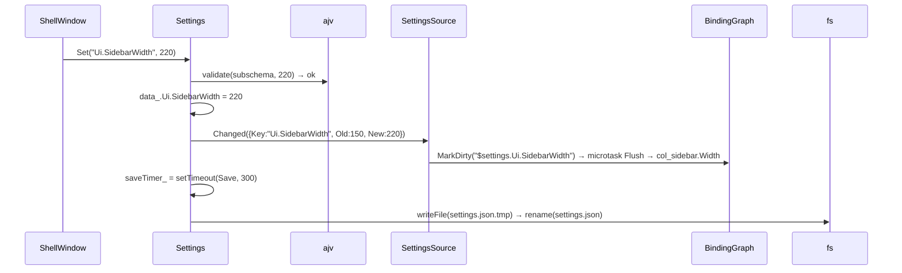
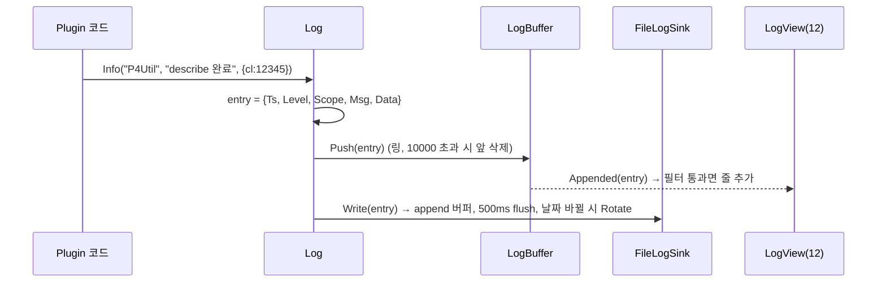

# 08. App Services — Settings · EventBus · Commands/Hotkeys · Log · Storage · Secrets · Schedule · Process · Fs · Paths

> 구현 Phase **P3** (Shell 직전). Renderer 프로세스에서 동작하는 앱 공통 서비스. Plugin은 `IPluginContext`(14)를 통해 이 서비스의 스코프 래퍼를 받는다. 모두 `Source/Scouter.App/Renderer/Services/`.

## 8.1 라이브러리

| 서비스 | 패키지 / API | 방식 |
|---|---|---|
| Settings | `node:fs` (`writeFile` → `.tmp` → `rename` 원자 쓰기), `ajv ^8` + `ajv-formats` | `Config/Settings.schema.json` 검증, 기본값은 `Defaults.json` + 스키마 `default` |
| EventBus | 자체 `Map<string, Set<handler>>` | 와일드카드 `P4Util.*` 구독, 동기 발행 |
| CommandRegistry | 자체 Map | `{Owner}.{Name}`, `CanExecute` |
| Hotkeys | `KeyEventArgs.Matches` (04) — root `PreviewKeyDown` | 문자열 `"Ctrl+Shift+P"` 정규화(`Ctrl Shift Alt Meta` 순) |
| Log | 자체 `LogBuffer` (링 버퍼 10000) + `node:fs.appendFile` 싱크 | `~/.scouter/logs/app-YYYYMMDD.log`, 7일 보관. electron-log 미사용 |
| Storage | `node:fs` JSON, 디바운스 300ms 저장 | `~/.scouter/plugins/{Id}/storage.json` |
| Secrets | Electron `safeStorage.encryptString/decryptString` (Renderer에서 `require("electron").safeStorage` — nodeIntegration) | `~/.scouter/secrets.bin` (Map → JSON → 암호화) |
| Schedule | `croner ^9` `new Cron("*/5 * * * *", fn)` | Plugin별 작업 목록, 언로드 시 `stop()` |
| Process | `node:child_process.spawn` (+ `AbortSignal`) | stdout/stderr 스트림, `P4CHARSET=utf8` 같은 env 주입, 타임아웃 |
| Clipboard | Electron `clipboard.writeText/readText` | |
| Fs | `node:fs/promises` 래퍼 + 경로 샌드박스(Plugin은 자기 폴더·`--layout-dir`·필요 허가 경로) | |
| Paths | IPC `app:get-paths` (03) 1회 호출 후 캐시 | `UserData Home Exe Resources Logs Temp Version IsPackaged Args` + 파생 `ScouterHome LogsDir SettingsFile` |
| Args | `process.argv` (Main이 `additionalArguments`로 전달) → `node:util.parseArgs` | `--test --no-auth --hidden --safe --layout-dir --plugin-dir --port` |
| Ipc | `electron.ipcRenderer` typed wrapper (`Shared/IpcChannels.ts`) | `Ipc.Invoke("window:close")`, `Ipc.On("window:maximized-changed", h)` |

## 8.2 클래스 구조 (C8-1)

```mermaid
classDiagram
	class Settings {
		<<static>>
		+Load(path, schema, defaults) Promise~void~
		+Get~T~(key) T
		+Set(key, value) void
		+Reset(key?) void
		+Has(key) boolean
		+Changed : Event~SettingsChange~
		+RegisterSchema(prefix, schema) void
		+Export() string / Import(json) void
		-Save() debounce 300ms, atomic
		-Validate(key, value) void
	}
	class SettingsChange { +Key; +OldValue; +NewValue }
	class EventBus {
		<<static>>
		+Publish(topic, payload) void
		+Subscribe(pattern, handler) IDisposable
		+Once(topic) Promise
	}
	class CommandRegistry {
		<<static>>
		+Register(cmd: CommandDef) IDisposable
		+Execute(id, param?) Promise~boolean~
		+CanExecute(id) boolean
		+List() CommandDef[]
		+Changed : Event
	}
	class CommandDef {
		+Id : string
		+Title : string
		+Category : string
		+Hotkey? : string
		+Execute(param) Promise~void~|void
		+CanExecute?() boolean
		+Icon? : string
	}
	class Hotkeys {
		<<static>>
		+Attach(root: UIElement) void
		+Bind(chord, commandId) IDisposable
		+Normalize(chord) string
		-onPreviewKeyDown_
	}
	class Log {
		<<static>>
		+Debug/Info/Warn/Error(scope, msg, data?)
		+Scope(name) ScopedLog
		+SetSink(sink) void
		+Buffer : LogBuffer
	}
	class LogBuffer {
		+Capacity : 10000
		+Push(entry) / Query(filter) / Appended : Event
	}
	class FileLogSink { +Write(entry); -Rotate() }
	class Storage { +constructor(path); +Get/Set/Delete/Keys; +Flush() }
	class Secrets { <<static>> +Get(key) string|null; +Set(key,v); +Delete(key); +IsAvailable }
	class Schedule { <<static>> +Add(owner, cron, fn) IDisposable; +RemoveAll(owner) }
	class Process { <<static>> +Run(cmd, args, opts) Promise~ProcessResult~; +Spawn(cmd, args, opts) RunningProcess }
	class RunningProcess { +Stdout/Stderr : Event~string~; +Exited : Promise~number~; +Kill() }
	class Paths { <<static>> +Init() Promise; +UserData/Home/Exe/Resources/Logs/Temp; +Version; +IsPackaged; +Args; +ScouterHome : "~/.scouter"; +LogsDir : "~/.scouter/logs"; +SettingsFile : "~/.scouter/settings.json" }
	class Args { <<static>> +Parse(argv); +IsTest; +NoAuth; +Hidden; +Safe; +LayoutDir; +PluginDir; +Port }
	class Ipc { <<static>> +Invoke~C~(channel, ...args); +Send; +On(channel, h) IDisposable }
	Settings --> SettingsChange
	CommandRegistry --> CommandDef
	Hotkeys --> CommandRegistry : Execute
	Log --> LogBuffer
	Log --> FileLogSink
```



| 파일 | 내용 |
|---|---|
| `Services/Settings.ts` | 설정. 키 PascalCase 점 표기(D-12) |
| `Services/EventBus.ts` | 토픽 `Scouter.*`(앱), `{PluginId}.*`(Plugin) |
| `Services/CommandRegistry.ts`, `Services/Hotkeys.ts` | |
| `Services/Log.ts`, `Services/LogBuffer.ts`, `Services/FileLogSink.ts` | |
| `Services/Storage.ts`, `Services/Secrets.ts`, `Services/Schedule.ts`, `Services/Process.ts`, `Services/Clipboard.ts`, `Services/Fs.ts`, `Services/Paths.ts`, `Services/Args.ts`, `Services/Ipc.ts` | |
| `Services/SettingsSource.ts` | `ISettingsSource` 구현 → `{$settings.*}` 바인딩(07) |
| `Config/Settings.schema.json`, `Config/Defaults.json` | 앱 설정 스키마. Plugin은 자기 `Settings.schema.json`을 `RegisterSchema("Plugins.P4Util", …)` |

## 8.3 Settings 상세

```jsonc
// ~/.scouter/settings.json (예)
{
	"$schema": "scouter://ScouterCore/settings.schema.json",
	"Ui": { "SidebarWidth": 150, "SidebarCollapsed": false, "SplitterEnabled": true, "NativeFrame": false, "LastPluginId": "P4Util", "PluginOrder": ["P4Util", "McpInspector"] },
	"Theme": { "Id": "oc-2", "Scheme": "System", "FontSize": 13 },
	"App": { "CloseToTray": true, "AutoStart": false, "AutoSelectNewPlugin": true },
	"Mcp": { "Port": 9515, "AllowedOrigins": [], "Approval": { "Default": "Ask" } },
	"Plugins": { "P4Util": { "Depot": "//depot/main/...", "BatchSize": 20 } }
}
```

- `Get("Ui.SidebarWidth")`: 경로 분해 → 값 없으면 스키마 `default` → `Defaults.json` → `undefined`(키 미정의는 `Log.Warn`).
- `Set`: ajv 부분 스키마로 검증(실패 throw), 값 저장, `Changed.Invoke({Key, Old, New})` **즉시**, 저장은 300ms 디바운스 → `settings.json.tmp` 쓰고 `rename`.
- 외부 편집 감시: chokidar로 `settings.json` 감시, 자기 저장 직후 1초는 무시, 변경된 키마다 `Changed`.
- 바인딩: `SettingsSource.Get(path)` + `Subscribe(path, h)` → `BindingGraph.MarkDirty("$settings."+path)`.

## 8.4 Commands / Hotkeys

| 명령 | 기본 핫키 | 소유 |
|---|---|---|
| `Shell.ToggleSidebar` | Ctrl+B | 10 |
| `Shell.OpenSettings` | Ctrl+, | 10 |
| `Shell.NextPlugin` / `Shell.PrevPlugin` | Ctrl+Tab / Ctrl+Shift+Tab | 10 |
| `Shell.OpenAbout` | — | 10 |
| `Shell.OpenThemePicker` | Ctrl+K Ctrl+T | 10, 13 |
| `Shell.ShowPlugin` | — (`CommandParameter`=PluginId) | 10, 16, 18 |
| `Shell.CommandPalette` | Ctrl+Shift+P | 18 |
| `Shell.ReloadLayout` | Ctrl+R (dev) | 07 |
| `Shell.ToggleDevTools` | F12 | 03 |
| `App.Quit` | Ctrl+Q | 21 |
| `{PluginId}.{Name}` | Plugin.json `Commands[]` | 14 |

핫키 사용자 재바인딩: `Settings "Hotkeys": { "Shell.ToggleSidebar": "Ctrl+Alt+B" }` — `Hotkeys.Attach` 시 및 `Changed("Hotkeys.*")` 시 재구성. TextBox 포커스 중에도 `Ctrl+*` 조합은 작동(문자 키 단독은 무시).

## 8.5 Process

```ts
const result = await Process.Run("p4", ["-ztag", "describe", "-s", "12345"],
{
	Env: { P4CHARSET: "utf8" },
	TimeoutMs: 30_000,
	Cwd: undefined,
	MaxOutputBytes: 8 * 1024 * 1024,
});
// result: { Code, Stdout, Stderr, TimedOut, DurationMs }
```

`spawn(cmd, args, { windowsHide: true, env: { ...process.env, ...Env } })`, `AbortController` 타임아웃, `MaxOutputBytes` 초과 시 kill + `TimedOut=false, Truncated=true`. 인코딩은 UTF-8 고정(iconv 미사용 — P4CHARSET으로 해결).

## 8.6 시퀀스

### S8-1 Settings.Set → 바인딩 → 파일



### S8-2 핫키 → 명령

```mermaid
sequenceDiagram
	actor U
	participant ID as InputDispatcher
	participant R as Root(Shell)
	participant H as Hotkeys
	participant CR as CommandRegistry
	participant SW as ShellWindow
	U->>ID: keydown Ctrl+B
	ID->>R: PreviewKeyDown (Tunnel, root에서 가장 먼저)
	R->>H: onPreviewKeyDown_(args)
	H->>H: chord = Normalize(args) = "Ctrl+B"; id = map_.get(chord)
	H->>CR: CanExecute("Shell.ToggleSidebar") → true
	H->>CR: Execute(id)
	CR->>SW: def.Execute() → Settings.Set("Ui.SidebarCollapsed", !cur)
	H->>ID: args.Handled = true (preventDefault)
```

### S8-3 Log 파이프라인



## 8.7 테스트

| 파일 | 확인 |
|---|---|
| `Settings.test.ts` | Get 기본값 체인, Set 검증 실패 throw, Changed 즉시, 디바운스 1회 쓰기(임시 폴더), 외부 변경 감지 |
| `EventBus.test.ts` | 와일드카드, Dispose 후 미수신, 핸들러 예외 격리(다음 핸들러 실행) |
| `Hotkeys.test.ts` | Normalize("shift+ctrl+p") = "Ctrl+Shift+P", 미등록은 Handled false |
| `CommandRegistry.test.ts` | 중복 Id throw, CanExecute false면 Execute false |
| `Log.test.ts` | 링 버퍼 용량, Query 필터, 로테이션 파일명 |
| `Process.test.ts` | `node -e` 실행, 타임아웃, 출력 초과 |

## 8.8 P3 체크리스트

- [ ] 14개 서비스 파일, `Services/Index.ts`에서 일괄 export
- [ ] `--test`에서 Settings 경로가 임시 userData를 가리킴
- [ ] Secrets가 `safeStorage.isEncryptionAvailable()` false일 때 명확한 에러
- [ ] 테스트 6파일 통과
