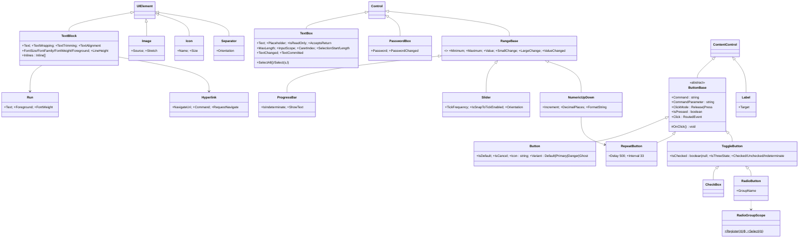
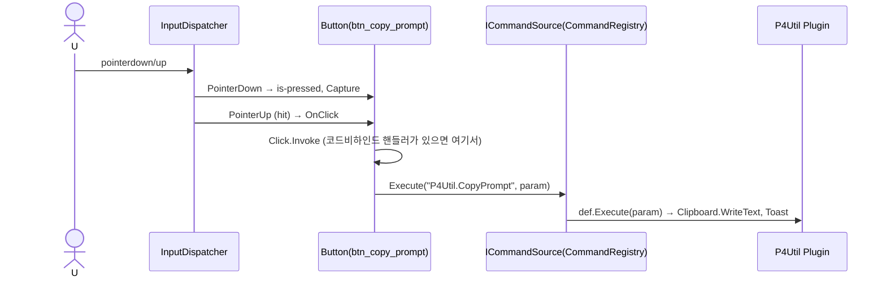
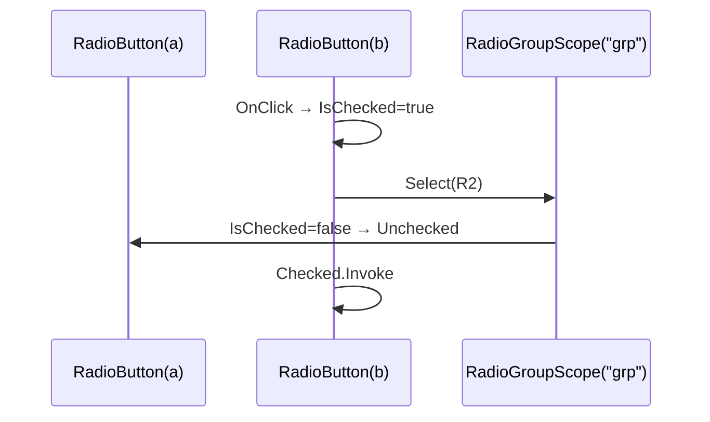
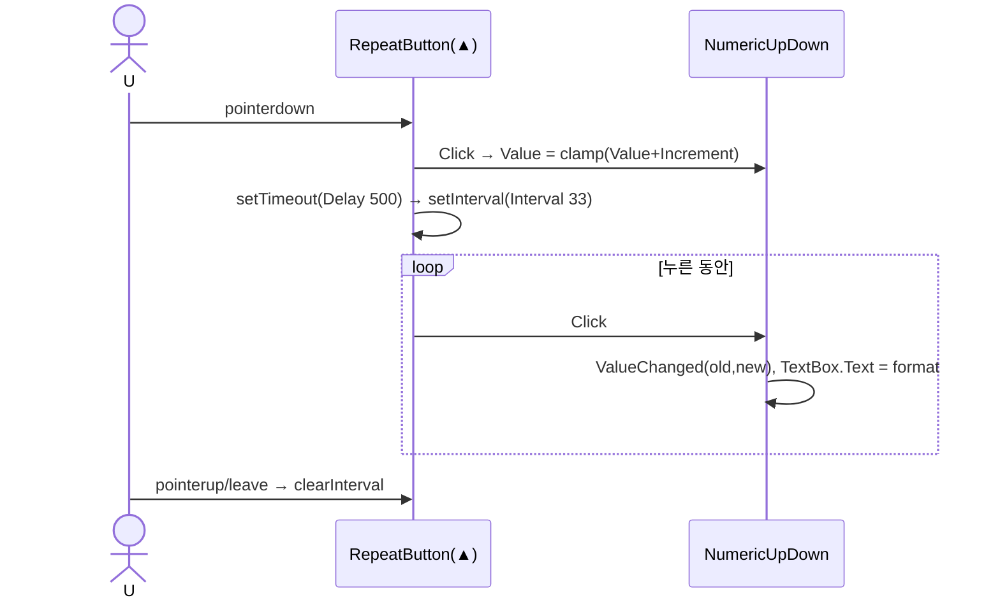
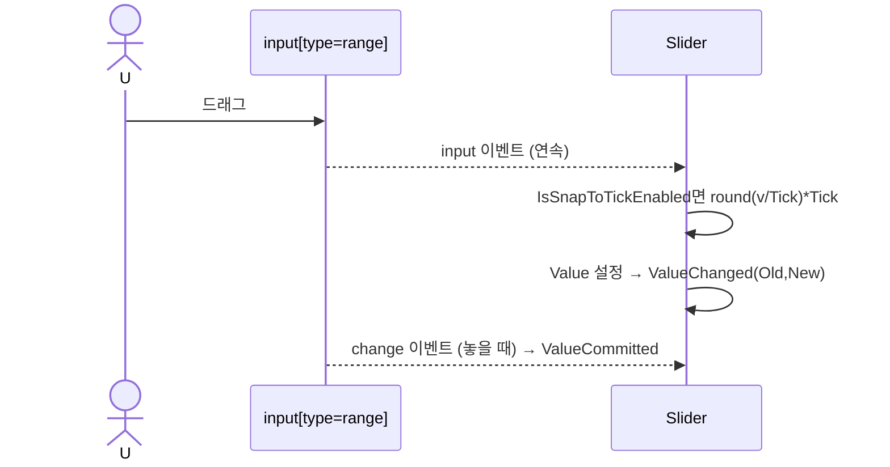

# 09. 기본 컨트롤 — Button · Toggle · Text · Range · Image/Icon

> 구현 Phase **P3(Shell 필수분) → P4(나머지)**. Shell(10)이 뜨기 위해 반드시 필요한 것: Button, ToggleButton, TextBlock, Icon, Separator. 모든 컨트롤은 04의 `UIProperty`/`RoutedEvent`를 사용하고 DOM 구조를 생성자에서 고정한다.

## 9.1 공통 규칙 · 라이브러리

| 항목 | 규칙 |
|---|---|
| DOM | 생성자에서 고정. 속성 변경 = class/style/attr/textContent만. `innerHTML` 금지 |
| CSS | `Styles/Controls/{Control}.css`, 클래스 `gui-{control}`, 파트 `gui-{control}__{part}`, 상태 `is-*`, 변형 `variant-*`. 색·크기 리터럴 금지 → `var(--*)` |
| 크기 | `--gui-control-height: 28px`, `--gui-radius: 6px`, `--gui-gap: 8px`, 폰트 `--gui-font-size`(13) |
| 접근성 | `role`, `aria-*` 필수. Playwright `getByRole` 가능 |
| 키보드 | WPF 기본 키(Space/Enter 버튼, 화살표 리스트/슬라이더, Tab) |
| 등록 | `@RegisterElement("Button")` 클래스 데코레이터 → `ElementCatalog`(07). 데코레이터는 모듈 로드 시 등록 큐에 넣고, `Gui.RegisterBuiltInElements()`(04)가 큐를 `ElementCatalog`에 반영한다 |
| 아이콘 | `lucide-static` SVG → `Scripts/GenIcons.mjs`(svgo) → `Styles/Icons.svg` 스프라이트 → `<svg><use href="#lucide-play"/></svg>`, `currentColor` |
| 네이티브 요소 | Button `<button type=button>`, TextBox `<input>`/`<textarea>`, Slider `<input type=range>` → 접근성·IME 공짜. CheckBox/Radio는 커스텀(테마 자유도) |

## 9.2 클래스 구조 (C9-1)



| 파일 | P |
|---|---|
| `Controls/ButtonBase.ts` `Button.ts` `ToggleButton.ts` | P3 |
| `Controls/RepeatButton.ts` | P4 |
| `Controls/CheckBox.ts` `RadioButton.ts` `RadioGroupScope.ts` | P4 |
| `Controls/TextBlock.ts` `Inlines.ts`(Run, Hyperlink) | P3 (Inlines P4) |
| `Controls/TextBox.ts` `PasswordBox.ts` `Label.ts` | P4 |
| `Controls/RangeBase.ts` `ProgressBar.ts` `Slider.ts` `NumericUpDown.ts` | P4 |
| `Controls/Image.ts` `Icon.ts` `Separator.ts` | P3 |
| `Controls/RegisterElement.ts` | P3 |
| `Styles/Controls/*.css` (컨트롤당 1) | |

## 9.3 UI 디자인

### Button

```
┌────────────────────┐  height 28, padding 0 12, radius 6, gap 6, font 13/500
│ [icon] Content     │  icon 16px, currentColor
└────────────────────┘
```

| Variant | 배경 | 글자 | 테두리 | hover | active |
|---|---|---|---|---|---|
| Default | `--button-background` | `--button-text` | `--border` | `--button-hover-background` | `--button-active-background` |
| Primary | `--primary` | `--primary-foreground` | none | `--primary-hover` | `--primary-active` |
| Danger | `--error` | `--error-foreground` | none | 어둡게 8% | 12% |
| Ghost | transparent | `--text-base` | none | `--background-hover` | `--background-active` |

상태: `is-pressed`(pointer down), `:focus-visible` → `outline: 2px solid var(--primary); outline-offset: 1px`, `is-disabled`(opacity .5, `inert`). Icon만 있고 Content 없으면 `is-icon-only` → 정사각 28×28.

### ToggleButton / CheckBox / RadioButton

- ToggleButton: Button과 같고 `is-checked` → `--primary-muted` 배경, `aria-pressed`.
- CheckBox DOM: `<label class="gui-checkbox" role="checkbox" tabindex=0><span class="gui-checkbox__box"><svg check/></span><span class="gui-checkbox__content"/></label>`. 박스 16×16 radius 4. `null` 상태는 가로줄.
- RadioButton: 원 16×16, 내부 점 8×8 `--primary`.

### TextBox

```
┌──────────────────────────────┐  height 28 (AcceptsReturn이면 auto, min 3줄), padding 0 8
│ placeholder / text            │  bg --input-background, border 1px --border, focus border --primary
└──────────────────────────────┘  invalid: border --error (IsValid=false)
```

### Range

- ProgressBar: 트랙 6px radius 3 `--border`, 채움 `--primary`. `IsIndeterminate` → CSS 애니메이션 슬라이드. `ShowText` → 우측 `45%`.
- Slider: `<input type=range>` + `accent-color: var(--primary)`; 커스텀 트랙은 P10.
- NumericUpDown: `[ TextBox ][▲][▼]` 오른쪽 스핀 버튼 각 14px, RepeatButton.

## 9.4 핵심 구현

```ts
@RegisterElement("Button")
export class Button extends ButtonBase
{
	public static readonly VariantProperty = UIProperty.Register<ButtonVariant>("Variant", Button, { Default: "Default", Parse: ParseEnum(kButtonVariants) });
	public static readonly IconProperty = UIProperty.Register<string>("Icon", Button, { Default: "" });
	public static readonly IsDefaultProperty = UIProperty.Register<boolean>("IsDefault", Button, { Default: false });

	private readonly icon_: Icon;
	private readonly presenter_: HTMLSpanElement;

	public constructor()
	{
		super();
		this.Element.classList.add("gui-button");
		this.icon_ = new Icon();
		this.icon_.Visibility = Visibility.Collapsed;
		this.Element.append(this.icon_.Element);
		this.presenter_ = document.createElement("span");
		this.presenter_.className = "gui-button__content";
		this.Element.append(this.presenter_);
	}

	//////////////////////////////////////////////////////////////////////////////////////
	// 등록 속성 변경을 DOM에 반영한다.
	protected override ApplyProperty(_prop: UIProperty<unknown>, _value: unknown): void
	{
		super.ApplyProperty(_prop, _value);
		switch (_prop)
		{
			case Button.VariantProperty:
				this.SetVariantClass(_value as string);
				break;
			case Button.IconProperty:
				this.icon_.Name = _value as string;
				this.icon_.Visibility = (_value as string).length > 0 ? Visibility.Visible : Visibility.Collapsed;
				this.Element.classList.toggle("is-icon-only", this.Content === null && (_value as string).length > 0);
				break;
		}
	}
}

// ButtonBase: 이벤트 연결은 생성자에서 04의 RoutedEvent로
//   PointerDown → IsPressed=true, Capture      PointerUp → pressed && 히트 → OnClick()
//   KeyDown Enter/Space → OnClick()            ClickMode=Press면 PointerDown에서 OnClick
protected OnClick(): void
{
	if (!this.IsEnabled)
		return;
	this.RaiseEvent(this.Click, new RoutedEventArgs(this));
	if (this.Command.length > 0 && this.CommandSource !== null)     // LoadContext.Commands (07)
		void this.CommandSource.Execute(this.Command, this.CommandParameter);
}
```

- TextBox: 네이티브 `input` 이벤트 → `Text` 갱신(`syncing_` 플래그로 `ApplyProperty`가 `input.value`를 다시 쓰지 않도록) → `TextChanged`. `TextCommitted`는 Enter(AcceptsReturn=false) 또는 blur. `InputScope=Number` → `inputmode=numeric`. 바인딩은 단방향(D-14)이므로 코드비하인드가 `TextCommitted`에서 `DataList.Set`한다.
- RadioGroupScope: `RadioButton` Loaded 시 `GroupName`이 있으면 root 기준 `Map<groupName, Set<RadioButton>>`, 없으면 부모 기준. 선택 시 나머지 `IsChecked=false`. 화살표 키로 그룹 내 이동.
- RangeBase: `Coerce`로 `Minimum ≤ Value ≤ Maximum` 보정, `Minimum > Maximum` 설정 순서와 무관하게 마지막 값 기준 재보정. `aria-valuemin/max/now`.
- Icon: `Name` 변경 → `<use href="#lucide-{name}">`만 갱신. 스프라이트에 없으면 `Log.Warn("Gui", "icon missing")` + 빈 사각.

## 9.5 시퀀스

### S9-1 버튼 클릭 → Command



### S9-2 TextBox 입력 → TextCommitted → DataList

```mermaid
sequenceDiagram
	actor U
	participant I as input(DOM)
	participant TB as TextBox(num_rev_from)
	participant CB as MainControl(코드비하인드)
	participant DL as DataList
	U->>I: 키 입력
	I-->>TB: input 이벤트 → syncing_=true; Text=value; syncing_=false
	TB->>TB: TextChanged.Invoke
	U->>I: Enter
	TB->>TB: KeyDown Enter && !AcceptsReturn → TextCommitted.Invoke
	TB->>CB: onRevFromCommitted_
	CB->>DL: Set("revFrom", num(text)) → 바인딩 재평가(btn_run.IsEnabled 등)
```

### S9-3 RadioButton 선택



### S9-4 NumericUpDown 스핀 (RepeatButton)



### S9-5 Slider 드래그 (네이티브 range)



## 9.6 테스트

| 파일 | 확인 |
|---|---|
| `Button.test.ts` | Variant 클래스, Icon 표시/is-icon-only, Enter/Space Click, IsEnabled=false 무반응, Command 호출 |
| `ToggleButton.test.ts` | 2/3 상태 순환, aria-pressed |
| `RadioButton.test.ts` | 그룹 배타, GroupName 있고/없고 |
| `TextBox.test.ts` | input → Text, Text 설정 → value, Enter Committed, AcceptsReturn textarea, MaxLength |
| `RangeBase.test.ts` | Coerce Min≤Value≤Max, Min>Max 갱신 순서 |
| `Icon.test.ts` | `<use href>` 갱신, 미존재 이름 경고 |
| Harness | `Pages/Buttons.xml`, `Pages/Inputs.xml` 스크린샷 |

## 9.7 체크리스트

- [ ] P3: Button/ToggleButton/TextBlock/Icon/Separator + CSS → Shell 렌더 가능
- [ ] P4: 나머지 12개, `GenIcons.mjs`로 사용 아이콘 스프라이트 생성(약 40개)
- [ ] 모든 컨트롤 role/aria, Tab 이동 순서 확인
- [ ] 테스트 6파일 + Harness 2페이지
