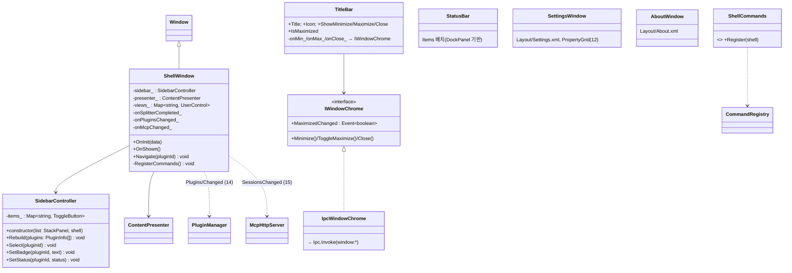
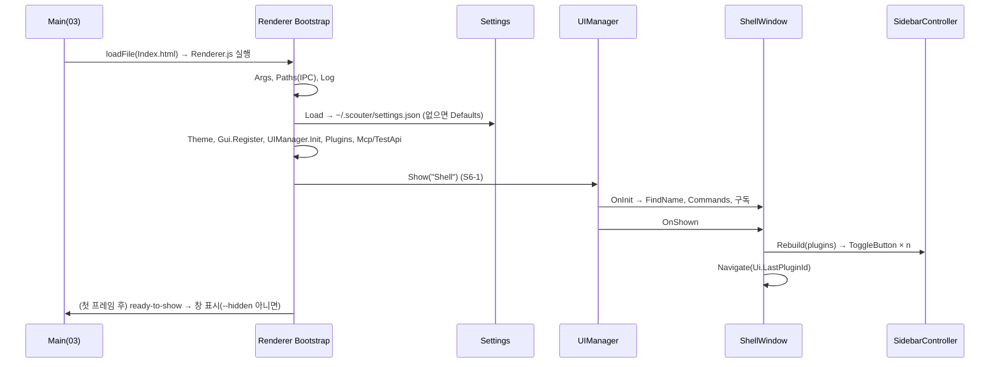
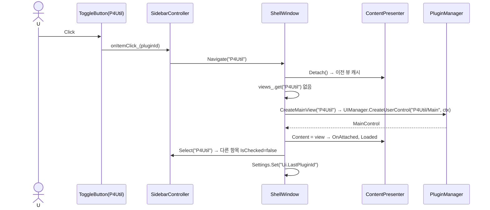
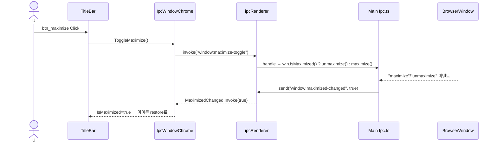
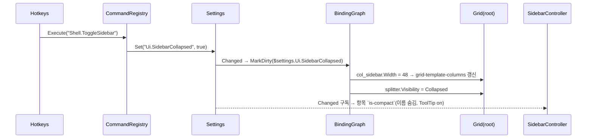

# 10. Shell — 메인 화면 · 사이드바 · TitleBar · StatusBar · 부트스트랩

> 구현 Phase **P3**. 이 문서가 끝나면 앱이 "앱처럼" 보인다: 사이드바·커스텀 타이틀바·상태바·설정 화면(기본 폼). Plugin이 없으므로 사이드바는 더미 항목 또는 바로 "설정"만.

## 10.1 라이브러리

| 기능 | 구현 |
|---|---|
| 창 제어 | `Ipc.Invoke("window:minimize|maximize-toggle|close")`, `Ipc.On("window:maximized-changed")` (03 IPC 표, D-22) |
| 드래그 영역 | CSS `-webkit-app-region: drag` (TitleBar), 버튼에 `no-drag` |
| 사이드바 폭 | Grid 열 바인딩 `{$settings.Ui.SidebarCollapsed} ? 48 : {$settings.Ui.SidebarWidth}` + GridSplitter(05) |
| Plugin 전환 | `ContentPresenter.Detach()` 캐시(06 S6-4) |
| 시스템 액센트 | `matchMedia("(prefers-color-scheme: dark)")`는 13에서; Shell은 토큰만 사용 |
| 외부 링크 | `INavigationService.OpenExternal(url)` → `shell.openExternal` |

## 10.2 UI 디자인

```
┌────────────────────────────────────────────────────────┐
│ ◉ Scouter                                       ─  □  × │ row0 TitleBar 32px, drag region
├─────────────┬────────────────────────────────────────────┤
│ ▶ P4Util   ││                                                │ row1 *
│   Inspector││   content (ContentPresenter)                    │  col_sidebar 150 (48~400), collapsed 48
│   Palette  ││                                                │  splitter 4px (Ui.SplitterEnabled)
│            ││                                                │
│ ────────── ││                                                │  footer: ⚙ 설정, ◂ 접기
│ ⚙ 설정     ││                                                │
│ ◂          ││                                                │
├─────────────┴────────────────────────────────────────────┤
│ ● MCP :9515   2 sessions                    oc-2 │ v0.4.0 │ row2 StatusBar 24px
└────────────────────────────────────────────────────────┘
```

- 사이드바 항목 = `ToggleButton Variant=Ghost` 32px, 아이콘 16 + 이름 + 우측 `Badge`(선택). 접힌 상태(48px)는 아이콘만, 이름은 ToolTip.
- 선택 항목: `is-checked` → `--primary-muted` 배경 + 좌측 2px `--primary` 바.
- Plugin 순서는 `Ui.PluginOrder`, 드래그 정렬은 P10.
- StatusBar: 좌 `dot_mcp`(StatusDot Ok/Idle/Error) `MCP :{@mcpPort}` `{@mcpSessions} sessions`, 우 테마 이름(클릭 → 테마 피커 13), 버전(클릭 → About).
- `Ui.NativeFrame=true`면 TitleBar `Collapsed`, 변경 시 "재시작 필요" 토스트 + `app:relaunch` 버튼.

## 10.3 Shell.xml

```xml
<Window xmlns="scouter/gui" Name="shell" Background="{$theme.background-base}">
	<DataList>
		<Data Key="appVersion" Type="String" Value=""/>
		<Data Key="mcpSessions" Type="Int" Value="0"/>
		<Data Key="mcpPort" Type="Int" Value="9515"/>
		<Data Key="mcpState" Type="String" Value="Idle"/>
		<Data Key="themeName" Type="String" Value=""/>
	</DataList>

	<Grid ContentHost="true" Name="root" RowDefinitions="Auto,*,Auto">
		<Grid.ColumnDefinitions>
			<ColumnDefinition Name="col_sidebar" Width="{$settings.Ui.SidebarCollapsed} ? 48 : {$settings.Ui.SidebarWidth}" MinWidth="48" MaxWidth="400"/>
			<ColumnDefinition Width="*"/>
		</Grid.ColumnDefinitions>

		<TitleBar Grid.Row="0" Grid.ColumnSpan="2" Name="title_bar" Title="Scouter" Icon="scouter"
		          Visibility="{$settings.Ui.NativeFrame} ? `Collapsed` : `Visible`"/>

		<Border Grid.Row="1" Grid.Column="0" Name="sidebar" Background="{$theme.background-panel}" BorderBrush="{$theme.border-weak-base}" BorderThickness="0,0,1,0">
			<DockPanel>
				<StackPanel DockPanel.Dock="Bottom" Name="sidebar_footer" Spacing="2" Margin="6">
					<Separator Margin="0,0,0,6"/>
					<ToggleButton Name="btn_settings" Content="설정" Icon="settings" Variant="Ghost" Command="Shell.OpenSettings"/>
					<Button Name="btn_collapse" Icon="panel-left-close" Variant="Ghost" Command="Shell.ToggleSidebar" ToolTip="사이드바 접기 (Ctrl+B)"/>
				</StackPanel>
				<ScrollViewer VerticalScrollBarVisibility="Auto">
					<StackPanel Name="plugin_list" Spacing="2" Margin="6"/>
				</ScrollViewer>
			</DockPanel>
		</Border>

		<GridSplitter Grid.Row="1" Grid.Column="0" Name="splitter" HorizontalAlignment="Right" ResizeDirection="Columns"
		              Visibility="{$settings.Ui.SplitterEnabled} &amp;&amp; !{$settings.Ui.SidebarCollapsed} ? `Visible` : `Collapsed`"/>

		<ContentPresenter Grid.Row="1" Grid.Column="1" Name="content"/>

		<StatusBar Grid.Row="2" Grid.ColumnSpan="2" Name="status_bar">
			<StatusBarItem><StatusDot Name="dot_mcp" Status="{@mcpState}"/></StatusBarItem>
			<StatusBarItem><TextBlock Text="MCP :{@mcpPort}"/></StatusBarItem>
			<StatusBarItem><TextBlock Name="txt_sessions" Text="{@mcpSessions} sessions"/></StatusBarItem>
			<StatusBarItem DockPanel.Dock="Right"><Button Name="btn_about" Variant="Ghost" Content="v{@appVersion}" Command="Shell.OpenAbout"/></StatusBarItem>
			<StatusBarItem DockPanel.Dock="Right"><Button Name="btn_theme" Variant="Ghost" Content="{@themeName}" Command="Shell.OpenThemePicker"/></StatusBarItem>
		</StatusBar>
	</Grid>
</Window>
```

## 10.4 클래스 구조 (C10-1)



| 파일 | 내용 |
|---|---|
| `Renderer/Layout/Shell.xml` `Settings.xml` `About.xml` `ThemePicker.xml`(13) | |
| `Renderer/Shell/ShellWindow.ts` | `@RegisterWindow("Shell")` |
| `Renderer/Shell/SidebarController.ts` | Plugin 목록 → ToggleButton |
| `Renderer/Shell/ShellCommands.ts` | `Shell.*` 명령 9개(§10.6) |
| `Renderer/Shell/IpcWindowChrome.ts` | Gui의 `IWindowChrome` 구현(Gui는 Electron을 모름) |
| `Renderer/Shell/SettingsWindow.ts` `AboutWindow.ts` | 다이얼로그 |
| `Scouter.Gui/Controls/Scouter/TitleBar.ts`, `Controls/StatusBar.ts` | 컨트롤 자체는 Gui |
| `Renderer/Bootstrap.ts` | §10.7 |

## 10.5 ShellWindow 핵심

```ts
@RegisterWindow("Shell")
export class ShellWindow extends Window
{
	private sidebar_!: SidebarController;
	private presenter_!: ContentPresenter;
	private readonly views_ = new Map<string, UserControl>();

	protected override OnInit(_data: DataList): void
	{
		this.presenter_ = this.RequireName(ContentPresenter, "content");
		this.sidebar_ = new SidebarController(this.RequireName(StackPanel, "plugin_list"), this);
		this.RequireName(GridSplitter, "splitter").DragCompleted.Add(this.onSplitterCompleted_);
		this.RequireName(TitleBar, "title_bar").Chrome = new IpcWindowChrome();
		ShellCommands.Register(this);
		this.bag_.Add(PluginManager.Changed.Add(this.onPluginsChanged_));
		this.bag_.Add(McpHttpServer.SessionsChanged.Add(this.onMcpChanged_));
		this.bag_.Add(ThemeManager.Changed.Add(() => this.DataList.Set("themeName", ThemeManager.Current.Name)));
		_data.Set("appVersion", Paths.Version);
	}

	protected override OnShown(): void
	{
		this.sidebar_.Rebuild(PluginManager.List());
		const last = Settings.Get<string>("Ui.LastPluginId");
		this.Navigate(PluginManager.Has(last) ? last : (PluginManager.List()[0]?.Id ?? ""));
	}

	//////////////////////////////////////////////////////////////////////////////////////
	// 사이드바 선택 → 콘텐츠 스와프. 이전 뷰는 Detach만 하고 캐시(상태 유지).
	public Navigate(_pluginId: string): void
	{
		const prev = this.presenter_.Detach();
		if (prev instanceof UserControl && prev.PluginId !== undefined)
			this.views_.set(prev.PluginId, prev);
		if (_pluginId.length === 0)
			return;
		let view = this.views_.get(_pluginId);
		if (view === undefined)
			view = PluginManager.CreateMainView(_pluginId);           // 실패 시 PluginError.xml 뷰 (14)
		this.presenter_.Content = view;
		this.sidebar_.Select(_pluginId);
		Settings.Set("Ui.LastPluginId", _pluginId);
	}

	private readonly onSplitterCompleted_ = (_s: UIElement, _a: RoutedEventArgs): void =>
	{
		void _s; void _a;
		const col = this.RequireName(Grid, "root").ColumnDefinitions.Get(0);
		Settings.Set("Ui.SidebarWidth", Math.round(col.ActualWidth));
	};
}
```

## 10.6 명령 · 설정

| 명령 | 핫키 | 동작 |
|---|---|---|
| `Shell.ToggleSidebar` | Ctrl+B | `Ui.SidebarCollapsed` 토글 |
| `Shell.OpenSettings` | Ctrl+, | `UIManager.ShowDialog("Settings")` |
| `Shell.OpenAbout` | — | `ShowDialog("About")` |
| `Shell.OpenThemePicker` | Ctrl+K Ctrl+T | 13 |
| `Shell.NextPlugin` / `PrevPlugin` | Ctrl+Tab / Ctrl+Shift+Tab | 순환 Navigate |
| `Shell.ReloadLayout` | Ctrl+R (dev) | `UIManager.Reload(Active)` |
| `Shell.ToggleDevTools` | F12 | `Ipc.Invoke("window:toggle-devtools")` (dev) |
| `Shell.ShowPlugin` | — | `CommandParameter`(PluginId)로 `Navigate(id)`. 16 `CommandExecute`, 18 팔레트 "Plugin: X" 항목이 사용 |

| 설정 | 기본 | 범위 |
|---|---|---|
| `Ui.SidebarWidth` | 150 | 100~400 |
| `Ui.SidebarCollapsed` | false | |
| `Ui.SplitterEnabled` | true | A-03 |
| `Ui.NativeFrame` | false | 재시작 필요 |
| `Ui.LastPluginId` | "" | |
| `Ui.PluginOrder` | [] | |
| `App.CloseToTray` | true | 21 |
| `App.AutoStart` | false | 21 |
| `App.AutoSelectNewPlugin` | true | 새 Plugin 설치 시 자동 이동 |

## 10.7 부트스트랩 (`Renderer/Bootstrap.ts`) — 최종 10단계

```ts
export async function BootstrapAsync(): Promise<void>
{
	Args.Parse(process.argv);                                                 // 1
	await Paths.Init();                                                       //   IPC app:get-paths
	Log.SetSink(new FileLogSink(Paths.LogsDir)); Log.Info("App", "start");     // 1
	await Settings.Load(Paths.SettingsFile, SettingsSchema, Defaults);        // 2
	await ThemeManager.InitAsync();                                           // 3  (13; P3에서는 고정 토큰 CSS만 주입)
	Gui.RegisterBuiltInElements();                                            // 4
	UIManager.Init(document.getElementById("root")!, new FsLayoutProvider());  // 5
	Hotkeys.Attach(UIManager.Root);
	if (!Args.Safe)
		await PluginManager.LoadAllAsync();                                   // 6  (14)
	await McpHttpServer.StartAsync(Args.Port ?? Settings.Get("Mcp.Port"));    // 7  (15) — P3에서는 TestApi용 http 서버만
	if (Args.IsTest)
		TestApiServer.Attach(McpHttpServer);                             // 8  (20)
	UIManager.Show("Shell");                                                  // 9
	if (!Paths.IsPackaged)
		HotReloader.Start(UIManager.LayoutProvider);                          // 10 (07)
}
```

각 단계 실패 시: 1~5는 치명(에러 화면 `document.body.textContent`), 6은 Plugin별 격리, 7은 포트 +1 ×5 재시도 후 실패하면 토스트 + StatusDot Error, 8~10은 로그만.

## 10.8 시퀀스

### S10-1 앱 시작 → Shell 표시



### S10-2 사이드바 항목 클릭 → Plugin 전환



### S10-3 TitleBar 버튼 → IPC → BrowserWindow



### S10-4 Ctrl+B 접기



## 10.9 테스트

| 종류 | 확인 |
|---|---|
| Unit `SidebarController.test.ts` | Rebuild n개, Select 배타, Badge |
| Unit `ShellCommands.test.ts` | ToggleSidebar 설정 토글, Next/Prev 순환 |
| E2E `Shell.e2e.ts` (Playwright electron, 20) | `--test`로 실행 → `data-testid=plugin_list` 존재, Ctrl+B → col 폭 48, 스플리터 드래그 → settings.json 값, 닫기 → window.json 저장 |
| Test API | `GET /test/tree`에 Shell 트리, `POST /test/click {name:"btn_settings"}` → Settings 다이얼로그 |

## 10.10 P3 체크리스트

- [ ] `npm run dev` → Shell 화면, 창 이동/최대화/닫기 모두 커스텀 TitleBar로
- [ ] 사이드바 스플리터 드래그 → 재시작 후 폭 유지
- [ ] Ctrl+B, Ctrl+, 동작; Settings 다이얼로그는 P3에서 리스트 + TextBox 수준(PropertyGrid는 P4)
- [ ] Bootstrap 10단계 모든 실패 경로 로그/토스트
- [ ] E2E 1개 그린
