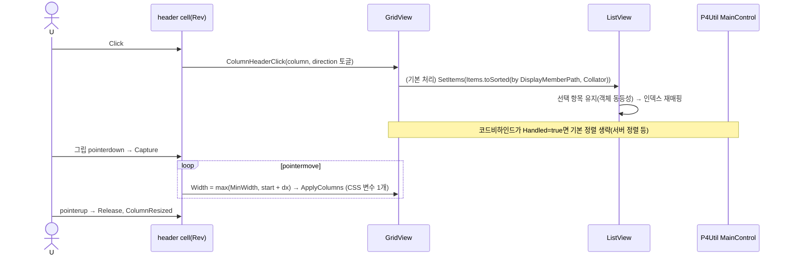

# 11. 항목 컨트롤 — ItemsControl · Selector · ListBox · ComboBox · Tab · Tree · ListView/GridView · DataGrid · Menu · ToolBar · Popup/ToolTip · Expander/GroupBox

> 구현 Phase **P4(1차: ListBox, ComboBox, TabControl, StatusBar, ListView+GridView, Popup, ToolTip, Expander, GroupBox)** → **P10(2차: TreeView, DataGrid, Menu/ContextMenu, ToolBar)**. P4Util(19)이 GridView를, ScouterCore 설정 화면(16)이 ListBox를 사용하므로 1차에 포함.

## 11.1 라이브러리

| 기능 | 구현 |
|---|---|
| 항목 ↔ 컨테이너 | 자체 `ItemContainerGenerator` (Map index→container), 템플릿은 코드 함수 `ItemTemplate: (item) => UIElement` (XML DataTemplate 제외 4.9) |
| 가상화 | `VirtualList`(12) 내장 — `IsVirtualizing=true` 및 Items > 200이면 자동 |
| 드롭다운/메뉴/툴팁 | `UIManager.ShowPopup` (06 Popup 레이어 z200) + 자체 `Placement` 계산(`getBoundingClientRect` + `visualViewport`) |
| 정렬 | `Array.prototype.toSorted` + `Intl.Collator("ko")` |
| GridView 열 폭 | CSS Grid `grid-template-columns` 공유(헤더/행 동일 문자열), 리사이즈는 헤더 그립 + `InputDispatcher.Capture` |
| 키보드 | WPF 준수: ↑↓ Home End PageUp/Down, Shift/Ctrl 다중, 타이핑 검색(1초 버퍼) |

## 11.2 클래스 구조 (C11-1)

```mermaid
classDiagram
	class Control
	class ItemsControl {
		+Items : ReadonlyArray~unknown~
		+SetItems(items) void
		+ItemTemplate : (item,index)=>UIElement
		+DisplayMemberPath : string
		+IsVirtualizing : boolean
		+ItemsPanel : Panel
		#GetContainer(index) ItemContainer
		#PrepareContainer(container,item) void
		-generator_ : ItemContainerGenerator
	}
	class ItemContainerGenerator { +Realize(i); +Recycle(i); +ContainerFromIndex(i); +IndexFromContainer(c) }
	class Selector {
		<<abstract>>
		+SelectionMode : Single|Multiple|Extended
		+SelectedIndex/SelectedItem/SelectedItems
		+SelectionChanged
		#SelectIndices(indices, source) void
		#selection_ : SelectionModel
	}
	class SelectionModel { +Primary; +Anchor; +Replace(indices) SelectionDiff; +Toggle(i); +Range(a,b) }
	class ListBox { +ScrollIntoView(i) }
	class ListBoxItem { +IsSelected; +SetSelected(b) }
	class ComboBox { +IsEditable; +IsDropDownOpen; +MaxDropDownHeight 300; +Text; +Placeholder; +DropDownOpened/Closed }
	class ListView { +View : GridView }
	class GridView { +Columns : GridViewColumn[]; +ColumnHeaderClick; +ColumnResized; +AllowsColumnReorder(false) }
	class GridViewColumn { +Header; +DisplayMemberPath; +Width : number|"*"|"Auto"; +MinWidth; +CellTemplate }
	class TabControl { +TabStripPlacement; +SelectedIndex; +SelectionChanged }
	class TabItem { +Header; +IsClosable; +CloseRequested }
	class TreeView { +SelectedItem; +SelectedItemChanged; +SetItems(nodes, adapter) }
	class TreeViewItem { +Header; +IsExpanded; +IsSelected; +Items; +Expanded/Collapsed }
	class DataGrid { +Columns; +AutoGenerateColumns; +CanUserSortColumns; +CanUserResizeColumns; +IsReadOnly=true }
	class MenuBase { +IsOpen; +Opened/Closed }
	class Menu
	class ContextMenu { +PlacementTarget }
	class MenuItem { +Header; +Icon; +InputGestureText; +IsCheckable; +IsChecked; +Command; +Items; +Click }
	class ToolBar { +Overflow » 드롭다운 }
	class StatusBar
	class StatusBarItem { +DockPanel.Dock }
	class Popup { +IsOpen; +PlacementTarget; +Placement; +HorizontalOffset/VerticalOffset; +StaysOpen; +Opened/Closed }
	class PopupPlacer { <<static>> +Compute(target, size, placement) Rect }
	class ToolTipService { <<static>> +Attach(el, content); InitialShowDelay 400; BetweenShowDelay 100 }
	class Expander { +Header; +IsExpanded; +ExpandDirection; +Expanded/Collapsed }
	class GroupBox { +Header }
	Control <|-- ItemsControl
	ItemsControl --> ItemContainerGenerator
	ItemsControl <|-- Selector
	Selector --> SelectionModel
	Selector <|-- ListBox
	Selector <|-- ComboBox
	Selector <|-- TabControl
	Selector <|-- DataGrid
	ListBox <|-- ListView
	ListView --> GridView
	GridView --> GridViewColumn
	ItemsControl <|-- TreeView
	ItemsControl <|-- MenuBase
	MenuBase <|-- Menu
	MenuBase <|-- ContextMenu
	ItemsControl <|-- ToolBar
	ItemsControl <|-- StatusBar
	ComboBox --> Popup
	ContextMenu --> Popup
	Popup --> PopupPlacer
	ToolTipService --> Popup
	ContentControl <|-- Expander
	ContentControl <|-- GroupBox
	ContentControl <|-- ListBoxItem
	ContentControl <|-- TabItem
```



## 11.3 UI 디자인

| 컨트롤 | DOM · 스타일 |
|---|---|
| ListBox | `div.gui-listbox[role=listbox][tabindex=0] > div.gui-listbox__item[role=option][aria-selected]`. 항목 높이 28, padding 0 8, `is-selected` → `--primary-muted` bg, hover `--background-hover`, 포커스 항목 outline 점선 |
| ComboBox | `div.gui-combobox > button.gui-combobox__toggle[aria-haspopup=listbox] (span.value + Icon chevron-down)`, 드롭다운 = ListBox in Popup, 폭 = 앵커 폭 이상, max-height 300 스크롤. `IsEditable` → toggle 대신 `<input>` + chevron |
| TabControl | `div.gui-tabcontrol > div.gui-tabcontrol__strip[role=tablist] > button.gui-tab[role=tab] ; div.gui-tabcontrol__content`. 탭 32px, 선택 하단 2px `--primary`, `IsClosable` → 우측 × Ghost 16 |
| GridView | `div.gui-listview > div.gui-gridview__header(grid) ; div.gui-listview__body > div.gui-gridview__row(grid)`. 헤더 28px `--background-panel`, 열 경계 리사이즈 그립 6px hover 시 `col-resize`, 정렬 방향 아이콘 chevron-up/down |
| TreeView | `role=tree`, 항목 `role=treeitem aria-expanded`, 들여쓰기 `--gui-tree-indent 16px` × depth (`style="--depth"`), 토글 chevron-right 회전 90° |
| Menu | `role=menubar/menu`, 항목 28px, 아이콘 열 20, 우측 `InputGestureText` `--text-weak`, 서브메뉴 chevron-right, 체커블 check 아이콘 |
| ToolBar | 32px flex, gap 2, 버튼 Ghost 28, 오버플로우 `»` |
| StatusBar | 24px, 폰트 12, `--background-panel`, 상단 1px border, 항목 padding 0 8, DockPanel |
| Popup | `.gui-popup` 절대위치, bg `--background-panel`, border `--border`, radius 6, shadow `--shadow-md`, 진입 fade 80ms |
| ToolTip | 작은 Popup, padding 4 8, 폰트 12, bg `--background-inverted`(있으면) |
| Expander | 헤더 28px 버튼(chevron + Header), 본문 padding 8 0 0 20 |
| GroupBox | `<fieldset class=gui-groupbox><legend>` border `--border` radius 6, legend 폰트 12 `--text-weak` |

## 11.4 핵심 구현 발췌

```ts
// Selector.SelectIndices — 변경된 컨테이너만 갱신 (v4 유지)
protected SelectIndices(_indices: number[], _source: SelectionSource): void
{
	const diff = this.selection_.Replace(_indices);
	if (diff.IsEmpty)
		return;
	for (const idx of diff.Removed) this.GetContainer(idx)?.SetSelected(false);
	for (const idx of diff.Added) this.GetContainer(idx)?.SetSelected(true);
	this.RaiseEvent(this.SelectionChanged, new SelectionChangedEventArgs(this, diff.AddedItems(this.Items), diff.RemovedItems(this.Items), _source));
}

// GridView 열 폭 → 헤더·모든 행이 공유하는 CSS 변수 1개만 갱신
private ApplyColumns(): void
{
	const tpl = this.columns_.map(c => typeof c.Width === "number" ? `${c.Width}px` : c.Width === "*" ? "minmax(80px,1fr)" : "max-content").join(" ");
	this.Element.style.setProperty("--gui-grid-columns", tpl);        // .gui-gridview__header, __row { grid-template-columns: var(--gui-grid-columns) }
}

// PopupPlacer — 화면 이탈 시 반대쪽으로 flip, 좌우는 clamp
export function ComputePlacement(_target: DOMRect, _size: Size, _placement: Placement, _ox: number, _oy: number): Rect
{
	const vw = window.visualViewport?.width ?? window.innerWidth;
	const vh = window.visualViewport?.height ?? window.innerHeight;
	let x = _target.left + _ox, y = _target.bottom + _oy;
	if (_placement === "Bottom" && y + _size.Height > vh) y = _target.top - _size.Height - _oy;   // flip
	if (_placement === "Top") y = _target.top - _size.Height - _oy;
	if (_placement === "Right") { x = _target.right + _ox; y = _target.top + _oy; }
	if (_placement === "Left") { x = _target.left - _size.Width - _ox; y = _target.top + _oy; }
	return { X: Math.max(0, Math.min(x, vw - _size.Width)), Y: Math.max(0, Math.min(y, vh - _size.Height)), Width: _size.Width, Height: _size.Height };
}
```

그 외 규칙:
- `ItemsControl.SetItems(_items)`: 전체 재생성 대신 길이 차이만큼 컨테이너 추가/제거 후 `PrepareContainer` 재호출(재사용). `IsVirtualizing`이면 내부 `VirtualList`가 함.
- `ComboBox` 드롭다운: Popup의 `StaysOpen=false` → 외부 클릭/ESC/스크롤/창 리사이즈에 닫힘. 선택 시 닫고 toggle에 포커스 반환. 키: Alt+↓ 열기, 타이핑 검색.
- `TabControl`: 미선택 탭 콘텐츠 DOM 유지 + `hidden` 속성(상태 보존). `SizeChanged`는 보이는 탭만(12 CodeEditor layout 호출 절감).
- `TreeView.SetItems(nodes, { Children, Header, HasChildren? })`: `HasChildren`이 있고 Children 미로드면 `Expanded` 이벤트에서 지연 로드.
- `DataGrid`: 1차 읽기 전용, 정렬/리사이즈는 GridView 공유 코드(`ColumnHeaderBar` 내부 클래스).
- `ContextMenu`: `UIElement.ContextMenu` 속성(XML `<Button.ContextMenu>`), DOM `contextmenu` → `preventDefault` → `Popup Placement=Mouse`. 오직 하나만 열림(`MenuBase.s_open_`).
- `ToolTipService`: `ToolTip` 속성이 문자열이면 `title`이 아니라 커스텀 툴팁(테마 일관). pointerenter 후 400ms, 이동/누름/ESC에 즉시 숨김. 바인딩 보간되므로 동적 문자열 가능.

## 11.5 시퀀스

### S11-1 ListBox 항목 클릭(Extended: Ctrl/Shift)

```mermaid
sequenceDiagram
	actor U
	participant C as ListBoxItem(#5)
	participant LB as ListBox
	participant SM as SelectionModel
	U->>C: pointerdown (Shift)
	C->>LB: OnItemPointerDown(idx=5, mods)
	alt Shift
		LB->>SM: Range(Anchor=2, 5) → [2,3,4,5]
	else Ctrl
		LB->>SM: Toggle(5)
	else 없음
		LB->>SM: Replace([5]); Anchor=5
	end
	LB->>LB: SelectIndices → diff 컨테이너만 SetSelected
	LB->>LB: SelectionChanged(Added,Removed,Source=Pointer)
	LB->>LB: ScrollIntoView(5), 포커스 항목 갱신
```

### S11-2 ComboBox 열기 → 선택

```mermaid
sequenceDiagram
	actor U
	participant T as toggle(button)
	participant CB as ComboBox
	participant P as Popup
	participant UM as UIManager(Popup layer)
	participant L as ListBox(dropdown)
	U->>T: Click
	T->>CB: IsDropDownOpen = true
	CB->>P: PlacementTarget=this, MinWidth=앵커폭, IsOpen=true
	P->>UM: ShowPopup(P) → layer[Popup] append, ComputePlacement
	CB->>CB: DropDownOpened; L.SelectedIndex = this.SelectedIndex; L.Focus()
	U->>L: ↓ ↓ Enter (또는 클릭)
	L->>CB: SelectionChanged(Source=Keyboard)
	CB->>CB: SelectedIndex = idx; value text 갱신; SelectionChanged 버블
	CB->>P: IsOpen=false → UM.Close(P) → DropDownClosed
	CB->>T: Focus()
```

### S11-3 GridView 헤더 클릭 정렬 · 열 리사이즈



### S11-4 ContextMenu 열기 → MenuItem 실행

```mermaid
sequenceDiagram
	actor U
	participant E as UIElement(lst_files)
	participant CM as ContextMenu
	participant P as Popup(Placement=Mouse)
	participant MI as MenuItem("경로 복사")
	participant CR as CommandRegistry
	U->>E: contextmenu(x,y)
	E->>CM: Open(x,y) → MenuBase.s_open_?.Close()
	CM->>P: IsOpen=true (Placement=Mouse)
	U->>MI: Click (또는 ↓ Enter)
	MI->>MI: IsCheckable이면 IsChecked 토글
	MI->>MI: Click 이벤트 버블
	MI->>CR: Execute(Command, CommandParameter)
	MI->>CM: Close() → Closed; 포커스를 E로 반환
```

### S11-5 ToolTip 표시

```mermaid
sequenceDiagram
	actor U
	participant B as Button(btn_collapse)
	participant TS as ToolTipService
	participant P as Popup
	U->>B: pointerenter
	B->>TS: Schedule(el) → setTimeout(400)
	TS->>P: Show(content, Placement=Bottom, target=el)
	U->>B: pointerleave / pointerdown / ESC
	B->>TS: Cancel → P.IsOpen=false; BetweenShowDelay 100ms 동안 이웃 요소는 즉시 표시
```

## 11.6 테스트

| 파일 | 확인 |
|---|---|
| `SelectionModel.test.ts` | Replace/Toggle/Range diff, Anchor 유지 |
| `ListBox.test.ts` | SetItems 재사용, 키보드 이동, Extended 모드, DisplayMemberPath |
| `ComboBox.test.ts` | 열기/닫기, 외부 클릭, Alt+↓, IsEditable Text |
| `TabControl.test.ts` | hidden 토글, IsClosable CloseRequested |
| `GridView.test.ts` | 컬럼 템플릿 문자열, 정렬 방향, 리사이즈 MinWidth |
| `PopupPlacer.test.ts` | flip/clamp 4방향 |
| `TreeView.test.ts` | 지연 로드, ←→ 토글 (P10) |
| Harness | `Pages/Lists.xml`, `Pages/Menus.xml` |

## 11.7 체크리스트

- [ ] P4: ItemsControl/Selector/SelectionModel → ListBox → ComboBox → TabControl → ListView+GridView → Popup/ToolTip → Expander/GroupBox → StatusBar
- [ ] P4Util Main.xml `lst_files`(GridView Rev/Action/Path) 렌더 확인
- [ ] P10: TreeView, DataGrid, Menu/ContextMenu, ToolBar
- [ ] 200항목 이상 자동 가상화 성능 확인(1만 항목 60fps 스크롤)
