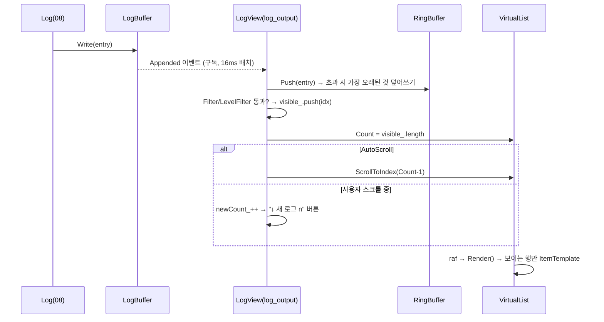
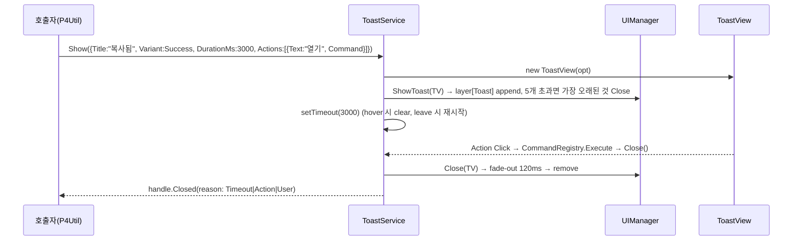
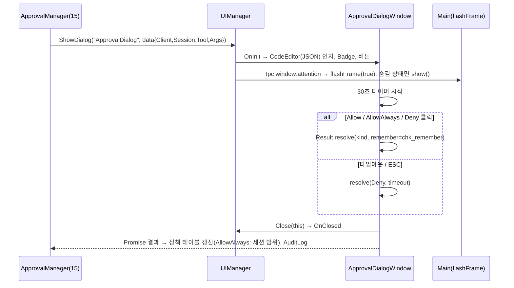

# 12. Scouter 전용 컨트롤 — VirtualList · LogView · CodeEditor · DiffView · MarkdownView · PropertyGrid · Badge/StatusDot/Avatar/Spinner · TitleBar · Toast · ApprovalDialog

> 구현 Phase **P3(TitleBar, StatusDot, Spinner, Toast) → P4(VirtualList, LogView, Badge, PropertyGrid, ApprovalDialog 골격) → P7(ApprovalDialog 완성) → P10(CodeEditor, DiffView, MarkdownView)**. 외부 라이브러리를 쓰는 유일한 컨트롤 그룹.

## 12.1 라이브러리

| 컨트롤 | 라이브러리 | 사용 API · 방식 | 번들 |
|---|---|---|---|
| VirtualList | 없음 | `scroll` + `requestAnimationFrame` + spacer div, `ResizeObserver`(04 SizeObserver) | — |
| LogView | 없음(VirtualList 사용) | 링 버퍼 10000, `Intl.DateTimeFormat` 타임스탬프 | — |
| CodeEditor | `monaco-editor` 0.5x + `monaco-editor-webpack-plugin` ^7 | `monaco.editor.create`, `defineTheme`, `setTheme`, `layout`, `onDidChangeModelContent`, `setModelLanguage` | `import("monaco-editor")` 지연 청크 (webpack `splitChunks`), 언어 `["typescript","javascript","json","xml","markdown","css","powershell","cpp","csharp"]`, features 최소 |
| DiffView | monaco `createDiffEditor` | `setModel({original, modified})`, `renderSideBySide` | CodeEditor 청크 공유 |
| MarkdownView | `marked` ^15 + `dompurify` ^3 | `marked.parse(md, {gfm:true, breaks:false})` → `DOMPurify.sanitize(html, {ADD_ATTR:["target"]})` → `Range.createContextualFragment` (innerHTML 예외 허용: 유일) | 동기 번들(작음) |
| PropertyGrid | `ajv` ^8 (검증), 자체 에디터 변환 | JSON Schema `type/enum/minimum/maximum/description/default/x-category/x-order/x-secret/x-editor` | — |
| Badge/StatusDot/Avatar/Spinner | 없음 | CSS 애니메이션(`@keyframes gui-pulse`, `gui-spin`) | — |
| TitleBar | 없음 — `IWindowChrome`(10) | `-webkit-app-region` | — |
| Toast | 없음 — UIManager Toast 레이어(06) | `setTimeout`, hover 시 일시정지 | — |
| ApprovalDialog | 없음 — Window + Layout XML | `UIManager.ShowDialog` → Promise | — |

## 12.2 클래스 구조 (C12-1)

```mermaid
classDiagram
	class VirtualList {
		+ItemHeight : number
		+Overscan 5
		+Count : number
		+ItemTemplate : (index)=>UIElement
		+ScrollToIndex(i, align)
		+Refresh(range?)
		-viewport_ : HTMLDivElement
		-spacer_ : HTMLDivElement
		-pool_ : Map~number, UIElement~
		-OnScroll() → raf → Render()
	}
	class LogView {
		+MaxLines 10000; +AutoScroll; +Filter; +LevelFilter; +WrapLines; +ShowTimestamp
		+Append(entry); +AppendLines(entries); +Clear(); +CopyAll(); +Export(path)
		-ring_ : RingBuffer~LogEntry~
		-visible_ : number[] (필터 후 인덱스)
	}
	class RingBuffer~T~ { +Push; +Get(i); +Count; +Clear }
	class CodeEditor {
		+Language; +Text; +ReadOnly; +LineNumbers; +Minimap; +WordWrap
		+TextChanged
		+RevealLine(n); +SetMarkers(m)
		-editor_ : monaco.IStandaloneCodeEditor|null
		-EnsureLoadedAsync()$
	}
	class MonacoLoader { <<static>> +LoadAsync() Promise; +ApplyTheme(tokens) }
	class MonacoTheme { <<static>> +FromTokens(tokens) IStandaloneThemeData }
	class DiffView { +Original; +Modified; +Language; +SideBySide }
	class MarkdownView { +Source; +LinkRequested }
	class PropertyGrid {
		+Schema : JsonSchema; +Value : object
		+SetSchema(s, v); +Get() object
		+ValueChanged(path, value); +ValidationChanged
		-editors_ : Map~path, IPropertyEditor~
	}
	class IPropertyEditor { <<interface>> +Element; +Get(); +Set(v); +Changed }
	class EditorFactory { <<static>> +Create(schemaNode) IPropertyEditor }
	class Badge { +Text; +Variant Info|Success|Warn|Error }
	class StatusDot { +Status Ok|Warn|Error|Idle|Busy; +Pulse }
	class Avatar { +Text; +Source; +Size }
	class Spinner { +Size }
	class TitleBar { +Title; +Icon; +ShowMinimize/Maximize/Close; +Chrome : IWindowChrome }
	class ToastService { <<static>> +Show(opt) ToastHandle; +Info/Success/Warn/Error(msg) }
	class ToastView { +Title; +Message; +Variant; +Actions; +Close() }
	class ApprovalDialogWindow { +Request : ApprovalRequest; +Result : Promise~Allow|AllowAlways|Deny~ }
	UIElement <|-- VirtualList
	Control <|-- LogView
	LogView --> VirtualList
	LogView --> RingBuffer
	Control <|-- CodeEditor
	CodeEditor ..> MonacoLoader
	MonacoLoader ..> MonacoTheme
	CodeEditor <|-- DiffView
	Control <|-- MarkdownView
	Control <|-- PropertyGrid
	PropertyGrid --> EditorFactory
	EditorFactory ..> IPropertyEditor
	UIElement <|-- Badge
	UIElement <|-- StatusDot
	UIElement <|-- Avatar
	UIElement <|-- Spinner
	Control <|-- TitleBar
	ToastService --> ToastView
	Window <|-- ApprovalDialogWindow
```



파일: `Scouter.Gui/Controls/Scouter/{VirtualList,LogView,RingBuffer,CodeEditor,MonacoLoader,MonacoTheme,DiffView,MarkdownView,PropertyGrid,PropertyEditors,Badge,StatusDot,Avatar,Spinner,TitleBar,Toast}.ts`, `Scouter.App/Renderer/Mcp/ApprovalDialogWindow.ts` + `Layout/ApprovalDialog.xml`.

## 12.3 UI 디자인

### LogView

```
┌─ 툴바 (옵션, ShowToolbar) ────────────────────────────────────────┐
│ [필터 TextBox        ] [Lvl ▾] [⏸ AutoScroll] [Wrap] [복사] [내보내기] [지우기] │ 28px
├──────────────────────────────────────────────────────────────┤
│ 07:50:01.123 [I] P4    Running p4 -ztag describe 12345                    │ 행 20px, mono
│ 07:50:01.456 [W] P4    file not found //depot/...                         │ W: --warning, E: --error bg 8%
│ 07:50:02.001 [E] Mcp   session abc timed out                              │ D: --text-weak
└──────────────────────────────────────────────────────────────┘
```

폰트 `--gui-font-mono`(Cascadia Code), 사용자가 위로 스크롤하면 AutoScroll 자동 해제 + "↓ 새 로그 n개" 플로팅 버튼. 선택 복사는 범위 행 텍스트로 재구성(가상화로 DOM 선택 불가).

### PropertyGrid

```
▾ 일반 (x-category)
  사이드바 폭         [ 150      ][▲▼]    ← number → NumericUpDown, description은 ToolTip + 아래 12px 회색
  트레이로 최소화     [✓]
  테마               [ oc-2            ▾]  ← enum → ComboBox
▾ MCP
  포트               [ 9515 ]  ⚠ 1024~65535   ← ajv 에러는 필드 아래 --error 텍스트
  토큰              [ •••••••• ] [보기]       ← x-secret → PasswordBox
```

2열 Grid `minmax(120px, 35%) 1fr`, 행 32px, 카테고리 = Expander. `x-editor: "path"` → TextBox + 폴더 버튼(`dialog.showOpenDialog` IPC), `"multiline"` → AcceptsReturn, `array of string` → 항목 리스트(+/−).

### Toast

`.gui-layer[data-layer=Toast]` 우하단 스택(gap 8, 상하 역순 새 항목 아래), 폭 320, 좌측 3px Variant 색 바, 아이콘 info/check/alert-triangle/x-circle, 제목 13/600 + 메시지 12, Actions 버튼 Ghost, `DurationMs` 기본 4000(Error는 0=수동), 최대 5개(넘으면 가장 오래된 것 제거), 마우스 오버 시 타이머 일시정지.

### ApprovalDialog (→ 15 §15.5 승인 정책)

```
┌─ 도구 실행 승인 ───────────────────────────────────┐ 380×auto
│ ⚠  claude-code (세션 3f9a) 가 다음 도구를 실행하려 합니다.  │
│    P4Util__Describe                                        │ Badge(플러그인) + 도구이름 mono
│    ▾ 인자 보기 (Expander, JSON CodeEditor ReadOnly, max 200px) │
│                                                            │
│ [ ] 이 세션에서 같은 도구는 다시 묻지 않기                   │ CheckBox chk_remember
│                    [거부]  [한 번 허용]  [항상 허용(Primary)] │ Deny=IsCancel(ESC), Allow=IsDefault(Enter)
└────────────────────────────────────────────────────────┘
```

타임아웃 30초 자동 Deny(진행바 하단 2px). 다이얼로그 표시 시 `win.flashFrame(true)` + 트레이 창 강제 표시(21).

## 12.4 핵심 구현

```ts
// VirtualList.Render — 보이는 범위만 DOM 유지, 나머지는 pool에서 제거
private Render(): void
{
	const top = this.viewport_.scrollTop;
	const first = Math.max(0, Math.floor(top / this.ItemHeight) - this.Overscan);
	const last = Math.min(this.Count - 1, Math.ceil((top + this.viewport_.clientHeight) / this.ItemHeight) + this.Overscan);
	this.spacer_.style.height = `${this.Count * this.ItemHeight}px`;
	for (const [i, el] of this.pool_)
		if (i < first || i > last) { el.Element.remove(); this.pool_.delete(i); }
	for (let i = first; i <= last; ++i)
	{
		let el = this.pool_.get(i);
		if (el === undefined)
		{
			el = this.ItemTemplate(i);
			el.Element.style.transform = `translateY(${i * this.ItemHeight}px)`;
			this.spacer_.append(el.Element);
			this.pool_.set(i, el);
		}
	}
}

// CodeEditor — monaco 지연 로드. 로드 전 설정은 pending_에 모아 단번에 적용
protected override OnAttached(): void
{
	super.OnAttached();
	void MonacoLoader.LoadAsync().then(monaco =>
	{
		if (!this.IsAttached) return;
		this.editor_ = monaco.editor.create(this.host_, { value: this.Text, language: this.Language, readOnly: this.ReadOnly, automaticLayout: false, minimap: { enabled: this.Minimap }, lineNumbers: this.LineNumbers ? "on" : "off", wordWrap: this.WordWrap ? "on" : "off", fontFamily: "var(--gui-font-mono)", theme: "scouter" });
		this.editor_.onDidChangeModelContent(() => { this.syncing_ = true; this.Text = this.editor_!.getValue(); this.syncing_ = false; this.RaiseEvent(this.TextChanged, new RoutedEventArgs(this)); });
		this.bag_.Add(this.SizeChanged.Add(() => this.editor_?.layout()));
	});
}
// MonacoLoader.LoadAsync: import("monaco-editor") 1회 + ThemeManager.Changed 구독 → defineTheme("scouter", MonacoTheme.FromTokens(tokens)); setTheme("scouter")

// MarkdownView — 유일한 innerHTML 예외 (eslint no-inner-html 규칙 파일 단위 disable + 사유 주석)
private RenderMarkdown(_md: string): void
{
	const html = DOMPurify.sanitize(marked.parse(_md, { gfm: true, async: false }) as string, { ADD_ATTR: ["target"], FORBID_TAGS: ["style", "iframe"] });
	this.body_.replaceChildren(document.createRange().createContextualFragment(html));
	for (const a of this.body_.querySelectorAll<HTMLAnchorElement>("a[href]"))
		a.addEventListener("click", e => { e.preventDefault(); this.RaiseEvent(this.LinkRequested, new LinkEventArgs(this, a.href)); });   // → INavigationService.OpenExternal
}

// PropertyGrid — 스키마 노드 → 에디터 매핑
// string→TextBox | enum→ComboBox | boolean→CheckBox | number/integer→NumericUpDown(min/max/multipleOf) | x-secret→PasswordBox
// x-editor:path→PathEditor | x-editor:multiline→TextBox(AcceptsReturn) | array<string>→StringListEditor | object→중첩 Expander
// 검증: ajv.compile(schema) 후 필드 변경마다 전체 검증 → errors[].instancePath로 에디터 매핑 → IsValid/메시지
```

## 12.5 시퀀스

### S12-1 LogView.Append → 가상 렌더



### S12-2 CodeEditor 테마 변경

```mermaid
sequenceDiagram
	participant TM as ThemeManager(13)
	participant ML as MonacoLoader
	participant MT as MonacoTheme
	participant M as monaco.editor
	TM->>ML: Changed(theme)
	ML->>MT: FromTokens(theme.Tokens) → {base: dark|vs, colors:{editor.background: --background-base, ...}, rules:[{token:"keyword", foreground: syntax-keyword}...]}
	ML->>M: defineTheme("scouter", data); setTheme("scouter")
	Note over M: 모든 에디터 인스턴스 즉시 반영
```

### S12-3 PropertyGrid 필드 변경 → Settings

```mermaid
sequenceDiagram
	actor U
	participant E as NumericUpDown(Mcp.Port)
	participant PG as PropertyGrid
	participant A as ajv
	participant SW as SettingsWindow(16)
	participant S as Settings
	U->>E: 9600 입력, Enter
	E->>PG: editor.Changed(path="Mcp.Port", 9600)
	PG->>PG: value_ 경로 갱신
	PG->>A: validate(value_)
	alt 유효
		PG->>SW: ValueChanged("Mcp.Port", 9600)
		SW->>S: Set("Mcp.Port", 9600) → Changed → "재시작 필요" 토스트(Restart 플래그 키)
	else 오류
		PG->>E: IsValid=false, 에러 문구 표시; ValidationChanged
	end
```

### S12-4 Toast 표시 → 액션 → 닫기



### S12-5 ApprovalDialog



## 12.6 테스트

| 파일 | 확인 |
|---|---|
| `VirtualList.test.ts` | 1만 항목에서 DOM 노드 ≤ (viewport/ItemHeight + 2×Overscan), ScrollToIndex, Count 감소 시 pool 정리 |
| `RingBuffer.test.ts` | 오버플로우 덮어쓰기, Get 순서 |
| `LogView.test.ts` | Filter/LevelFilter, MaxLines, AutoScroll 해제 조건, CopyAll 포맷 |
| `MonacoTheme.test.ts` | 토큰 → rules 매핑 누락 0, base 선택 (CodeEditor 자체는 happy-dom 불가 → E2E) |
| `MarkdownView.test.ts` | `<script>` 제거, 링크 클릭 LinkRequested, GFM 테이블 |
| `PropertyGrid.test.ts` | 스키마 타입별 에디터, x-category 그룹, ajv 에러 표시, Get() 구조 |
| `Toast.test.ts` | 최대 5, 타이밍(가짜 타이머), hover 일시정지 |
| E2E `ApprovalDialog.e2e.ts` | Test API `POST /test/approval {decision}`로 응답, 타임아웃 Deny |

## 12.7 체크리스트

- [ ] P3: TitleBar(Ipc chrome) · StatusDot · Spinner · Toast — Shell과 함께
- [ ] P4: VirtualList → LogView → Badge → PropertyGrid(설정 화면용) → ApprovalDialog XML/창 골격
- [ ] P7: ApprovalDialog ↔ ApprovalManager 연결, flashFrame
- [ ] P10: MonacoLoader(지연 청크 크기 확인 ≈ 3~4MB) → CodeEditor → DiffView → MarkdownView
- [ ] webpack `monaco-editor-webpack-plugin` 언어 9개만, features 최소화 확인
