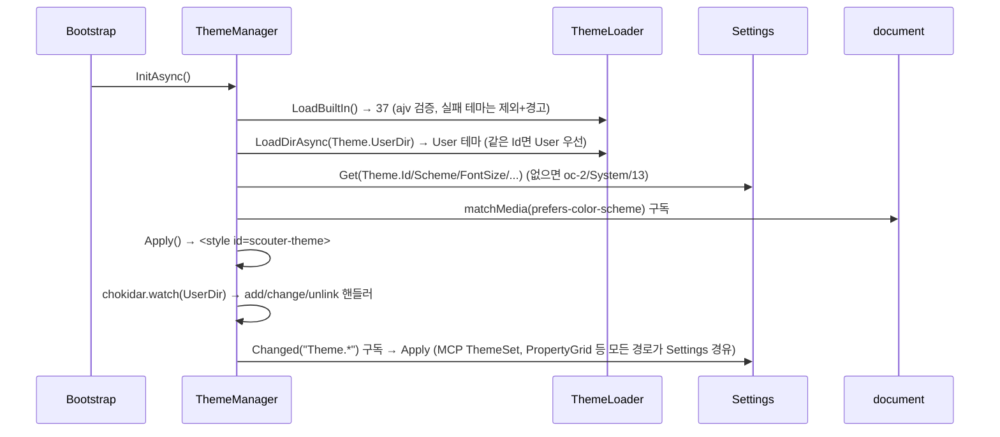
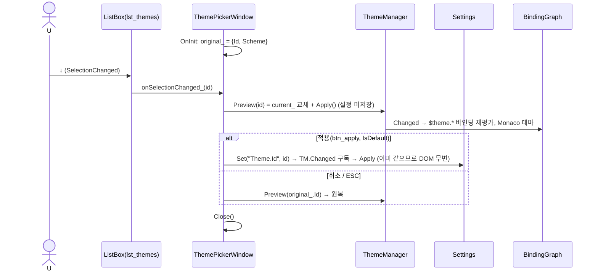
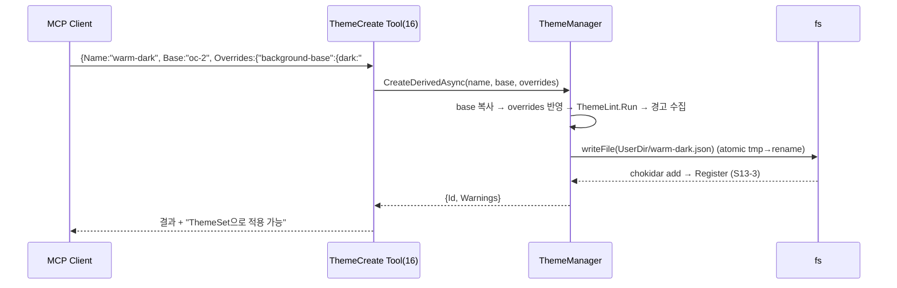

# 13. 테마 시스템 — opencode 테마 엔진 이식 · ThemeManager · 테마 피커

> 구현 Phase **P5**. P3~P4에서는 `oc-2` 다크 토큰을 고정 CSS(`Styles/Tokens.default.css`)로 주입해 동작시키고, P5에서 동적 엔진으로 교체한다. 37개 내장 테마 / 256 토큰, JSON 포맷은 원본 그대로(D-09).

## 13.1 라이브러리

| 기능 | 라이브러리 · API |
|---|---|
| 테마 JSON 검증 | `ajv` ^8 `compile(Theme.schema.json)` — `$schema name defs theme` 필수, 토큰 값은 `#rrggbb` 또는 defs 키 |
| 내장 테마 로드 | webpack `require.context("./Themes", false, /\.json$/)` → 번들 포함 |
| 사용자 테마 | `node:fs/promises.readdir` + `chokidar` ^4 `watch("~/.scouter/themes", {ignoreInitial:true, awaitWriteFinish:{stabilityThreshold:100}})` |
| 시스템 스킴 | `window.matchMedia("(prefers-color-scheme: dark)")` `change` 이벤트 (Electron `nativeTheme`은 Main에 있어 IPC 필요 → 사용 안 함) |
| CSS 주입 | `<style id="scouter-theme">` `textContent` 교체 + `<html data-theme data-scheme>` |
| 대비(contrast) 검사 | 자체 WCAG 상대 휘도(sRGB 선형화) — 20줄 |
| Monaco | `MonacoTheme.FromTokens` (12) |
| 색 파생(ThemeCreate) | 자체 HSL 변환(`Color.ts` 60줄), 외부 색 라이브러리 안 쓰기 |

## 13.2 파이프라인

```
테마 JSON (37 내장 + ~/.scouter/themes/*.json + Plugin 제공)
   { "$schema", "name", "defs": {...}, "theme": { "token": { "dark": "...", "light": "..." } } }
   ▼ ThemeLoader.Parse (ajv)
Theme { Id, Name, Source, Defs, Tokens, HasLight, HasDark }
   ▼ ThemeResolver.Resolve(theme, scheme)  — defs 참조 해석, dark/light 선택, 누락 토큰은 oc-2에서 채움(경고)
ResolvedTheme { Id, Scheme, Tokens: Map<string,string> }  (256)
   ▼ ThemeCss.Build(resolved, typography, density)
":root{--background-base:#...; ...; --gui-font-size:13px; --gui-control-height:28px}"
   ▼ <style id="scouter-theme">  +  <html data-theme="oc-2" data-scheme="dark">
   ▼ ThemeManager.Changed → BindingGraph($theme.*) / MonacoLoader / EventBus Scouter.ThemeChanged
```

`Styles/Tokens.css`는 컨트롤 별칭(`--gui-button-primary-bg: var(--button-primary-background)`)을 정의해 토큰 이름이 바뀔 때 수정 지점을 1곳으로.

## 13.3 클래스 구조 (C13-1)

```mermaid
classDiagram
	class Theme { +Id; +Name; +Source : BuiltIn|User|Plugin; +Defs; +Tokens : Record~token,{dark,light}~; +HasLight; +HasDark }
	class ResolvedTheme { +Id; +Scheme : Dark|Light; +Tokens : Map~string,string~ }
	class Typography { +FontSize 13; +FontFamily; +MonoFamily }
	class ThemeLoader {
		<<static>>
		+LoadBuiltIn() Theme[]
		+LoadDirAsync(dir) Promise~Theme[]~
		+Parse(json, source) Theme
		-validate_ : ajv ValidateFunction
	}
	class ThemeResolver { <<static>> +Resolve(theme, scheme, fallback) ResolvedTheme; -ResolveRef(defs, value, depth) }
	class ThemeCss { <<static>> +Build(resolved, typo, density) string }
	class ThemeLint { <<static>> +Run(theme) ThemeLintResult; +Contrast(fg,bg) number }
	class ThemeManager {
		<<static>>
		+Changed : Event~ThemeChangedEventArgs~
		+Current : Theme; +Resolved : ResolvedTheme; +Mode : Dark|Light|System
		+InitAsync() Promise
		+Register(theme, source)/Unregister(id)
		+List() ThemeSummary[]
		+Set(id) boolean; +SetMode(mode); +SetTypography(t); +SetDensity(d)
		+Apply() void
		+CreateDerivedAsync(name, baseId, overrides) Promise~Theme~
		-themes_ : Map~string,Theme~
		-style_ : HTMLStyleElement
		-media_ : MediaQueryList
		-watcher_ : FSWatcher
	}
	class MonacoTheme { <<static>> +FromTokens(resolved) IStandaloneThemeData }
	class ThemePickerWindow { Layout/ThemePicker.xml; 미리보기 + 적용/취소 }
	ThemeLoader ..> Theme
	ThemeResolver ..> ResolvedTheme
	ThemeManager --> ThemeLoader
	ThemeManager --> ThemeResolver
	ThemeManager --> ThemeCss
	ThemeManager --> ThemeLint
	ThemeManager ..> Settings : Theme.*
	MonacoTheme ..> ResolvedTheme
	ThemePickerWindow ..> ThemeManager
```

| 파일 | 위치 |
|---|---|
| `Theme.ts` `ThemeResolver.ts` `ThemeCss.ts` `ThemeLint.ts` `Color.ts` | `Scouter.Gui/Theme` (Electron 무의존, 하네스에서도 사용) |
| `ThemeManager.ts` `ThemeLoader.ts` `Themes/*.json` | `Scouter.App/Renderer/Theme` |
| `MonacoTheme.ts` | `Scouter.Gui/Controls/Scouter` (12와 동일 파일, 여기서는 사용만) |
| `Theme.schema.json` | `Scouter.App/Config` |
| `Layout/ThemePicker.xml` + `Shell/ThemePickerWindow.ts` | App |
| `Scripts/ThemeLint.mjs` | CI: 내장 37개 전체 lint |

## 13.4 설정

| 키 | 기본 | 설명 |
|---|---|---|
| `Theme.Id` | `oc-2` | |
| `Theme.Scheme` | `System` | Dark / Light / System |
| `Theme.FontSize` | 13 | 10~20 → `--gui-font-size` |
| `Theme.FontFamily` | `Segoe UI, system-ui, sans-serif` | |
| `Theme.MonoFamily` | `Cascadia Code, Consolas, monospace` | |
| `Theme.Density` | `Normal` | Compact(24/4/6) / Normal(28/6/8) → `--gui-control-height/radius/gap` |
| `Theme.UserDir` | `~/.scouter/themes` | chokidar 감시 |

## 13.5 UI 디자인 — 테마 피커 (`Shell.OpenThemePicker`)

```
┌─ 테마 ─────────────────────────────────────────────────┐ 560×420
│ [검색 txt_filter                ]  Scheme: (•)System ( )Dark ( )Light   │
│ ┌─ lst_themes (ListBox, ItemTemplate) ──┐ ┌─ pnl_preview ─────────────┐ │
│ │ ■■■■ oc-2            ✓ BuiltIn  │ │ 샘플 버튼/입력/리스트/코드     │ │
│ │ ■■■■ catppuccin-mocha  BuiltIn  │ │ (UserControl Layout/ThemeSample) │ │
│ │ ■■■■ my-warm           User ⚠  │ │ 미리보기는 별도 <style> 스코프 │ │
│ └─────────────────────────────────┘ └───────────────────────────────┘ │
│ 폰트 크기 [13][▲▼]   밀도 (•)Normal ( )Compact      [폴더 열기] [적용] [취소] │
└───────────────────────────────────────────────────────────────────────┘
```

- 항목의 `■■■■` = 해당 테마 `background-base / primary / text-base / accent` 4색 스와치(인라인 style은 금지이므로 `--swatch-1..4` CSS 변수를 요소에 설정).
- 리스트에서 ↑↓마다 **전체 앱에 즉시 임시 적용**(Apply만, 설정 저장 안 함) → 적용이면 `Settings.Set`, 취소/ESC면 원복. CommandPalette(18)의 테마 미리보기도 같은 경로.
- `⚠` = ThemeLint 경고 있음(ToolTip에 요약). `HasLight=false`면 Light 선택 시 배지 "다크 전용".

## 13.6 핵심 구현

```ts
// ThemeResolver — defs 참조는 최대 8단계(순환 방지), 누락은 fallback에서
public static Resolve(_theme: Theme, _scheme: Scheme, _fallback: ResolvedTheme | null): ResolvedTheme
{
	const out = new Map<string, string>();
	const warnings: string[] = [];
	for (const token of kAllTokens)                                   // 256개 고정 목록 (Theme.ts)
	{
		const raw = _theme.Tokens[token]?.[_scheme === "Dark" ? "dark" : "light"];
		const value = raw === undefined ? null : ThemeResolver.ResolveRef(_theme.Defs, raw, 0);
		if (value === null)
		{
			warnings.push(token);
			out.set(token, _fallback?.Tokens.get(token) ?? "#ff00ff");    // 누락 가시화
			continue;
		}
		out.set(token, value);
	}
	if (warnings.length > 0)
		Log.Warn("Theme", `${_theme.Id}: ${warnings.length} tokens missing`, { tokens: warnings });
	return { Id: _theme.Id, Scheme: _scheme, Tokens: out };
}

// ThemeManager.Apply — 변경 시에만 DOM 터치
public static Apply(): void
{
	const scheme = this.Mode === "System" ? (this.media_.matches ? "Dark" : "Light") : this.Mode;
	this.resolved_ = ThemeResolver.Resolve(this.current_, this.current_.HasScheme(scheme) ? scheme : "Dark", this.default_);
	const css = ThemeCss.Build(this.resolved_, this.typography_, this.density_);
	if (css !== this.style_.textContent)
	{
		this.style_.textContent = css;
		document.documentElement.dataset["theme"] = this.current_.Id;
		document.documentElement.dataset["scheme"] = this.resolved_.Scheme.toLowerCase();
		this.Changed.Invoke({ Id: this.current_.Id, Name: this.current_.Name, Scheme: this.resolved_.Scheme, Resolved: this.resolved_ });
		EventBus.Publish("Scouter.ThemeChanged", { Id: this.current_.Id, Name: this.current_.Name, Scheme: this.resolved_.Scheme });
	}
}
```

이식 시 고칠 원본 결함(v4 7.6 유지): `oc-2.json` light `icon-weak-base="C7C7C7"` `#` 누락 → 수정 + lint 형식 검사; `v2Overrides` 제외; catppuccin-frappe/macchiato light 대비 2.x → `HasLight=false`; `resolve.ts` 미정의 `base/base2/base3` 제거; 하드코딩 `#ffffff` → `var(--border-weak-base)`.

## 13.7 시퀀스

### S13-1 시작 시 테마 초기화



### S13-2 테마 피커에서 선택 → 미리보기 → 적용/취소



### S13-3 사용자 테마 파일 변경 핫리로드

```mermaid
sequenceDiagram
	participant FS as chokidar
	participant TM as ThemeManager
	participant TL as ThemeLoader
	participant T as ToastService
	FS->>TM: change(~/.scouter/themes/my-warm.json)
	TM->>TL: Parse(readFile) 
	alt 유효
		TM->>TM: Register(theme, User) → 현재 테마와 Id 같으면 Apply()
	else ajv 오류
		TM->>T: Warn("테마 파싱 실패: instancePath message") ; 이전 버전 유지
	end
```

### S13-4 MCP `ScouterCore__ThemeCreate`



## 13.8 테스트

| 파일 | 확인 |
|---|---|
| `ThemeResolver.test.ts` | defs 참조 체인 8단계, 순환 참조 → null, 누락 토큰 fallback + 경고 |
| `ThemeCss.test.ts` | 256 `--` 변수 + typography/density 변수, 결정적 출력(스냅샷) |
| `ThemeLint.test.ts` | `#` 누락 검출, 대비 4.5 미만 경고, oc-2 경고 0 |
| `ThemeLoader.test.ts` | 37개 전부 ajv 통과, 잘못된 JSON 제외 |
| `ThemeManager.test.ts` (happy-dom, matchMedia stub) | System → 스킴 전환, Apply 무변 시 DOM 미터치(textContent setter spy), Changed 1회 |
| `Scripts/ThemeLint.mjs` | CI에서 37개 전체 lint, 경고 임계 이상이면 실패 |
| E2E | 테마 피커 열기 → ↓ → `html[data-theme]` 변경 → ESC → 원복 |

## 13.9 체크리스트

- [ ] `Tokens.default.css` 제거, ThemeManager로 교체 후 모든 컨트롤 스크린샷 다크/라이트 확인
- [ ] 37개 테마 lint 0 error, 원본 결함 5건 수정 확인
- [ ] 테마 피커 + Density
- [ ] 사용자 폴더 핫리로드, `ctx.Ui.AddStyleSheet` 스코프 주입 확인(14)
- [ ] CSP: 프로덕션에서 `unsafe-eval` 제거 가능 여부 확인(monaco worker 포함) — 사용자 확인 항목
