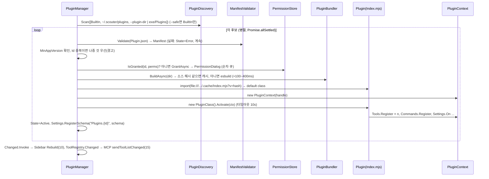
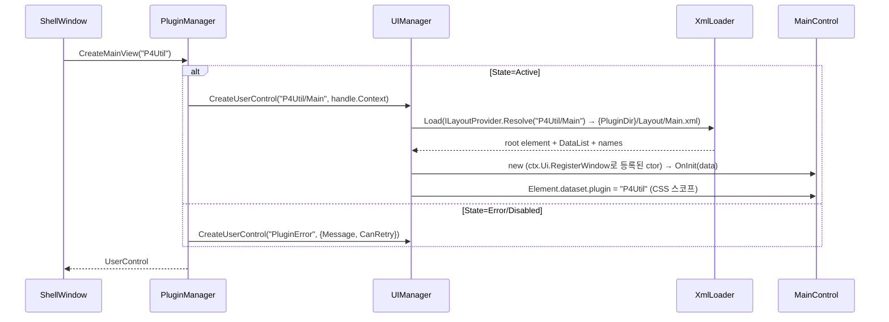
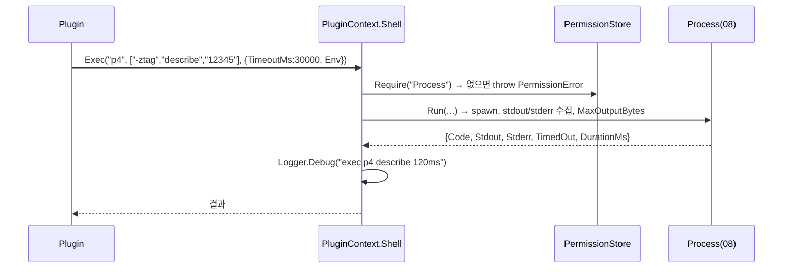

# 14. Plugin 시스템 — Manifest · Loader(esbuild) · IPluginContext · 권한 · 핫리로드

> 구현 Phase **P6**. Plugin = 폴더 하나(`Plugin.json` + `Index.ts` + `Layout/*.xml`). 메인 화면은 XML `UserControl`(D-13), 기능은 MCP Tool로도 노출(15). 동일 프로세스에서 esbuild 번들 후 `import()`(D-17, D-23) — Worker 격리 없음, 권한은 가드레일이지 샌드박스가 아니다.

## 14.1 라이브러리

| 기능 | 라이브러리 · API |
|---|---|
| Manifest 검증 | `ajv` ^8 + `ajv-formats`(semver 패턴) — `Config/Plugin.schema.json` |
| 번들 | `esbuild` ^0.2x `build({ entryPoints:[Index.ts], bundle:true, format:"esm", platform:"browser", target:"es2022", outfile:.cache/Index.mjs, external:["@scouter/gui","@scouter/plugin-api","electron","node:*"], sourcemap:"inline", plugins:[ScouterExternalsPlugin] })`. esbuild 바이너리는 electron-builder `extraResources`로 포함(`esbuild/bin`) |
| 동적 import | `import(pathToFileURL(outfile).href + "?v=" + hash)` — 쿼리로 모듈 캐시 우회 |
| externals 제공 | `window.__scouter_modules__ = { "@scouter/gui": GuiModule, "@scouter/plugin-api": ApiModule }`; `ScouterExternalsPlugin`이 `import x from "@scouter/gui"`를 `const x = window.__scouter_modules__["@scouter/gui"]`로 재작성 |
| 핫리로드 | `chokidar` watch(PluginDir, `{ignored: /\.cache/}`) — `*.xml` → 07 HotReloader, `*.ts|*.json|*.css` → 재번들 |
| 버전 범위 | `MinAppVersion` 버전 비교는 자체 20줄(semver 라이브러리 안 쓰기, `x.y.z`만) |
| 스토리지 | 08 Storage(`~/.scouter/plugins/{Id}/storage.json`), Secrets(safeStorage) |
| CSS 스코프 | `ctx.Ui.AddStyleSheet(css)` → 자체 간단 변환: 각 셀렉터 앞에 `[data-plugin="P4Util"] ` 접두(CSSOM `insertRule` 후 `cssRules` 순회로 재작성) |
| Worker | `ctx.Worker.Run(script, args)` → `new Worker(new URL(...), {type:"module"})` (esbuild로 워커 파일도 번들) |
| 패키징 | `scouter plugin pack` = `Scripts/PluginPack.mjs`: esbuild(sourcemap 없이) + `zip`(node `archiver`가 아니라 `zlib` + 자체 zip writer — 또는 P9에 `adm-zip` 추가 검토, A1) |

## 14.2 폴더 구조 · Manifest

```
Plugins/P4Util/
├─ Plugin.json
├─ Index.ts                 ← export default class P4UtilPlugin extends PluginBase
├─ Layout/Main.xml          ← 메인 UserControl (다이얼로그는 Layout/*.xml 추가)
├─ Views/MainControl.ts     ← 코드비하인드
├─ Tools/*.ts               ← ITool 1개 = 파일 1개
├─ Recipes/*.md             ← AI용 사용법(MCP Prompt/Resource)
├─ Settings.schema.json     ← Settings.RegisterSchema("Plugins.P4Util")
├─ Styles.css               ← 자동 스코프
└─ .cache/Index.mjs         ← esbuild 출력(gitignore)
```

```json
{
	"Id": "P4Util", "Name": "Perforce Utilities", "Version": "0.1.0",
	"Description": "p4 명령 위에서 동작하는 리버전 범위 파일 목록 추출 등 유틸리티",
	"Author": "윤정도", "Main": "Index.ts", "Layout": "Layout/Main.xml", "Icon": "p4",
	"MinAppVersion": "0.4.0",
	"Permissions": ["Process", "Fs.Read", "Clipboard", "Settings"],
	"Settings": "Settings.schema.json",
	"Tools": ["ExtractFiles", "Describe", "OpenedSummary", "ChangeFiles", "Blame", "DiffRange", "ReviewPrompt"],
	"Commands": ["CopyPrompt"],
	"Hotkeys": { "CopyPrompt": "Ctrl+Shift+C" }
}
```

`Tools`/`Commands` 배열은 **선언**이다: Activate 후 선언만 되고 등록 안 된 항목은 경고(W-P01), 선언 없이 등록된 항목은 오류로 거부(목록이 설치 시 사용자에게 보이는 것이므로).

## 14.3 클래스 구조 (C14-1)

```mermaid
classDiagram
	class PluginManager {
		<<static>>
		+Changed : Event
		+LoadAllAsync() Promise
		+LoadAsync(dir, source) Promise~PluginHandle~
		+UnloadAsync(id) Promise
		+ReloadAsync(id) Promise
		+List() PluginInfo[]; +Has(id); +Get(id)
		+CreateMainView(id) UserControl
		-plugins_ : Map~string,PluginHandle~
	}
	class PluginHandle { +Manifest; +Dir; +Source; +State : Loading|Active|Error|Disabled; +Instance : PluginBase|null; +Context : PluginContext; +Error?; +LoadMs }
	class PluginDiscovery { <<static>> +Scan(dirs) PluginCandidate[] ; 순서 BuiltIn → ~/.scouter/plugins → --plugin-dir(개발) / exe/Plugins(배포) }
	class ManifestValidator { <<static>> +Validate(json) Manifest; -ajv }
	class PluginBundler { <<static>> +BuildAsync(dir, manifest) Promise~string~ ; esbuild, 해시 캐시 }
	class PermissionStore { <<static>> +IsGranted(id, perms) boolean; +GrantAsync(id, perms) Promise~boolean~ ; ~/.scouter/permissions.json }
	class PluginContext {
		+Manifest; +Settings; +Storage; +Secrets; +Logger; +Events; +Tools; +Resources; +Prompts
		+Commands; +Hotkeys; +Shell; +Fs; +Http; +Clipboard; +Schedule; +Worker; +Paths; +Ui; +App
		+Dispose() void
		-bag_ : DisposableBag
		-Require(perm) void
	}
	class PluginBase { <<abstract>> #context_; +Id; +Activate(ctx); +Deactivate(); #OnActivate()*; #OnDeactivate() }
	class ITool { <<interface>> +Name; +Description; +InputSchema; +Annotations?; +DefaultApproval?; +Run(args, call) }
	class IToolCall { <<interface>> +SessionId; +Progress(n,msg); +Signal : AbortSignal; +Log }
	class ToolRegistry { <<static>> +Register(pluginId, tool) Disposable; +List(); +Find(fullName); +Changed }
	class PluginWatcher { chokidar; xml→HotReloader, ts→ReloadAsync (debounce 300) }
	class PluginErrorView { Layout/PluginError.xml : 오류 메시지 + 재시도 버튼 }
	PluginManager --> PluginHandle
	PluginManager --> PluginDiscovery
	PluginManager --> ManifestValidator
	PluginManager --> PluginBundler
	PluginManager --> PermissionStore
	PluginHandle --> PluginContext
	PluginHandle --> PluginBase
	PluginContext --> ToolRegistry
	PluginContext ..> ITool
	ITool ..> IToolCall
	PluginManager --> PluginWatcher
	PluginManager ..> PluginErrorView
```



파일: `Scouter.App/Renderer/Plugin/{PluginManager,PluginHandle,PluginDiscovery,ManifestValidator,PluginBundler,PermissionStore,PluginContext,ToolRegistry,PluginWatcher,Services/*.ts}`, `Scouter.PluginApi/{Index.ts,PluginBase.ts,IPluginContext.ts,ITool.ts,Types.ts}`(실제(런타임) 코드는 PluginBase만, 나머지 타입), `Config/Plugin.schema.json`, `Layout/PluginError.xml`, `Layout/PermissionDialog.xml`.

## 14.4 IPluginContext 서비스 표

| 서비스 | 주요 API | 권한 | 내부 위임(08) |
|---|---|---|---|
| `Manifest` | 읽기 전용 | — | |
| `Settings` | `Get<T>(key,def)` `Set` `On(key,cb)` — `Plugins.{Id}.` 자동 접두 | `Settings` | Settings |
| `Storage` | `Get/Set/Delete`, `OpenFile(name)` | 기본 | Storage |
| `Secrets` | `Get/Set/Delete` | `Secrets` | Secrets |
| `Logger` | `Debug/Info/Warn/Error(msg,data)` scope=`Plugin:{Id}` | 기본 | Log.Scope |
| `Events` | `On(name,cb)→Disposable`, `Emit(name,args)` 발신 `{Id}.` 강제 | 기본 | EventBus |
| `Tools` | `Register(tool)`, `Invoke(fullName,args)` | Invoke는 `Tools.Invoke` | ToolRegistry, ApprovalManager(15) |
| `Resources` | `Register(uri,{Path\|Text,MimeType})` → `scouter://{Id}/{uri}` | 기본 | McpServer ResourceRegistry |
| `Prompts` | `Register(name,{Description,Arguments,Build})` | 기본 | McpServer |
| `Commands` | `Register(name,{Title,Hotkey?,Run})` → `{Id}.{name}` | 기본 | CommandRegistry |
| `Hotkeys` | `Bind(gesture,cb)` 충돌 경고+후순위 | 기본 | Hotkeys |
| `Shell` | `Exec(cmd,args,opts)`, `Spawn(...)→IProcess`, `SetStatus(status,text)`, `SetBadge(n)` | `Process` | Process, SidebarController |
| `Fs` | `ReadText/WriteText/ReadDir/Exists/Watch` — 기본 허용 PluginDir+StorageDir | 그 외 `Fs.Read/Write` | Fs |
| `Http` | `Fetch(url,init)` | `Network` (새 호스트 Toast) | fetch |
| `Clipboard` | `ReadText/WriteText` | `Clipboard` | Clipboard |
| `Schedule` | `Cron(expr,cb)`, `Interval(ms,cb)` | 기본 | Schedule(croner) |
| `Worker` | `Run<T>(script,args)` | 기본 | Web Worker |
| `Paths` | `PluginDir StorageDir UserDataDir Temp` | — | Paths |
| `Ui` | `RegisterWindow(name,ctor)`(이름 `{Id}/name`), `Show/ShowDialog/Find/Toast/Confirm/AddStyleSheet`, `Layout.Get/Set` | — | UIManager, ToastService |
| `App` | `Plugins.List()`, `Mcp.Sessions()`, `Commands.Execute`, `Theme`, `LogBuffer.Query`, `SaveDialog`, `Version` | `App.*` | |

모든 등록은 `bag_`(DisposableBag)에 묶여 `Deactivate` 시 자동 해제. 권한 부족 시 `PermissionError` throw(Plugin은 이를 catch해 사용자에게 안내).

## 14.5 권한

| 권한 | 승인 |
|---|---|
| `Settings` `Clipboard` | 자동 |
| `Process` `Fs.Read` `Fs.Write` `Network` `Secrets` `App.*` `Tools.Invoke` | 설치(첫 로드) 시 1회 `PermissionDialog`(D-15), `~/.scouter/permissions.json` `{ "P4Util": { "Granted": [...], "At": iso, "Version": "0.1.0" } }` |
| 권한 추가된 새 버전 | 추가분만 다시 질문 |
| BuiltIn Plugin | 자동 승인 |
| `App.AskPluginPermission` = false (기본) | 묻지 않고 선언 권한을 자동 승인(D-11 로컬 신뢰). true로 켜면 다이얼로그 |
| `--test` | `--grant-all` 플래그 또는 Test API `POST /test/permission`으로 응답 |

PermissionDialog UI: 380px, Plugin 이름/버전/작성자, 권한별 한 줄 설명 및 아이콘(terminal, folder, globe, key, ...), [허용(Primary)] [거부 → Disabled 상태로 로드, 사이드바 항목 회색 + 클릭 시 재질문].

## 14.6 시퀀스

### S14-1 LoadAll (부트스트랩 6단계)



### S14-2 메인 뷰 생성 (Shell Navigate에서)



### S14-3 핫리로드 (`*.ts` 변경)

```mermaid
sequenceDiagram
	participant W as PluginWatcher(chokidar)
	participant PM as PluginManager
	participant P as Plugin(old)
	participant C as PluginContext
	participant SW as ShellWindow
	W->>PM: change(Tools/Describe.ts) → debounce 300ms → ReloadAsync("P4Util")
	PM->>SW: views_.delete("P4Util"), 보고 있으면 Detach + Spinner
	PM->>P: Deactivate()
	PM->>C: Dispose() → Tools/Commands/Events/Watch/Schedule/Hotkeys 전부 해제
	PM->>PM: BuildAsync → import(?v=newHash) → Activate (S14-1 하반)
	alt 성공
		PM->>SW: Changed → 보고 있었으면 Navigate 재호출; Log "[Plugin] P4Util reloaded in 340ms"
	else 실패
		PM->>SW: State=Error → PluginErrorView(에러 + 스택, [재시도]) ; Toast Error
	end
```

### S14-4 Plugin이 `ctx.Shell.Exec` 호출 (권한 검사)



## 14.7 테스트

| 파일 | 확인 |
|---|---|
| `ManifestValidator.test.ts` | 필수 필드, Id 패턴 `^[A-Z][A-Za-z0-9]*$`, semver, 알 수 없는 권한 오류 |
| `PluginBundler.test.ts` | 해시 캐시 히트, externals 재작성 결과 문자열 포함 `__scouter_modules__` |
| `PluginContext.test.ts` | Settings 접두, Events Emit 접두 강제, PermissionError, Dispose 후 모든 등록 사라짐 |
| `PermissionStore.test.ts` | 저장/로드, 버전에 권한 추가 시 부분 질문 |
| Integration `PluginManager.int.ts` | `Tests/Fixtures/Plugins/Hello`를 실제 esbuild로 로드(Electron 아닌 node에서: import 경로만 확인) |
| E2E | `--plugin-dir Fixtures/Plugins` → 사이드바에 Hello, 클릭 → Main.xml 렌더, 파일 수정 → 리로드 로그 |

## 14.8 체크리스트

- [ ] `Scouter.PluginApi` d.ts + PluginBase 배포 형태 확정(`window.__scouter_modules__`)
- [ ] Hello Plugin(Fixtures) 로드 → 사이드바 → 뷰 → Tool 등록 목록(MCP에서는 15)
- [ ] PermissionDialog, permissions.json
- [ ] 핫리로드 ts/xml/css 세 경로
- [ ] esbuild 바이너리 패키징 경로(`process.resourcesPath`) 확인 — P9에서 재확인
