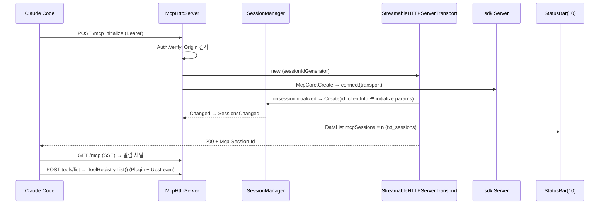
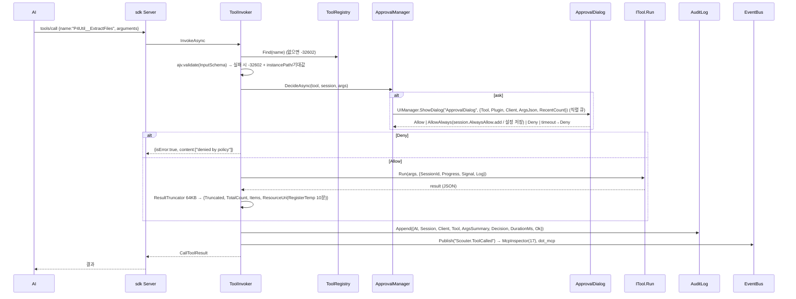
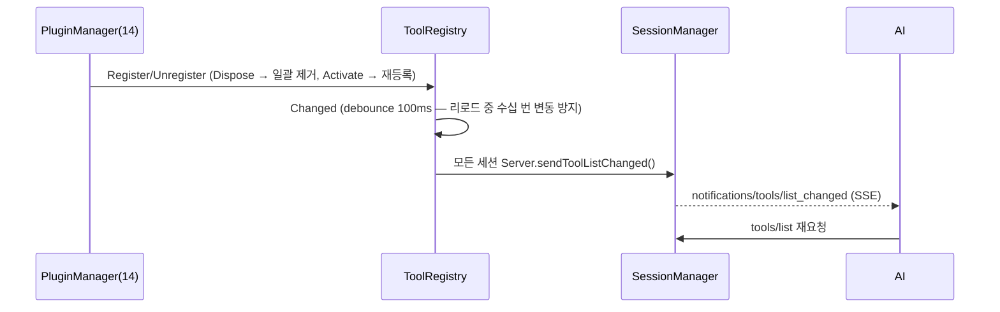
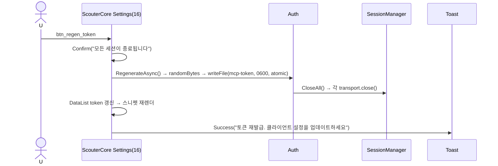
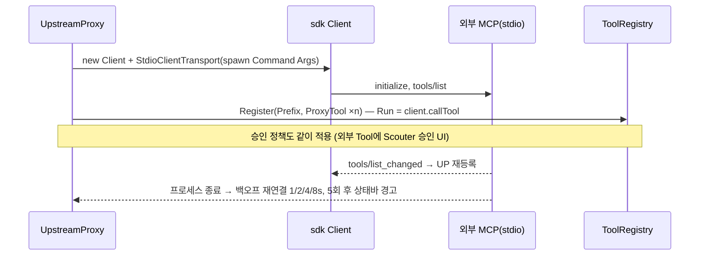

# 15. MCP 서버 — Streamable HTTP · 세션 · 승인 · 감사 · UpstreamProxy

> 구현 Phase **P7**(단, `McpHttpServer`의 node:http + `Router` 골격과 `StartAsync/StopAsync`는 **P0(03)**에서 만들고 `/test/*`(20)만 마운트한다. `/mcp` 라우트·세션·인증·승인은 P7). Scouter는 **MCP 서버**다(D-01). 외부 AI(Claude Code / OpenCode / Cursor)가 `http://127.0.0.1:9515/mcp`에 붙어 Plugin이 등록한 Tool/Resource/Prompt를 사용한다. Renderer 프로세스에서 `node:http`로 직접 구동(D-11: Main은 창/트레이만).

## 15.1 라이브러리

| 기능 | 라이브러리 · API |
|---|---|
| HTTP | `node:http.createServer` — express/fastify 안 쓴다(라우트 5개, 자체 `Router` 40줄) |
| MCP 프로토콜 | `@modelcontextprotocol/sdk` ^1 **low-level** `Server`(`server/index.js`) + `StreamableHTTPServerTransport`(`server/streamableHttp.js`). `McpServer`(고수준) 대신 low-level을 쓰는 이유(D-19): Tool 목록이 런타임에 바뀌므로 `setRequestHandler(ListToolsRequestSchema, ...)`로 매 요청 시 ToolRegistry를 읽게 |
| 스키마 | Tool `InputSchema`는 JSON Schema 그대로 노출, 검증은 `ajv`. sdk가 요구하는 `zod`는 프로토콜 레벨 스키마에만(peer 의존) |
| 세션 ID | `node:crypto.randomUUID()` (sdk `sessionIdGenerator`) |
| 토큰 | `crypto.randomBytes(32).toString("base64url")` → `~/.scouter/mcp-token` mode 0600; 비교는 `crypto.timingSafeEqual` |
| 감사 로그 | `fs.appendFile` JSONL + 크기 회전(20MB) — 08 Log와 별도 파일 |
| Upstream stdio | `node:child_process.spawn` + sdk `Client` + `StdioClientTransport` |
| Upstream HTTP | sdk `Client` + `StreamableHTTPClientTransport` |
| Test API | 같은 http 서버에 `--test`일 때만 라우트 붙임(20) |

## 15.2 엔드포인트

| 경로 | 메서드 | 설명 |
|---|---|---|
| `/mcp` | POST | JSON-RPC. 응답 JSON 또는 SSE(`Accept: text/event-stream`) |
| `/mcp` | GET | 서버→클라이언트 알림 SSE(`Mcp-Session-Id` 필수) |
| `/mcp` | DELETE | 세션 종료 |
| `/health` | GET | `{Ok, Version, Sessions, Tools}` 인증 불필요 |
| `/test/*` | — | `--test` 전용(20 §20.4) |

바인드 `127.0.0.1`. `Mcp.Port`(9515) 충돌 시 +1 ×5 시도 → 상태바 `txt_port`. 인증 `Authorization: Bearer`, `--no-auth`로 해제(개발). `Origin` 헤더 있으면 `Mcp.AllowedOrigins` 외 403.

## 15.3 클래스 구조 (C15-1)

```mermaid
classDiagram
	class McpHttpServer {
		+Http : http.Server
		+Router : Router
		+Port : number
		+State : Stopped|Starting|Running|Error
		+SessionsChanged : Event
		+StateChanged : Event
		+StartAsync(port) Promise~number~
		+StopAsync() Promise
		+Sessions() SessionInfo[]
		-Handle(req, res)
		-router_ : Router
	}
	class Router { +Add(method, path, handler); +Dispatch(req,res) boolean }
	class Auth { +Verify(req) boolean; +Token; +RegenerateAsync(); -tokenPath_ }
	class SessionManager {
		+Create(id, transport, server) Session; +Changed : Event → EventBus `Scouter.McpSessionsChanged`(17); +Get(id) Session|null; +Remove(id); +List()
		+Changed : Event
		-IdleSweep() 30분
	}
	class Session { +Id; +ClientInfo {name,version}; +CreatedAt; +LastSeen; +Transport; +Server : sdk Server; +AlwaysAllow : Set~string~; +CallCount }
	class McpCore { +Create(session) Server ; setRequestHandler ×8 ; +NotifyToolsChanged() }
	class ToolRegistry { <<static>> +Register(pluginId, tool); +List(); +Find(fullName); +Changed ; ajv 캐시 }
	class ResourceRegistry { <<static>> +Register(pluginId, uri, provider); +Read(uri); +List(); +RegisterTemp(text, ttl) uri }
	class PromptRegistry { <<static>> +Register(pluginId, name, def); +List(); +Get(name,args) }
	class ApprovalManager {
		<<static>>
		+DecideAsync(tool, session, args) Promise~Decision~
		-Policy(tool, session) auto|ask|deny
		-queue_ : Promise chain (다이얼로그 1개씩)
	}
	class ToolInvoker { <<static>> +InvokeAsync(fullName, args, session, progress, signal) Promise~CallToolResult~ ; 검증→승인→Run→자르기→감사 }
	class AuditLog { <<static>> +Append(entry); -Rotate() }
	class UpstreamProxy { +ConnectAllAsync(cfg[]); +Tools(); +CallAsync(name,args) ; Client + transports }
	class ResultTruncator { <<static>> +Apply(result, limit 64KB) }
	McpHttpServer --> Router
	McpHttpServer --> Auth
	McpHttpServer --> SessionManager
	SessionManager --> Session
	Session --> McpCore
	McpCore --> ToolRegistry
	McpCore --> ResourceRegistry
	McpCore --> PromptRegistry
	McpCore --> ToolInvoker
	ToolInvoker --> ApprovalManager
	ToolInvoker --> AuditLog
	ToolInvoker --> ResultTruncator
	ToolRegistry <-- UpstreamProxy : 재등록 {Prefix}__{Name}
```

파일: `Scouter.App/Renderer/Mcp/{McpHttpServer,Router,Auth,SessionManager,McpCore,ToolInvoker,ApprovalManager,ApprovalDialogWindow(12),AuditLog,UpstreamProxy,ResultTruncator,ResourceRegistry,PromptRegistry}.ts`, `Renderer/Plugin/ToolRegistry.ts`(14 공유), `Config/ConnectSnippets.json`.

## 15.4 핵심 구현

```ts
// McpHttpServer.Handle — 라우팅과 세션 분기
private async HandleMcpAsync(_req: IncomingMessage, _res: ServerResponse): Promise<void>
{
	if (!Args.NoAuth && !this.auth_.Verify(_req))
		return Json(_res, 401, { error: "unauthorized" });
	const origin = _req.headers.origin;
	if (origin !== undefined && !Settings.Get<string[]>("Mcp.AllowedOrigins", []).includes(origin))
		return Json(_res, 403, { error: "origin not allowed" });

	const sessionId = _req.headers["mcp-session-id"] as string | undefined;
	const body = _req.method === "POST" ? await ReadJsonAsync(_req, kMaxBodyBytes) : undefined;   // 4MB

	let session = sessionId !== undefined ? this.sessions_.Get(sessionId) : null;
	if (session === null && _req.method === "POST" && IsInitializeRequest(body))
	{
		const transport = new StreamableHTTPServerTransport({
			sessionIdGenerator: () => randomUUID(),
			onsessioninitialized: (_id) => { session = this.sessions_.Create(_id, transport, server); },
		});
		const server = McpCore.Create(() => session);   // 핸들러는 세션을 필요 시점에 조회
		await server.connect(transport);
		return transport.handleRequest(_req, _res, body);
	}
	if (session === null)
		return Json(_res, 404, { error: "unknown session" });
	session.LastSeen = Date.now();
	await session.Transport.handleRequest(_req, _res, body);
	if (_req.method === "DELETE")
		this.sessions_.Remove(session.Id);
}

// McpCore — 세션별 sdk Server (Tool 목록은 매 요청 시 동적)
server.setRequestHandler(ListToolsRequestSchema, async () => ({
	tools: ToolRegistry.List().map((_t) => ({ name: _t.FullName, description: _t.Description, inputSchema: _t.InputSchema, annotations: ToAnnotations(_t) })),
}));
server.setRequestHandler(CallToolRequestSchema, async (_req, _extra) =>
	ToolInvoker.InvokeAsync(_req.params.name, _req.params.arguments ?? {}, session(), (_n, _msg) => _extra.sendNotification({ method: "notifications/progress", params: { progressToken: _req.params._meta?.progressToken, progress: _n, message: _msg } }), _extra.signal));
// ToolRegistry.Changed → 모든 세션 server.sendToolListChanged()
```

## 15.5 승인 정책

우선순위: `Mcp.Tools.{FullName}.Approval` 설정 → 세션 "항상 허용"(메모리) → Tool `DefaultApproval` → `Annotations`(ReadOnly→auto, Destructive→ask) → 전역 `Mcp.DefaultApproval`(ask).

| 값 | 동작 |
|---|---|
| auto | 즉시 실행, 상태바 `dot_mcp` 300ms Active 깜박임, 감사 로그 |
| ask | ApprovalDialog(12 §12.3). 창이 트레이에 있으면 표시 + `window:attention`(flashFrame) + OS Notification. 다이얼로그 30s 타임아웃 → Deny |
| deny | `isError:true` "denied by policy" |

`Process`/`Fs.Write` 권한 Plugin Tool을 auto로 설정하면 설정 화면에 경고 Badge.

## 15.6 시퀀스

### S15-1 초기화 (새 클라이언트 연결)



### S15-2 tools/call 전체 경로



### S15-3 Plugin 리로드 → tools/list_changed



### S15-4 토큰 재발급 (ScouterCore 설정 화면 btn_regen_token)



### S15-5 UpstreamProxy



## 15.7 설정

| 키 | 기본 |
|---|---|
| `Mcp.Enabled` | true |
| `Mcp.Port` | 9515 |
| `Mcp.DefaultApproval` | ask |
| `Mcp.Tools.{FullName}.Approval` | — |
| `Mcp.AllowedOrigins` | [] |
| `Mcp.Upstreams` | `[{Name, Transport: stdio\|http, Command?, Args?, Url?, Headers?, Prefix}]` |
| `Mcp.Audit.Enabled` / `MaxSizeMb` / `FullArgs` | true / 20 / false |
| `Mcp.SessionIdleMinutes` | 30 |

`Mcp.Port`/`Enabled` 변경은 재시작 필요(PropertyGrid "재시작 필요" 토스트, 12).

## 15.8 보안 체크리스트

- 127.0.0.1 바인드, Bearer 필수, Origin 기본 거부, body 4MB 제한, 세션 유휴 30분 정리.
- 토큰 파일 0600(Windows는 ACL 적용 불가 → 사용자 프로필 하위 폴더로만), 재발급 시 전세션 종료.
- 감사 로그는 요약(문자열 256자, 배열 길이)만.
- Test API는 `--test` 없이는 라우트 자체 없음.

## 15.9 테스트

| 파일 | 확인 |
|---|---|
| `Router.test.ts` `Auth.test.ts` | 라우트 매칭, timingSafeEqual 길이 불일치 처리, `--no-auth` |
| `ApprovalManager.test.ts` | 우선순위 5단계 전부, AlwaysAllow 세션 범위, 큐 직렬화 |
| `ToolInvoker.test.ts` | ajv 실패 메시지 형식, 자르기, 감사 배열 요약, Signal 중단 |
| Integration `McpHttpServer.int.ts` | 실제 node:http + sdk `Client`(StreamableHTTPClientTransport)로 initialize → tools/list → call(테스트 Tool) → DELETE; 401/403/404 |
| E2E | Claude Code 스니펫 그대로의 설정으로 외부 연결 스모크(수동 체크리스트) |

## 15.10 구현 체크리스트

- [ ] `/health`, initialize/tools/list/tools/call, 세션 생성/종료/유휴
- [ ] ApprovalDialog 연결(12 → 15), auto/ask/deny 세 경로 E2E(Test API `/test/approval`)
- [ ] 감사 로그 회전, `Scouter.ToolCalled` → 상태바
- [ ] Resource/Prompt (ScouterCore 16에서 실제 등록)
- [ ] UpstreamProxy stdio 1개로 검증(예: `@modelcontextprotocol/server-filesystem`)
