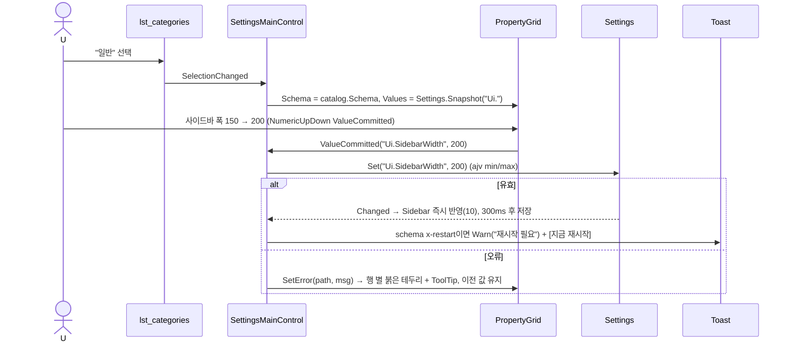
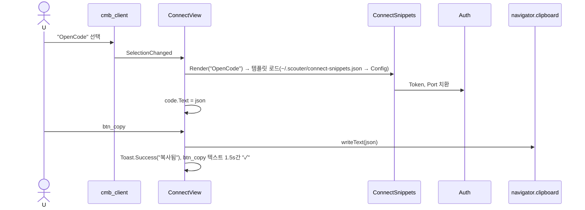
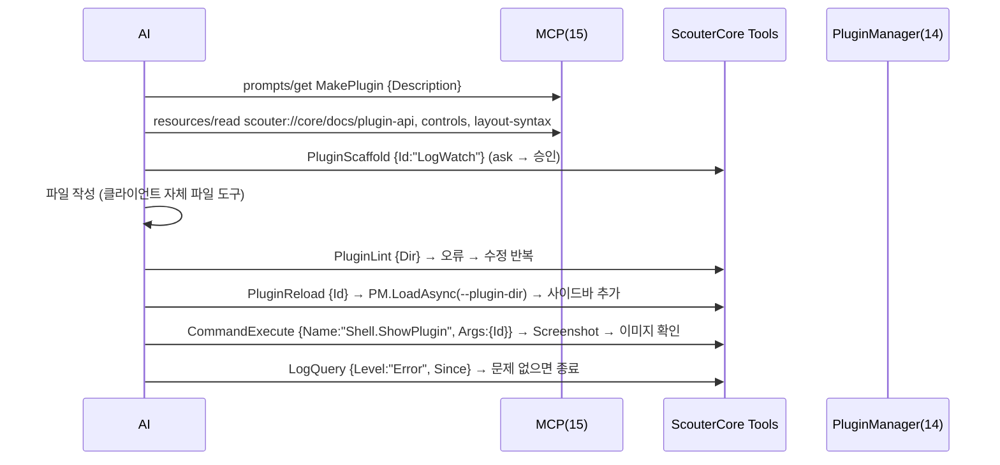
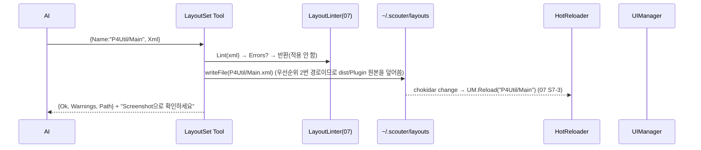

# 16. 내장 Plugin: ScouterCore — 설정 화면 · 연결 스니펫 · 운영 Tool/Resource/Prompt

> 구현 Phase **P6(화면) ~ P7(Tool)**. 필수 Plugin, 버전 = 앱 버전. 설정·테마·레이아웃·Plugin 관리를 **UI와 MCP Tool 양쪽**으로 제공해 "AI가 Scouter 자체를 개발·운영하는" 루프를 만든다. 내장 Plugin도 일반 Plugin과 같은 계약(14)을 쓴다 — 이것이 Plugin API의 첫 검증.

## 16.1 라이브러리

| 기능 | 라이브러리 · API |
|---|---|
| 설정 편집 | PropertyGrid(12) + `Settings.schema.json`(ajv). 스키마 `x-category/x-order/x-secret/x-editor` |
| 스니펫 | `Config/ConnectSnippets.json` 템플릿 `{{Token}} {{Port}}` 자체 치환; `~/.scouter/connect-snippets.json` 우선 |
| 클립보드 | `navigator.clipboard.writeText` (Renderer, 포커스 무관 — Electron은 제한 없음) |
| 스크린샷 | `webContents.capturePage` → IPC `app:capture-page({Rect?})` → PNG base64 (Main이 수행, 유일한 스크린샷 경로; Test API도 같은 IPC) |
| Layout lint | 07 `LayoutLinter`(인프로세스, `@xmldom/xmldom` 아닌 `DOMParser`) |
| 문서 리소스 | 빌드 시 `Scripts/GenDocs.mjs`가 `plugin-api.d.ts`·`Layout.schema.json`에서 마크다운 생성 → `Renderer/BuiltIn/ScouterCore/Docs/*.md` (webpack `asset/source`) |
| Scaffold | `Templates/Plugin/**` 복사 + `{{Id}}` 치환 (`node:fs`) |

## 16.2 클래스 구조 (C16-1)

```mermaid
classDiagram
	class ScouterCorePlugin { +OnActivate(): Tools ×19, Resources, Prompt, Commands("OpenSettings"), Ui.RegisterWindow("ScouterCore/Main") }
	class SettingsMainControl {
		<<UserControl>>
		+OnInit(data)
		-lst_categories : ListBox
		-grid : PropertyGrid
		-tab_connect : ConnectView
		-OnCategorySelected(id)
		-OnValueCommitted(path, value)
	}
	class ConnectView { -cmb_client : ComboBox; -code : CodeEditor(ReadOnly json); -btn_copy; -btn_regen_token; -txt_port }
	class SettingsCatalog { <<static>> +Categories() : {Id, Title, Schema}[] ; App schema + Plugins.{Id} schema 병합 }
	class ConnectSnippets { <<static>> +Clients() string[]; +Render(client) string }
	class Tools_Settings { SettingsGet SettingsSet }
	class Tools_Theme { ThemeList ThemeSet ThemeCreate ThemeLint }
	class Tools_Layout { LayoutGet LayoutSet LayoutLint ControlCatalog }
	class Tools_Plugin { PluginList PluginReload PluginScaffold PluginLint }
	class Tools_Ops { CommandList CommandExecute LogQuery ConnectSnippet Screenshot }
	class DocsResources { scouter://core/docs/plugin-api | controls | layout-syntax ; templates/plugin ; settings-schema ; logs/recent }
	class MakePluginPrompt { Arguments: Description ; Build() → 절차 프롬프트 }
	ScouterCorePlugin --> SettingsMainControl
	SettingsMainControl --> ConnectView
	SettingsMainControl --> SettingsCatalog
	ConnectView --> ConnectSnippets
	ScouterCorePlugin --> Tools_Settings
	ScouterCorePlugin --> Tools_Theme
	ScouterCorePlugin --> Tools_Layout
	ScouterCorePlugin --> Tools_Plugin
	ScouterCorePlugin --> Tools_Ops
	ScouterCorePlugin --> DocsResources
	ScouterCorePlugin --> MakePluginPrompt
```

파일: `Renderer/BuiltIn/ScouterCore/{Plugin.json,Index.ts,Layout/Main.xml,Layout/Connect.xml,Views/SettingsMainControl.ts,Views/ConnectView.ts,SettingsCatalog.ts,ConnectSnippets.ts,Tools/*.ts(16),Resources.ts,Prompts.ts,Docs/*.md(생성),Templates/Plugin/**}`.

## 16.3 UI 디자인 — 설정 화면 (`Layout/Main.xml`)

```
┌─ lst_categories (ListBox 180px) ─┬─ content ────────────────────────────────────────────┐
│ 필터 [txt_filter        ] │ ▸ 일반 (Ui)                              PropertyGrid  │
│ ── 앱 ──                    │   사이드바 폭         [150      ]                    │
│ ● 일반                    │   스플리터 허용       [x]                            │
│   테마 · 글꼴             │   네이티브 프레임     [ ]  ⚠ 재시작 필요              │
│   연결 (MCP)              │ ▸ 고급                                                  │
│   승인 정책 (Tools)       │   ...                                                   │
│   로그                    │                                                         │
│   핫키                    │                                                         │
│ ── Plugin ──               │                                                         │
│   P4Util                  │                                                         │
│   McpInspector            │                                                         │
│ ────────────────────────── │  [기본값 복원] [내보내기] [가져오기]   settings.json 열기 │
└────────────────────────────┴────────────────────────────────────────────────────────┘
```

- 카테고리는 `SettingsCatalog`가 만든다: App `Settings.schema.json`의 `x-category` 그룹 + 각 Plugin `Settings.schema.json`(하나씩). 필터는 키/제목/설명 문자열 포함.
- 연결(MCP) 카테고리는 PropertyGrid 대신 `Connect.xml` UserControl:

```
▸ 상태  ● Running  http://127.0.0.1:9515/mcp   세션 2   Tool 27
▸ 클라이언트 [Claude Code ▾] (cmb_client)                    [복사] (btn_copy)
  ┌─ code (CodeEditor json ReadOnly, 높이 160) ─────────────────────────┐
  │ { "mcpServers": { "scouter": { "type":"http", "url": "...", ... } } } │
  └────────────────────────────────────────────────────────────────┘
▸ 토큰  ********  [보기] [재발급 (btn_regen_token)]     허용 Origin [        ] [+]
```

- 승인 정책 카테고리: `ListView/GridView` (Tool │ Plugin │ 기본 │ 재정의 ComboBox auto/ask/deny/기본) → `Mcp.Tools.{Full}.Approval`.

## 16.4 Tool 표

| Tool | 승인 | 입력 → 출력 | 구현 |
|---|---|---|---|
| `SettingsGet` | auto | `{Path?}` → 값/트리(`x-secret` 마스킹) | `Settings.Snapshot()` 필터 |
| `SettingsSet` | ask | `{Path, Value}` → `{Ok, RequiresRestart}` | `Settings.Set` (ajv 오류는 그대로 반환) |
| `ThemeList/Set/Create/Lint` | auto/auto/ask/auto | 13 | ThemeManager |
| `LayoutGet` | auto | `{Name}` → XML 원문 + 해석된 경로 | ILayoutProvider |
| `LayoutSet` | ask | `{Name, Xml}` → lint 결과; 통과 시 `~/.scouter/layouts/{Name}.xml` 저장 + `Scouter.LayoutReloaded` | LayoutLinter + HotReloader |
| `LayoutLint` | auto | `{Xml}` → `{Errors[], Warnings[]}` E000~/W030~ | |
| `ControlCatalog` | auto | `{Tag?}` → 속성/이벤트/기본값 표 | `ElementCatalog` + `UIProperty` 메타 |
| `PluginList` | auto | → `{Id, Name, Version, State, Source, Tools[], LoadMs}[]` | PluginManager.List |
| `PluginReload` | ask | `{Id}` | PluginManager.ReloadAsync |
| `PluginScaffold` | ask | `{Id, Name, Dir?}` → 생성 파일 목록 | Templates 복사 |
| `PluginLint` | auto | `{Dir}` → Manifest/Layout/tsc(선택) 오류 | ManifestValidator + LayoutLinter + esbuild dry-run |
| `CommandList` | auto | → `{Name, Title, Hotkey}[]` | CommandRegistry |
| `CommandExecute` | ask | `{Name, Args?}` | |
| `LogQuery` | auto | `{Level?, Scope?, Since?, Text?, Limit=200}` | LogBuffer.Query |
| `ConnectSnippet` | auto | `{Client}` → 스니펫 문자열 | ConnectSnippets.Render |
| `Screenshot` | auto | `{Name?}` → image content(PNG base64) | IPC `app:capture-page`, Name이면 그 요소 `getBoundingClientRect` 범위 |

Resources: `scouter://core/docs/plugin-api`, `.../controls`, `.../layout-syntax`, `scouter://core/templates/plugin`, `scouter://core/settings-schema`, `scouter://core/logs/recent`(최근 500줄), `scouter://theme/tokens`, `scouter://theme/schema`.

Prompt `ScouterCore.MakePlugin({Description})`: "1) docs 리소스 3개를 읽고 2) `PluginScaffold` 3) Index.ts/Main.xml 작성 4) `PluginLint` 5) `PluginReload` 6) `Screenshot`으로 화면 확인 7) `LogQuery Level=Error`로 오류 확인" 순서를 지시.

## 16.5 시퀀스

### S16-1 설정 값 수정 (PropertyGrid → Settings)



### S16-2 연결 스니펫 복사 (btn_copy)



### S16-3 AI가 MakePlugin 프롬프트로 Plugin 만드는 루프



### S16-4 `LayoutSet` → 핫리로드



## 16.6 테스트

| 파일 | 확인 |
|---|---|
| `SettingsCatalog.test.ts` | App+Plugin 스키마 병합, x-category 순서, 필터 |
| `ConnectSnippets.test.ts` | 3 클라이언트 치환 결과가 유효 JSON, 사용자 파일 우선 |
| `Tools/*.test.ts` | 각 Tool InputSchema ajv 자기검증(스키마 자체가 유효), SettingsGet 시크릿 마스킹, LogQuery 필터 |
| E2E | 설정 화면 열기 → 사이드바 폭 변경 → `settings.json` 확인; ConnectSnippet Tool 결과로 실제 sdk Client 연결 |

## 16.7 체크리스트

- [ ] P6: 설정 화면(PropertyGrid 경로 전체), 연결 탭(서버 상태만)
- [ ] P7: Tool 19개(§16.4), Resources, MakePlugin 프롬프트, Screenshot IPC
- [ ] `GenDocs.mjs` → docs 리소스 3개가 실제 API와 일치(CI에서 diff 검사)
- [ ] MakePlugin 루프로 Hello Plugin을 AI가 실제로 만드는 것 — P7 완료 기준
