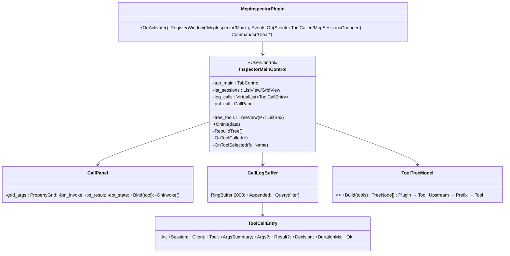
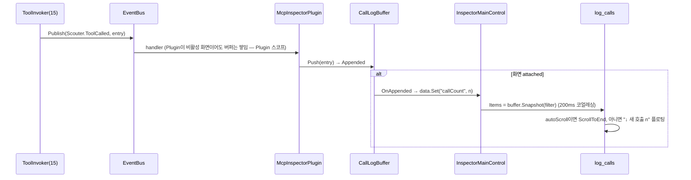
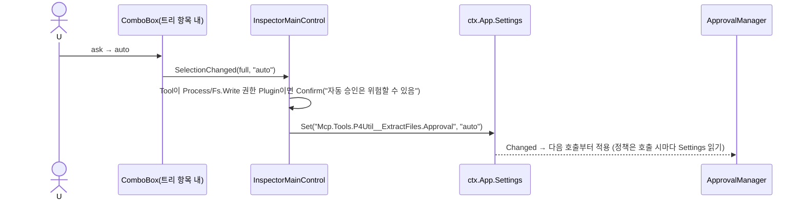
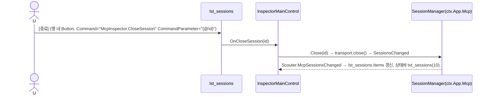

# 17. 내장 Plugin: McpInspector — 세션 · Tool 트리 · 호출 로그 · 직접 호출

> 구현 Phase **P7**(MCP 서버와 함께). MCP 서버의 내부를 보는 화면. 이 화면 하나가 TreeView/TabControl/VirtualList/PropertyGrid/CodeEditor/ComboBox/GridView를 전부 쓰므로 **컨트롤 1차 완료 기준 화면**(22). TreeView/CodeEditor는 P10이므로 P7에서는 ListBox/TextBox(ReadOnly)로 시작하고 P10에서 교체한다(두 버전 모두 XML 수정만).

## 17.1 라이브러리

| 기능 | 구현 |
|---|---|
| 데이터 소스 | `ctx.App.Mcp.Sessions()`, `ToolRegistry.List()`, EventBus `Scouter.ToolCalled` / `Scouter.McpSessionsChanged` (새 이벤트, 15 SessionsChanged를 EventBus로 재발신) |
| 호출 로그 | 12 `RingBuffer<ToolCallEntry>(2000)` + `VirtualList` |
| 직접 호출 폼 | 12 `PropertyGrid`에 Tool `InputSchema`를 그대로 넣음(ajv) → `ctx.Tools.Invoke(fullName, args)` (승인 정책도 통과 — 자기 화면에서도 승인 다이얼로그가 뜨는 것이 정상) |
| 인자/결과 보기 | `CodeEditor`(json, ReadOnly, P10) / P7에서는 `TextBox AcceptsReturn IsReadOnly` + `JSON.stringify(v, null, 2)` |
| 승인 인라인 변경 | `ComboBox` → `ctx.App.Settings.Set("Mcp.Tools.{Full}.Approval")` (`App.*` 권한) |
| 감사 로그 열기 | `shell.showItemInFolder` IPC `app:show-item(path)` |

## 17.2 클래스 구조 (C17-1)



파일: `Renderer/BuiltIn/McpInspector/{Plugin.json,Index.ts,Layout/Main.xml,Layout/CallPanel.xml,Views/InspectorMainControl.ts,Views/CallPanel.ts,CallLogBuffer.ts,ToolTreeModel.ts,Styles.css}`.

## 17.3 UI 디자인

```
┌─ tree_tools (240) ───────────┬─ tab_main ───────────────────────────────────────────────┐
│ [필터            ]  27 tools │ [세션 2] [호출 로그 143] [직접 호출]                          │
│ ▾ ScouterCore (16)         │───────────────────────────────────────────────────────────│
│    SettingsGet    [auto ▾]  │ 세션 (lst_sessions GridView)                                        │
│    SettingsSet    [ask  ▾]  │  클라이언트         연결        마지막 활동   호출   [종료]           │
│ ▾ P4Util (7)               │  claude-code 1.0.x  09:12:03    2분 전    41                        │
│    ExtractFiles   [auto ▾]  │  opencode 0.5.x     09:40:11    방금       3                         │
│ ▾ Upstream: fs (11)        │───────────────────────────────────────────────────────────│
│                            │ 호출 로그 (log_calls VirtualList, 한 줄 = 20px, 클릭 → 아래 상세)    │
│                            │  09:41:02 ● 120ms  P4Util__Describe      claude-code  auto           │
│                            │  09:41:07 ● 3.2s   P4Util__ExtractFiles  claude-code  ask→Allow     │
│                            │  09:41:30 ● err    ScouterCore__LayoutSet opencode    ask→Deny      │
│                            │ ┌─ 상세: 인자 │ 결과 (TabControl, CodeEditor json ReadOnly) ─────┐    │
│                            │ │ { "Depot": "//mabinogi/...", "From": 1, "To": 40 }              │    │
│                            │ └────────────────────────────────────────────────────────┘    │
│ [감사 로그 열기]           │ [지우기] [자동 스크롤 x]  필터: [Tool  ] [세션 ▾] [실패만 □]            │
└────────────────────────────┴──────────────────────────────────────────────────────────────────┘
```

직접 호출 탭(`CallPanel.xml`): 상단 Tool 이름 + Description, `grid_args` PropertyGrid(InputSchema; required 누락이면 btn_invoke 비활성), `[호출 (btn_invoke, Primary)] [인자 JSON 복사]`, 결과 CodeEditor + `dot_state`(Idle/Running/Ok/Error) + 소요 시간. StatusDot 색: Ok green, Error red, Running Busy 펄스.

`Main.xml` 골격:

```xml
<UserControl xmlns="scouter/gui" Name="mcp_inspector">
	<UserControl.Data>
		<Item Key="toolCount" Type="Number" Value="0" />
		<Item Key="sessionCount" Type="Number" Value="0" />
		<Item Key="callCount" Type="Number" Value="0" />
		<Item Key="autoScroll" Type="Boolean" Value="true" />
	</UserControl.Data>
	<Grid ColumnDefinitions="240,4,*">
		<DockPanel Grid.Column="0">
			<TextBox DockPanel.Dock="Top" Name="txt_filter" Placeholder="Tool 필터" />
			<Button DockPanel.Dock="Bottom" Name="btn_audit" Content="감사 로그 열기" Variant="Ghost" />
			<TreeView Name="tree_tools" />
		</DockPanel>
		<GridSplitter Grid.Column="1" />
		<TabControl Grid.Column="2" Name="tab_main">
			<TabItem Header="세션 {@sessionCount}"><ListView Name="lst_sessions">...</ListView></TabItem>
			<TabItem Header="호출 로그 {@callCount}"> ... <VirtualList Name="log_calls" ItemHeight="20" /> ... </TabItem>
			<TabItem Header="직접 호출"><ContentPresenter Name="pnl_call" /></TabItem>
		</TabControl>
	</Grid>
</UserControl>
```

## 17.4 시퀀스

### S17-1 호출 로그 실시간 갱신



### S17-2 직접 호출 (btn_invoke)

```mermaid
sequenceDiagram
	actor U
	participant T as tree_tools
	participant V as InspectorMainControl
	participant CP as CallPanel
	participant G as grid_args
	participant TI as ToolInvoker(ctx.Tools.Invoke)
	participant AM as ApprovalManager
	U->>T: Tool 선택
	T->>V: SelectedItemChanged
	V->>CP: Bind(tool) → tab_main.SelectedIndex = 2
	CP->>G: Schema = tool.InputSchema, Values = 이전 입력(Storage "lastArgs.{Full}")
	U->>G: 인자 입력 (ValueCommitted → required 충족 시 btn_invoke.IsEnabled)
	U->>CP: btn_invoke
	CP->>CP: dot_state = Running, IsEnabled = false
	CP->>TI: Invoke(full, args, {Session:"inspector"})
	TI->>AM: 정책 적용 (ask이면 ApprovalDialog — 자기 화면에서도 뜸)
	TI-->>CP: result | error
	CP->>CP: txt_result = JSON, dot_state = Ok/Error, 소요 ms; Storage.Set(lastArgs)
```

### S17-3 승인 정책 인라인 변경



### S17-4 세션 종료 버튼



## 17.5 테스트

| 파일 | 확인 |
|---|---|
| `ToolTreeModel.test.ts` | Plugin/Upstream 그룹, 필터, 정렬(Intl.Collator) |
| `CallLogBuffer.test.ts` | 2000 순환, 필터(Tool/세션/실패만) |
| E2E | Test API로 Tool 호출 → 로그 행 증가 확인; 직접 호출 → `ScouterCore__SettingsGet` 결과 표시 |

## 17.6 체크리스트

- [ ] P7: 세션/호출 로그/직접 호출 (ListBox/TextBox 대체버전)
- [ ] P10: TreeView/CodeEditor 교체 — XML과 `FindName` 캐스트만 변경되는지 확인(설계 검증 지표)
- [ ] 컨트롤 1차 완료 기준: 이 화면 스크린샷이 다크/라이트 양쪽에서 깨짐 없음
