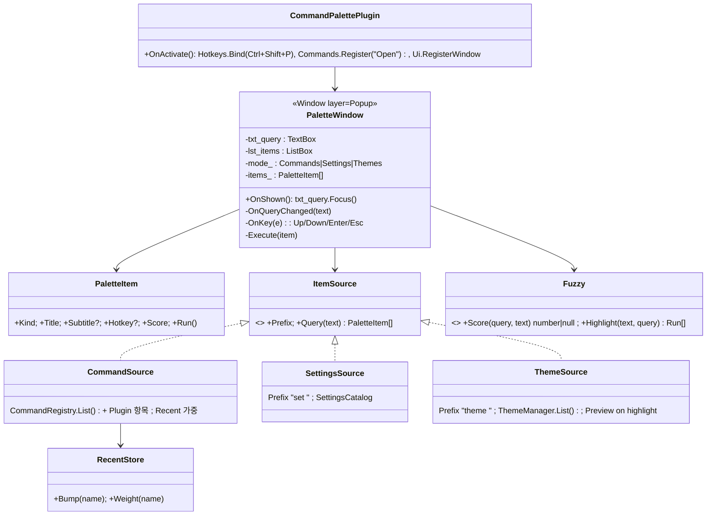
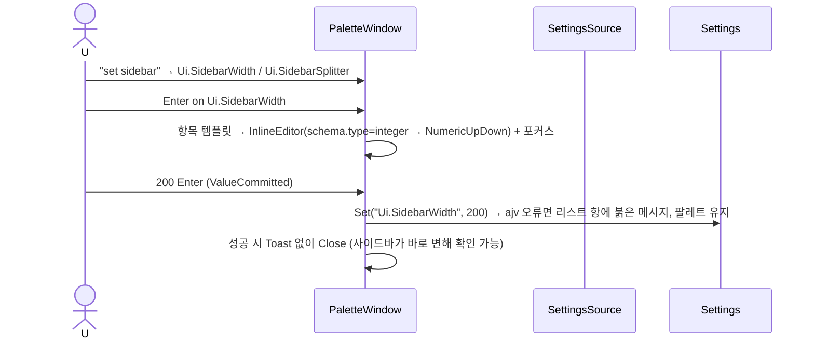

# 18. 내장 Plugin: CommandPalette — Ctrl+Shift+P · fuzzy 검색 · 설정/테마 미리보기

> 구현 Phase **P9**(P3 Shell 에서 커맨드 레지스트리가 생기면 골격버전은 앞당길 수 있음). Popup 레이어 사용 예제이며 CommandRegistry · Settings · ThemeManager 를 하나의 입력창에서 묶는다.

## 18.1 라이브러리

| 기능 | 구현 |
|---|---|
| fuzzy 매칭 | 자체 `Fuzzy.ts` ≈60줄: 문자 순서 매칭, 연속 문자 보너스 +5, 단어 시작 +10, 대소문자 무시, 한글 초성 매칭은 **안 함**(사용자 확인 항목). fuse.js 등 안 쓰기 |
| 최근 사용 | `ctx.Storage.Get("recent")` → `{Name: count, lastAt}` 상위 정렬 |
| 핫키 | `ctx.Hotkeys.Bind("Ctrl+Shift+P")` — Shell 명령 `CommandPalette.Open` |
| 표시 | `ctx.Ui.Show("CommandPalette/Main", data, "Popup")` — Popup 레이어(z 200), 바깥 클릭/ESC 닫기 |
| 리스트 | 11 `ListBox` + ItemTemplate(제목/부제/핫키 Badge) — 최대 50개만 렌더 |
| 설정 모드 | `> ` 접두 없으므로(기본이 커맨드) `set ` 접두 → SettingsCatalog(16) 검색, 선택 시 인라인 에디터(NumericUpDown/CheckBox/TextBox) |
| 테마 모드 | `theme ` 접두 → `ThemeManager.List()`, 방향키로 이동 시 `Preview(id)`(13 S13-2), Enter 적용, ESC 원복 |
| Plugin 전환 | `Shell.ShowPlugin` 명령에 `CommandParameter={Id}` — 목록에 "Plugin: P4Util" 항목으로 자동 추가 |

## 18.2 클래스 구조 (C18-1)



파일: `Renderer/BuiltIn/CommandPalette/{Plugin.json,Index.ts,Layout/Main.xml,Views/PaletteWindow.ts,Sources/{CommandSource,SettingsSource,ThemeSource}.ts,Fuzzy.ts,RecentStore.ts,Styles.css}`.

## 18.3 UI 디자인

```
            ┌────────────────────────────────────────────────────────┐  width 560, top 80px
            │ 🔍 [sidebar_                                            ] │  txt_query 36px
            ├────────────────────────────────────────────────────────┤
            │ ▶ Shell: 사이드바 토글                        Ctrl+B   │  선택 = --background-active
            │   Settings: Ui.SidebarWidth = 150            set      │  매칭 문자 <b> 강조(Run)
            │   Settings: Ui.SidebarSplitter = true                  │  행 32px, 최대 12행 후 스크롤
            │   Plugin: P4Util                                       │
            ├────────────────────────────────────────────────────────┤
            │ ↑↓ 이동  ↵ 실행  esc 닫기      set / theme 접두어         │  힌트 한 줄 --text-weak
            └────────────────────────────────────────────────────────┘  shadow --shadow-md, radius 8
```

설정 항목 Enter → 항목이 인라인 에디터로 바뀐다(`Settings: Ui.SidebarWidth [150 ] ↵ 저장 / esc 취소`). 테마 항목은 왼쪽에 4색 스와치(13).

```xml
<Window xmlns="scouter/gui" Name="command_palette" Width="560" Layer="Popup" Placement="TopCenter" Margin="80,0,0,0" CloseOnOutsideClick="true">
	<StackPanel>
		<TextBox Name="txt_query" Placeholder="명령 검색…  (set: 설정, theme: 테마)" Icon="search" Height="36" />
		<ListBox Name="lst_items" MaxHeight="384" ItemTemplate="PaletteItem" />
		<TextBlock Name="txt_hint" Variant="Weak" Text="↑↓ 이동  ↵ 실행  esc 닫기" />
	</StackPanel>
</Window>
```

## 18.4 핵심 구현 — Fuzzy

```ts
export class Fuzzy
{
	//////////////////////////////////////////////////////////////////////////////////////
	// 쿼리 문자가 순서대로 모두 등장하면 점수, 아니면 null.
	// @param _query: 소문자 쿼리
	// @param _text: 대상 문자열
	public static Score(_query: string, _text: string): number | null
	{
		if (_query.length === 0)
			return 0;
		const text = _text.toLowerCase();
		let score = 0;
		let prev = -2;
		let ti = 0;
		for (const ch of _query)
		{
			const idx = text.indexOf(ch, ti);
			if (idx < 0)
				return null;
			score += 1;
			if (idx === prev + 1)
				score += 5;                                              // 연속
			if (idx === 0 || " ._:/-".includes(text[idx - 1]))
				score += 10;                                             // 단어 시작
			prev = idx;
			ti = idx + 1;
		}
		return score - Math.floor(text.length / 20);                 // 짧은 항목 우선
	}
}
```

정렬: `Score 내림` → `RecentStore.Weight 내림` → `Intl.Collator("ko")`. 빈 쿼리는 최근 순 그대로 두고, 입력마다 `requestAnimationFrame` 1회로 코얼레싱한다.

## 18.5 시퀀스

### S18-1 열기 → 검색 → 실행

```mermaid
sequenceDiagram
	actor U
	participant HK as Hotkeys
	participant P as CommandPalettePlugin
	participant UM as UIManager
	participant W as PaletteWindow
	participant SRC as CommandSource
	participant CR as CommandRegistry
	U->>HK: Ctrl+Shift+P
	HK->>P: Open
	P->>UM: Show("CommandPalette/Main", {}, "Popup")
	UM->>W: OnShown → txt_query.Focus(), items_ = SRC.Query("") (최근 순)
	U->>W: "sidebar" 입력 (TextChanged)
	W->>SRC: Query("sidebar") → Fuzzy → 상위 50
	W->>W: lst_items.Items = items_, SelectedIndex = 0
	U->>W: Enter (PreviewKeyDown)
	W->>CR: Execute("Shell.ToggleSidebar")
	W->>W: RecentStore.Bump; Close()
```

### S18-2 테마 미리보기 (`theme ` 모드)

```mermaid
sequenceDiagram
	actor U
	participant W as PaletteWindow
	participant TS as ThemeSource
	participant TM as ThemeManager
	U->>W: "theme cat"
	W->>TS: Query("cat") → catppuccin-* 4개 ; original_ = TM.Current.Id
	U->>W: ↓ (SelectionChanged)
	W->>TM: Preview(item.Id) → 전체 앱 즉시 반영 (팔레트 자신도 토큰 사용이므로 함께 변함)
	alt Enter
		W->>TM: Settings.Set("Theme.Id", id) → 확정
	else ESC / 바깥 클릭 / 다른 모드로 전환
		W->>TM: Preview(original_) → 원복
	end
```

### S18-3 설정 인라인 수정 (`set ` 모드)



## 18.6 테스트

| 파일 | 확인 |
|---|---|
| `Fuzzy.test.ts` | 순서 매칭, 연속/단어시작 보너스, 실패 null, `Highlight` 분할 |
| `RecentStore.test.ts` | Bump/Weight 지수 감소 |
| `PaletteWindow.test.ts` (happy-dom) | Up/Down 순환, Enter 실행, ESC 닫기, 접두어 모드 전환 시 original 테마 원복 |
| E2E | Ctrl+Shift+P → "toggle" → Enter → 사이드바 상태 변경(Test API `/test/find`) |

## 18.7 체크리스트

- [ ] 명령 모드 + 최근 순
- [ ] set / theme 모드, 미리보기 원복
- [ ] Plugin 항목 자동 추가, 핫키 Badge 표시(Hotkeys 레지스트리에서 역조회)
- [ ] 한글 초성 검색 필요 여부 — 사용자 확인
