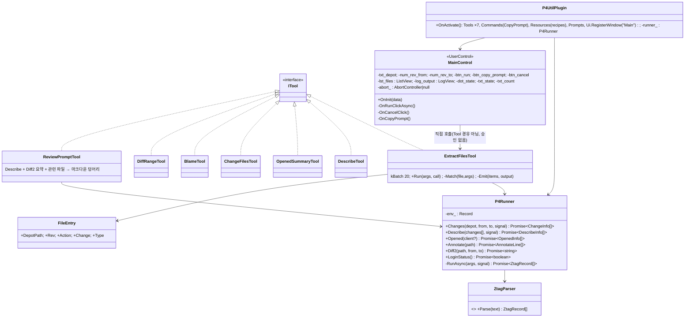
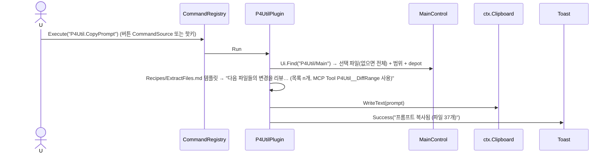

# 19. Plugin: P4Util — Perforce 유틸리티 (킬러 1차)

> 구현 Phase **P8**. `p4` CLI를 감싸는 것이 아니다(D-10). AI가 p4를 직접 치는 것은 이미 가능하므로, **자주 하는 복합 작업을 한 방에 끝내는 유틸리티(Tool)** + **어느 AI 클라이언트를 쓰든 같이 쓰이는 운영 지식(Recipes)** + **단독으로도 유용한 UI**가 가치. 상태 변경(edit/submit/revert)은 1차 제외. 외부 Plugin 폴더(`Plugins/P4Util`)에서 일반 Plugin 경로로 로드되어 Plugin 시스템(14)의 실증 대상.

## 19.1 라이브러리

| 기능 | 구현 |
|---|---|
| p4 실행 | `ctx.Shell.Spawn("p4", ["-ztag", ...], {Env:{P4CHARSET:"utf8", P4PORT?, P4USER?, P4CLIENT?}, Cwd})` — 스트림 읽기, `MaxOutputBytes 64MB` |
| -ztag 파싱 | 자체 `ZtagParser` (줄 `... key value`, 반복 필드 `depotFile0..n` → 배열, 레코드 구분 빈 줄) — 외부 파서 모듈 안 쓰기(node p4api는 네이티브 바이너리, 제외) |
| 인코딩 | `P4CHARSET=utf8` 강제 → iconv-lite 불필요. CRLF는 `split(/\r?\n/)` |
| 동시성 | `Describe` 배치 20개(`kBatch`), 배치 간 순차(p4 서버 부하), `AbortSignal`로 취소 |
| 출력 | `Output: Screen|Clipboard|File` — `ctx.Clipboard`, `ctx.App.SaveDialog`, 파일은 `ctx.Fs.WriteText`(Fs.Write 권한 아니라 StorageDir 아래 기본, SaveDialog 선택 경로는 사용자 선택이므로 허용) |
| 설정 | `Settings.schema.json`: `DefaultDepot`(string, x-editor path이 아닌 text), `P4Port`, `P4User`, `P4Client`, `DescribeBatch`(20), `MaxChanges`(2000) |
| UI | 09/11/12 컨트롤: TextBox, NumericUpDown, Button, TabControl, ListView+GridView, LogView, StatusBar, StatusDot |
| Recipes | `Recipes/*.md` → `ctx.Resources.Register("recipes/{name}", {Path})`; `ctx.Prompts.Register("ExtractFiles")` |

## 19.2 클래스 구조 (C19-1)



파일: `Plugins/P4Util/{Plugin.json, Index.ts, P4Runner.ts, ZtagParser.ts, Types.ts, Tools/{ExtractFiles,Describe,OpenedSummary,ChangeFiles,Blame,DiffRange,ReviewPrompt}Tool.ts, Views/MainControl.ts, Layout/Main.xml, Recipes/{ExtractFiles,Review,OpenedSummary}.md, Settings.schema.json, Styles.css}`.

## 19.3 Tool 표

| Tool | 설명 | 내부 p4 | 승인 |
|---|---|---|---|
| `ExtractFiles({Depot, From, To, Actions?, Ext?, Dedupe=true, Output=Screen})` | 범위 내 변경 파일 목록(마지막 액션 기준 중복 제거) | `changes -s submitted depot@from,to` → `describe -s` 배치 | auto(ReadOnly) |
| `Describe({Changes[]})` | 구조화 설명/파일/작성자 | `describe -s` | auto |
| `OpenedSummary({Client?})` | 열린 파일 요약(체인지 그룹, diff 크기) | `opened`, `diff -ds` | auto |
| `ChangeFiles({Change})` | 단일 체인지 파일 | `describe -s` | auto |
| `Blame({Path, Line?})` | 라인 책임 | `annotate -c` | auto |
| `DiffRange({Path, From, To})` | 리버전 범위 diff | `diff2` | auto |
| `ReviewPrompt({Change})` | 리뷰 컨텍스트 한 덩어리 | 복합 | auto |

결과 64KB 초과는 15 `ResultTruncator`가 `{Truncated, TotalCount, Items(앞 N), ResourceUri}`로 자른다. `MaxChanges`(2000) 초과 범위는 Tool이 `isError` 없이 `{NeedsConfirm:true, ChangeCount}`를 반환하고 Recipe가 "사용자에게 범위 확인"을 지시.

## 19.4 UI 디자인 (`Layout/Main.xml`)

```
┌──────────────────────────────────────────────────────────────────────────┐
│ Depot [//mabinogi/...            ] Rev [1   ][▲▼] ~ [40  ][▲▼] [파일 목록 추출] [AI 프롬프트 복사] │ Border Top, Padding 12
│        액션 [x]add [x]edit [x]delete   확장자 [.cpp;.h        ]   [x]중복 제거   [중단]     │ 2행 (btn_cancel: isRunning일 때만)
├─ tabs ────────────────────────────────────────────────────────────────────────┤
│ [파일 목록 1,204] [로그]                                                                    │
│  Rev │ Action │ Change │ Path                                     (lst_files GridView)     │ 헤더 클릭 정렬
│  #12 │ edit   │ 88123  │ //mabinogi/main/src/Skill/Transform.cpp                            │ 더블클릭 → Describe 탭
│  #3  │ add    │ 88101  │ //mabinogi/main/src/Arcana/KnotUI.cpp                              │ 우클릭 → ContextMenu(P10)
│  ...                                                                                       │
├──────────────────────────────────────────────────────────────────────────┤
│ ● 추출 중… 40개 체인지 중 20                                                    1,204 files  │ StatusBar
└──────────────────────────────────────────────────────────────────────────┘
```

XML 요지(07 문법에 맞춘 버전):

```xml
<UserControl xmlns="scouter/gui" Name="p4util_main">
	<UserControl.Data>
		<Item Key="revFrom" Type="Number" Value="1" />
		<Item Key="revTo" Type="Number" Value="40" />
		<Item Key="isRunning" Type="Boolean" Value="false" />
		<Item Key="fileCount" Type="Number" Value="0" />
		<Item Key="stateText" Type="String" Value="대기" />
	</UserControl.Data>
	<DockPanel LastChildFill="true">
		<Border DockPanel.Dock="Top" Padding="12" Background="{$theme.background-panel}" BorderBrush="{$theme.border-weak-base}" BorderThickness="0,0,0,1">
			<StackPanel Spacing="8">
				<StackPanel Orientation="Horizontal" Spacing="8">
					<Label Content="Depot" Target="#txt_depot" />
					<TextBox Name="txt_depot" Width="320" Placeholder="//depot/project/..." Text="{$settings.Plugins.P4Util.DefaultDepot}" />
					<Label Content="Rev" Margin="12,0,0,0" />
					<NumericUpDown Name="num_rev_from" Width="90" Minimum="1" Value="{@revFrom}" />
					<TextBlock Text="~" />
					<NumericUpDown Name="num_rev_to" Width="90" Minimum="1" Value="{@revTo}" />
					<Button Name="btn_run" Content="파일 목록 추출" Variant="Primary" IsEnabled="!{@isRunning}" />
					<Button Name="btn_copy_prompt" Content="AI 프롬프트 복사" Variant="Ghost" Command="P4Util.CopyPrompt" />
				</StackPanel>
				<StackPanel Orientation="Horizontal" Spacing="8">
					<CheckBox Name="chk_add" Content="add" IsChecked="true" /><CheckBox Name="chk_edit" Content="edit" IsChecked="true" /><CheckBox Name="chk_delete" Content="delete" IsChecked="true" />
					<Label Content="확장자" /><TextBox Name="txt_ext" Width="160" Placeholder=".cpp;.h" />
					<CheckBox Name="chk_dedupe" Content="중복 제거" IsChecked="true" />
					<Button Name="btn_cancel" Content="중단" Variant="Danger" Visibility="{@isRunning ? 'Visible' : 'Collapsed'}" />
				</StackPanel>
			</StackPanel>
		</Border>
		<StatusBar DockPanel.Dock="Bottom">
			<StatusBarItem><StatusDot Name="dot_state" Status="Idle" /></StatusBarItem>
			<StatusBarItem><TextBlock Name="txt_state" Text="{@stateText}" /></StatusBarItem>
			<StatusBarItem Dock="Right"><TextBlock Name="txt_count" Text="{@fileCount} files" /></StatusBarItem>
		</StatusBar>
		<TabControl Name="tabs">
			<TabItem Header="파일 목록 {@fileCount}">
				<ListView Name="lst_files" SelectionMode="Extended">
					<ListView.View><GridView>
						<GridViewColumn Header="Rev" Width="60" DisplayMemberPath="Rev" />
						<GridViewColumn Header="Action" Width="80" DisplayMemberPath="Action" />
						<GridViewColumn Header="Change" Width="90" DisplayMemberPath="Change" />
						<GridViewColumn Header="Path" Width="*" DisplayMemberPath="DepotPath" />
					</GridView></ListView.View>
				</ListView>
			</TabItem>
			<TabItem Header="로그"><LogView Name="log_output" /></TabItem>
		</TabControl>
	</DockPanel>
</UserControl>
```

## 19.5 시퀀스

### S19-1 btn_run → 추출 → 결과 표시

```mermaid
sequenceDiagram
	actor U
	participant B as btn_run
	participant MC as MainControl
	participant D as DataList
	participant T as ExtractFilesTool
	participant R as P4Runner
	participant P as p4 (spawn)
	participant L as lst_files
	U->>B: Click
	B->>MC: OnRunClickAsync
	MC->>MC: args = {Depot: txt_depot.Text, From/To: data, Actions: chk_*, Ext: split(';'), Dedupe}
	MC->>D: Set(isRunning,true) → btn_run 무효·btn_cancel 표시 ; dot_state=Busy ; log_output.Clear()
	MC->>T: Run(args, {Progress, Signal: abort_.signal, Log: log_output.Append})
	T->>R: Changes(depot, from, to)
	R->>P: p4 -ztag changes -s submitted //depot/...@1,40
	P-->>R: stdout → ZtagParser
	loop 20개 배치
		T->>R: Describe(batch) → p4 -ztag describe -s c1 c2 ...
		T->>MC: Progress(n, total, msg) → data stateText = msg
	end
	T-->>MC: {Count, ChangeCount, Files}
	MC->>L: Items = Files (>200 → 자동 가상화)
	MC->>D: Set(fileCount, n), Set(isRunning,false), stateText="완료 3.2s" ; dot_state=Ok
```

### S19-2 중단 (btn_cancel) / 오류

```mermaid
sequenceDiagram
	actor U
	participant MC as MainControl
	participant T as ExtractFilesTool
	participant R as P4Runner
	participant P as p4
	U->>MC: btn_cancel
	MC->>MC: abort_.abort()
	T->>T: 다음 배치 전 signal.throwIfAborted()
	R->>P: 진행 중 프로세스 kill()
	T-->>MC: AbortError
	MC->>MC: dot_state=Warn, stateText="중단됨 (부분 결과 n)" ; 지금까지 모인 항목 표시
	Note over MC: p4 오류(로그인 만료 등)은 dot_state=Error, log_output에 stderr 원문, stateText 최종 줄, Toast 없음(자기 화면 안에 이미 표시)
```

### S19-3 btn_copy_prompt (Command `P4Util.CopyPrompt`, Ctrl+Shift+C)



### S19-4 외부 AI가 MCP로 ExtractFiles 호출

```mermaid
sequenceDiagram
	participant AI as Claude Code
	participant M as MCP(15)
	participant T as ExtractFilesTool
	participant MC as MainControl(열려 있으면)
	AI->>M: resources/read scouter://P4Util/recipes/ExtractFiles → 절차 확인
	AI->>M: tools/call P4Util__ExtractFiles {Depot, From:88000, To:88123, Ext:[".cpp"], Output:"File"}
	M->>T: Run (ReadOnly → auto; progress 알림 → AI에 notifications/progress)
	T->>T: Emit(File) → StorageDir/extract-{ts}.txt
	T-->>M: {Count, ChangeCount, Files: 앞 200, Truncated, ResourceUri, FilePath}
	M-->>AI: 결과
	T->>MC: Events.Emit("P4Util.Extracted", result) → 화면도 같은 결과 표시(열려 있을 때)
```

## 19.6 P4Runner 핵심

```ts
private async RunAsync(_args: string[], _signal?: AbortSignal): Promise<ZtagRecord[]>
{
	const proc = this.ctx_.Shell.Spawn("p4", ["-ztag", ..._args], { Env: this.env_, Signal: _signal, TimeoutMs: 120_000 });
	const out = await proc.ReadAllAsync();                     // {Code, Stdout, Stderr}
	if (out.Code !== 0)
	{
		if (/Perforce password .* invalid|not logged in/i.test(out.Stderr))
			throw new P4Error("NotLoggedIn", "p4 login이 필요합니다", out.Stderr);
		throw new P4Error("CommandFailed", `p4 ${_args[0]} 실패 (${out.Code})`, out.Stderr);
	}
	return ZtagParser.Parse(out.Stdout);
}
```

`ZtagParser`: `... depotFile0 //a/b` 패턴을 `{depotFile:[...]}`로 모으고 공백 줄에서 레코드 구분. `... desc` 다중 줄은 다음 `... ` 까지 보존.

## 19.7 Recipes

| 파일 | 내용 요지 |
|---|---|
| `ExtractFiles.md` | From/To가 체인지 번호인지 리버전인지 확인, 500+ 체인지는 사용자 확인, 결과는 Output=File 후 경로만 알림 |
| `Review.md` | `ReviewPrompt` → 파일별 `DiffRange` → 리뷰 포맷(위험/제안/질문) |
| `OpenedSummary.md` | 제출 전 스스로 점검하는 순서 |

## 19.8 테스트

| 파일 | 확인 |
|---|---|
| `ZtagParser.test.ts` | 반복 필드, 다중 줄 desc, CRLF, 빈 입력 |
| `ExtractFilesTool.test.ts` | Fake P4Runner로 배치/중복 제거/필터/진행률/취소 |
| `P4Runner.test.ts` | Fake Shell로 오류 분류(NotLoggedIn) |
| Harness | `Pages/P4Util.xml` 에 Main.xml 그대로 렌더 (데이터 더미) |
| E2E | `--plugin-dir Plugins` + `P4UTIL_FAKE=1`(fake p4 스크립트 PATH 앞) → btn_run → lst_files 행 수 |

## 19.9 체크리스트

- [ ] P4Runner + ZtagParser + ExtractFiles (UI와 Tool 둘 다)
- [ ] 나머지 Tool 6개, Recipes 3개, Prompt
- [ ] 실제 depot에서 1~40 동작 확인(사용자 환경) — P8 완료 기준
- [ ] P10 후: 파일 행 ContextMenu(경로 복사 / Describe / Blame), Describe 탭 추가
