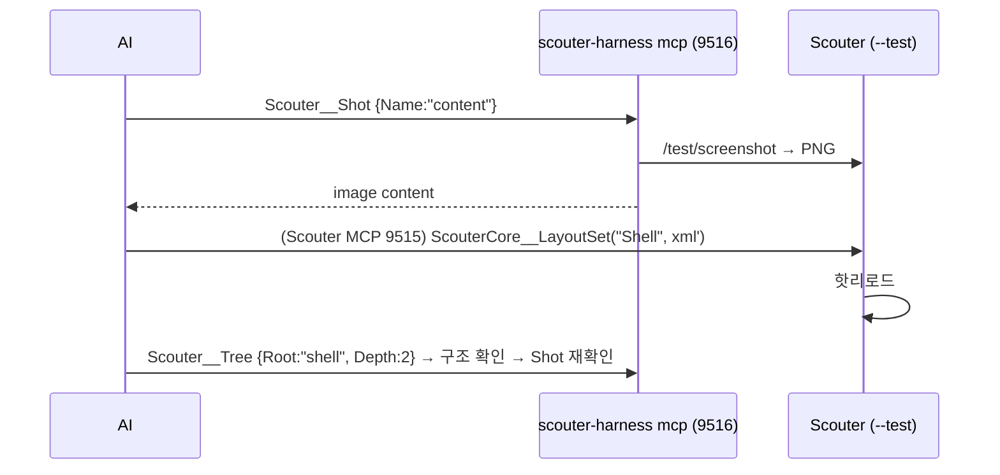

# 20. 테스트 · Test API · 하네스 · CI

> 구현 Phase **P0에서 시작해 매 Phase 확장**. AI가 Linux에서 자기 구현을 스스로 검증하게 하는 것이 1순위(D-16). 검증 방법이 없는 기능은 구현하지 않는다.

## 20.1 라이브러리

| 계층 | 라이브러리 | 방식 |
|---|---|---|
| 런너 | `node:test` + `node:assert/strict` | `node --import tsx --import ./Source/Scouter.Tests/Setup.ts --test "Source/**/*.test.ts"`. jest/vitest 안 쓰기(변환 설정 제로, ESM 그대로) |
| TS 실행 | `tsx` | 데코레이터 사용(`@RegisterElement`)으로 Node `--experimental-strip-types` 불가 (D-25). 데코레이터 제거 시 재검토 |
| DOM | `happy-dom` ^17 | `Setup.ts`에서 `GlobalRegistrator.register()` + 스텁: `ResizeObserver`(`Trigger()` 노출), `PointerEvent`, `matchMedia`, `requestAnimationFrame`(setTimeout 0), `getComputedStyle` 일부. jsdom 보다 3~5배 빠름 |
| 가짜 타이머 | `node:test` `mock.timers` | 디바운스(Settings 300ms, LayoutReloaded 100ms, Palette rAF) 검증 |
| 커버리지 | `c8` ^10 | `c8 --reporter=text --reporter=lcov npm run test:unit`. 기준 Gui Core 90%, 기타 70% |
| E2E | `playwright` ^1.5 `_electron.launch` | Electron 기동 후 **Test API로 조작**(Playwright 셀렉터는 스크린샷·최후 수단으로만). Linux `xvfb-run -a` |
| Test API 서버 | `node:http` (15의 같은 서버, `/test/*` 라우트) | `--test`에서만 등록, 인증 없음, 127.0.0.1만 |
| 하네스 | `Source/Scouter.Harness` (TS 클라이언트 + CLI + MCP 모드 9516) | `fetch` 기반, 의존 0 |
| 스크린샷 비교 | `pixelmatch` 불사용 — 스크린샷은 **사람/AI가 보는 산출물**, 회귀는 `tree` JSON 구조 스냅샷으로 | 폰트·DPI 차이로 픽셀 비교는 유지보수 불가 판단 |
| 린트 | `Scripts/LayoutLint.mjs`(07, @xmldom/xmldom), `ThemeLint.mjs`(13), `GenDocs.mjs --check`(16) | CI static 잡 |

## 20.2 계층 L0~L4

| 계층 | 대상 | 도구 | 시간 |
|---|---|---|---|
| **L0 정적** | tsc, eslint(02 커스텀 룰), LayoutLint, ThemeLint, GenDocs diff | node | ~30s |
| **L1 단위** | UIProperty/RoutedEvent/BindingResolver/DataList/Fuzzy/ZtagParser/ThemeResolver 순수 로직 | node:test | ~5s |
| **L2 DOM 단위** | 컨트롤 렌더·이벤트·바인딩 재평가, XML 로드, UIManager 레이어 | happy-dom | ~20s |
| **L3 통합** | MCP 서버 실제 포트(임의)로 sdk Client 연결, Settings 파일 I/O(tmp), PluginManager 번들(esbuild 실제) | node:test, tmp 디렉터리 | ~40s |
| **L4 E2E** | Electron 기동 → Test API 시나리오 → 스크린샷 artifact | playwright+xvfb | ~2분 |

L2에서 확인할 수 없는 것(실제 레이아웃 크기, 스크롤, 폰트)만 L4로. 모든 컨트롤은 L2 테스트 최소 1개 + 하네스 갤러리 포함.

## 20.3 클래스 구조 (C20-1)

```mermaid
classDiagram
	class TestApiServer {
		+Attach(server: McpHttpServer)$ — server.Router에 /test/* 등록
		-Handle(req, res)
		-approvalPolicy_ : allow|deny|manual
	}
	class ElementInspector { +Tree(rootName?, depth?) TreeNode ; +Find(name) TreeNode|null ; +Rect(el) }
	class InputSimulator { +Click(name, button, count) ; +Type(name, text, clear) ; +Key(name?, key, modifiers) ; 모두 InputDispatcher 경유 }
	class Harness {
		<<npm @scouter/harness>>
		+Launch(opts) Promise~Harness~
		+WaitReady()
		+Tree(root?) ; +Find(name) ; +Click(name) ; +Type(name,text) ; +Key(key) ; +Set(name,prop,value)
		+Screenshot(path, name?) ; +Logs(since?) ; +LayoutWarnings()
		+Settings : {Get, Set}
		+Approval(policy) ; +Permission(pluginId, grant)
		+Reset() ; +Reload() ; +Quit()
	}
	class HarnessCli { click | type | tree | find | shot | logs | settings | mcp }
	class HarnessMcp { 9516 ; Tools: Scouter__Click/Type/Tree/Shot/Logs — 개발 중 AI가 앱을 조작 }
	class Setup_ts { happy-dom register + 스텁 }
	TestApiServer --> ElementInspector
	TestApiServer --> InputSimulator
	Harness ..> TestApiServer : HTTP
	HarnessCli --> Harness
	HarnessMcp --> Harness
```

파일: `Renderer/TestApi/{TestApiServer,ElementInspector,InputSimulator}.ts`, `Source/Scouter.Harness/{Index.ts,Harness.ts,Cli.ts,Mcp.ts,Pages/*.xml}`, `Source/Scouter.Tests/{Setup.ts,Unit/**,Integration/**,E2E/**,Fixtures/**}`.

## 20.4 Test API 라우트 (`/test/*`)

| 메서드 경로 | 본문 / 응답 |
|---|---|
| `GET /test/ping` | `{Ready, Phase: "boot"\|"shell"\|"plugins"\|"ready", Version}` |
| `GET /test/tree?root=&depth=` | `{TypeName, Name, Visible, Enabled, Rect, Props, Children[]}` — Props는 `UIProperty.Registered(type)` 중 직렬 가능한 것 |
| `GET /test/find?name=` | 단일 노드 또는 404 |
| `POST /test/click {Name, Button?}` / `/dblclick` / `/rightclick` | `data-testid` → DOM 요소 중심에 pointerdown/up/click 디스패치(04 InputDispatcher가 받음). 보이지 않거나 IsEnabled=false는 409 |
| `POST /test/type {Name, Text, Clear?}` | 포커스 → (Clear) → 문자별 `keydown/input` → TextChanged |
| `POST /test/key {Name?, Key: "Ctrl+Shift+P", Modifiers?}` | 04 `KeyEventArgs.Matches` 문법 그대로 |
| `POST /test/set {Name, Property, Value}` | `UIProperty` 직접 설정 |
| `POST /test/eval {Script}` | `window.__scouter_modules__` 접근, 결과 JSON. 최후 수단 |
| `POST /test/screenshot {Name?, Path?}` | IPC `app:capture-page({Rect?})` → PNG base64 또는 파일 경로 |
| `GET /test/logs?since=&level=` | 08 `LogBuffer.Query` |
| `GET /test/layout-warnings` | 세션 동안 수집된 XML 경고(07 W코드) |
| `POST /test/approval {Policy}` | 15 ApprovalManager 자동 응답 (`allow`\|`deny`\|`manual`) |
| `POST /test/permission {PluginId, Grant}` | 14 PermissionStore 직접 기록 |
| `GET/POST /test/settings {Path, Value}` | 08 Settings |
| `POST /test/reset` | Settings · Storage · permissions → 초기값(임시 userData 안) |
| `POST /test/reload {Layout?}` | UIManager.Reload |
| `POST /test/quit` | `app.quit()` |

`--test` 플래그 효과(03): 임시 userData, 단일 인스턴스 락 해제, 트레이/업데이터 off, `--hidden`이면 `show:false`(스크린샷은 동작). v4의 `/api/test/*` 경로는 `/test/*`로 단순화(MCP `/mcp`, `/health` 와 동일 그룹).

## 20.5 시퀀스

### S20-1 E2E 테스트 1개의 흐름

```mermaid
sequenceDiagram
	participant T as node:test (E2E/Shell.test.ts)
	participant H as Harness
	participant PW as playwright._electron
	participant E as Electron Main
	participant R as Renderer(TestApiServer)
	T->>H: Launch({Args:["--test","--no-auth","--hidden","--port","0"]})
	H->>PW: launch({args, env:{SCOUTER_LOG:"debug"}})
	PW->>E: 기동 → stdout "SCOUTER_TEST_PORT=51234"
	H->>H: 포트 파싱
	loop ≤ 20s
		H->>R: GET /test/ping → Ready?
	end
	T->>H: Click("btn_collapse")
	H->>R: POST /test/click {Name:"btn_collapse"}
	R->>R: InputSimulator → InputDispatcher → Button.Click → Shell.ToggleSidebar
	T->>H: Settings.Get("Ui.SidebarCollapsed") → true ; Find("col_sidebar").Rect.Width == 48
	T->>H: Screenshot("out/shell-collapsed.png")
	T->>H: Quit() → POST /test/quit ; PW waitForClose
```

### S20-2 AI 개발 루프 (하네스 MCP 9516)



이 루프가 동작하므로 "UI 작업을 AI가 스크린샷으로 보며 수행"하는 것이 P0 완료 기준에 들어간다.

### S20-3 L2 DOM 테스트 패턴

```ts
test("Button Click raises routed event and executes command", () =>
{
	const root = Gui.CreateTestRoot();                                  // #root + 레이어, happy-dom
	const btn = new Button();
	btn.Command = "Test.Hello";
	let ran = 0;
	CommandRegistry.Register("Test.Hello", () => { ran++; });
	root.Attach(btn);
	btn.Dom.dispatchEvent(new PointerEvent("pointerdown", { bubbles: true }));
	btn.Dom.dispatchEvent(new PointerEvent("pointerup", { bubbles: true }));
	btn.Dom.dispatchEvent(new MouseEvent("click", { bubbles: true }));
	assert.equal(ran, 1);
});
```

## 20.6 하네스 API

```ts
const app = await Harness.Launch({ Args: ["--test", "--no-auth", "--hidden", "--layout-dir", "./Source/Scouter.App/Renderer/Layout"] });
await app.WaitReady();
await app.Click("btn_collapse");
assert.equal(await app.Settings.Get("Ui.SidebarCollapsed"), true);
assert.equal((await app.Find("col_sidebar")).Rect.Width, 48);
await app.Screenshot("./out/sidebar-collapsed.png");
await app.Quit();
```

CLI: `scouter-harness click btn_run` · `tree --root shell --depth 3` · `shot --name content out.png` · `logs --since 10s` · `mcp --port 9516`. 하네스 갤러리 `Pages/*.xml`(컨트롤별 샘플)은 `--layout-dir Source/Scouter.Harness/Pages`로 로드해 스크린샷 배치 생성(`npm run gallery`).

## 20.7 CI

```yaml
jobs:
  static:      npm ci → tsc --noEmit → eslint . → node Scripts/LayoutLint.mjs → node Scripts/ThemeLint.mjs → node Scripts/GenDocs.mjs --check
  unit:        npm run test:unit  (L1–L3, c8 임계 미달 시 실패)
  linux-e2e:   npm run build && xvfb-run -a npm run test:e2e   # 스크린샷 artifact, tree JSON 스냅샷
  windows-e2e: npm run build && npm run test:e2e -- --grep-invert @manual   # windows-latest
  package:     electron-builder --win nsis   # tag v* 시만, 21
```

구조 스냅샷: `tree` JSON에서 `Rect` 제외 후 `Tests/E2E/__snapshots__/*.json` 버전관리. 업데이트는 `UPDATE_SNAPSHOTS=1`.

## 20.8 분업

| AI (Linux) | 사용자 (Windows) |
|---|---|
| 구현, L0~L4 작성·실행, 스크린샷 확인, 문서 | `Scripts/StartUpDebugging.ps1` 실행 후 `out/*.png`·`out/report.json` 확인 |
| Windows 경로/인코딩은 `path.win32` 시뮬레이션 | 트레이, 자동 시작, DPI 125/150%, 다중 모니터, 실제 p4, 방화벽, NSIS 설치/업데이트 |

## 20.9 체크리스트

- [ ] P0: `ping/eval/screenshot/tree/click` + Harness Launch/Quit + CI static/unit
- [ ] P1: `find/type/key/set`, happy-dom Setup 스텁 완성
- [ ] P2: `layout-warnings/reload`; P3: `settings/logs`; P6: `permission`; P7: `approval`
- [ ] 하네스 MCP 모드(9516) — P0 마지막 항목
- [ ] Windows 런너 연결 여부 — 사용자 확인(사내 러너 또는 GitHub Actions windows-latest)
