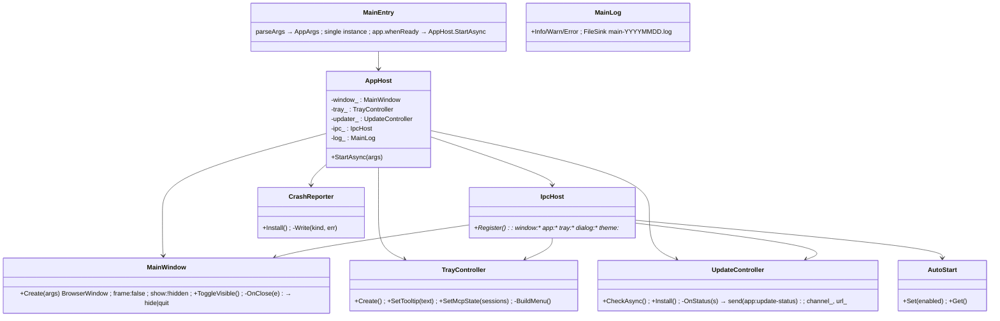
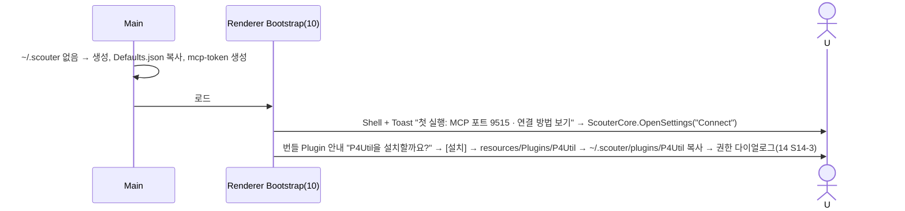

# 21. 운영 · 패키징 — 트레이, 자동 시작, 업데이트, NSIS, 로그 회전

> 구현 Phase **P9**. Main 프로세스가 맡는 거의 유일한 영역(D-11). Renderer는 IPC로 요청만 한다.

## 21.1 라이브러리

| 기능 | 라이브러리 / API | 사용 방식 |
|---|---|---|
| 트레이 | Electron `Tray`, `Menu`, `nativeImage` | `Assets/tray-16.png`(+`@2x`), 메뉴: 열기 / 설정 / MCP 상태(세션 n) / 종료. 클릭 → 창 토글. `tray:set-tooltip` IPC로 Renderer가 툴팁 갱신 |
| 닫기 → 트레이 | `win.on("close")` 가로채기 | `App.CloseToTray`(기본 true)면 `hide()`, 아니면 quit |
| 자동 시작 | `app.setLoginItemSettings({openAtLogin, args:["--hidden"]})` | 설정 `App.AutoStart`; IPC `app:set-auto-start`. 포터블 실행 시 무시 |
| 글로벌 핫키 | `globalShortcut.register("Ctrl+Shift+Space")` | 설정 `Hotkeys.Global.Show`; 창 보이기/숨기기. 등록 실패(충돌) 시 Toast |
| 단일 인스턴스 | `app.requestSingleInstanceLock()` | 2번째 실행은 기존 창 `show()+focus()`, `--test`에서는 미사용 |
| 자동 업데이트 | `electron-updater` ^6 (`autoUpdater`) | `App.Update.Channel`(stable/none), generic provider `App.Update.Url`(사내 파일서버/HTTP). IPC `app:update-check` / `app:update-status`. 설치는 사용자 확인 후 `quitAndInstall` |
| 패키징 | `electron-builder` ^25 NSIS | `oneClick:false`, `perMachine:false`, `allowToChangeInstallationDirectory:true`; `extraResources`: `esbuild` 바이너리(14), `Plugins/P4Util`(번들 안 함, 소스 그대로 → 첫 실행 시 `~/.scouter/plugins`로 복사 제안), `Themes/` |
| 코드 사이닝 | 보류 | 방화벽/스마트스크린 경고는 사용자 확인 항목 |
| 로그 회전 | 자체 `FileSink`(08) | `app-YYYYMMDD.log` 일별, 7일 보관, 최대 20MB/일; `mcp-audit.jsonl` 20MB 롤링(15). electron-log 안 쓰기 |
| 충돌 리포트 | `process.on("uncaughtException")`, `webContents.on("render-process-gone")` | `~/.scouter/logs/crash-{ts}.json`(스택, 버전, 마지막 로그 200줄). 원격 전송 없음 |
| About | 12 `AboutWindow` | 버전(`app.getVersion()`), Electron/Node/Chromium 버전, 포트, userData 경로(클릭 → `app:show-item`), 업데이트 확인 버튼 |
| 설정 내보내기/가져오기 | `dialog.showSaveDialog/showOpenDialog` + Settings 직렬화 | `secrets.bin`은 제외, 가져오기는 ajv 검증 후 재시작 안내 |
| 주의 요청 | `win.flashFrame(true)`, `Notification` | IPC `window:attention` — 승인 다이얼로그(15) |
| 스크린샷/파일 | `webContents.capturePage`, `shell.showItemInFolder` | IPC `app:capture-page`, `app:show-item` |
| PluginPack | `Scripts/PluginPack.mjs` + `adm-zip`(후보, 사용자 확인) | `Plugins/{Id}` → `{Id}-{version}.scouterplugin`(zip). 가져오기는 설정 화면 [Plugin 설치] |
| 시스템 테마 감지 | `nativeTheme.on("updated")` | `Theme.Scheme=system`이면 Renderer에 `theme:system-changed` |

## 21.2 클래스 구조 (C21-1) — Main 프로세스



파일: `Source/Scouter.App/Main/{Index.ts,AppHost.ts,MainWindow.ts,TrayController.ts,UpdateController.ts,IpcHost.ts,AutoStart.ts,CrashReporter.ts,MainLog.ts,Args.ts}`, `Shared/IpcChannels.ts`(문자열 상수 + 페이로드 타입).

## 21.3 UI 디자인

**트레이 메뉴**
```
 Scouter 열기
 ---------------------
 MCP: 실행 중 · 세션 2      (비활성, 상태만)
 설정…
 업데이트 확인
 ---------------------
 종료
```

**설정 > 일반 (16 SettingsCatalog에 이 문서가 추가하는 항목)**

| 키 | 에디터 | 기본 |
|---|---|---|
| `App.CloseToTray` | CheckBox | true |
| `App.AutoStart` | CheckBox | false |
| `App.StartHidden` | CheckBox | false |
| `App.Update.Channel` | ComboBox stable/none | stable |
| `App.Update.Url` | TextBox | (배포 문서에서 지정) |
| `Hotkeys.Global.Show` | HotkeyEditor | Ctrl+Shift+Space |
| `Log.Level` | ComboBox debug/info/warn | info |
| `Log.RetainDays` | NumericUpDown 1~30 | 7 |

**업데이트 Toast**: "v0.5.0 다운로드 완료 — [지금 재시작] [나중에]" (12 ToastService, sticky). About 창은 12 문서.

## 21.4 시퀀스

### S21-1 창 닫기 → 트레이 → 복원

```mermaid
sequenceDiagram
	actor U
	participant R as Renderer(TitleBar btn_close)
	participant I as IpcHost
	participant W as MainWindow
	participant T as TrayController
	U->>R: btn_close
	R->>I: invoke window:close
	I->>W: win.close()
	W->>W: on(close): CloseToTray && !quitting_ → e.preventDefault(); hide()
	W->>T: SetTooltip("Scouter — 백그라운드, MCP 세션 2")
	U->>T: 트레이 클릭
	T->>W: ToggleVisible() → show(); focus()
	U->>T: 트레이 > 종료
	T->>W: quitting_ = true ; app.quit() → Renderer `app:before-quit` → MCP StopAsync(세션 종료 알림) → 종료
```

### S21-2 자동 업데이트

```mermaid
sequenceDiagram
	participant UC as UpdateController
	participant AU as autoUpdater
	participant R as Renderer
	actor U
	Note over UC: 시작 60s 후 + 6시간 간격 (croner) ; --test에서는 off
	UC->>AU: checkForUpdates()
	AU-->>UC: update-available {version} → send(app:update-status, {State:"downloading"})
	AU-->>UC: download-progress → status
	AU-->>UC: update-downloaded
	UC->>R: app:update-status {State:"ready", Version}
	R->>U: Toast sticky [지금 재시작][나중에]
	U->>R: 지금 재시작
	R->>UC: invoke app:update-install
	UC->>AU: quitAndInstall(isSilent=true, forceRunAfter=true)
	Note over UC: error → status {State:"error", Message} → About 창에만 표시, Toast 없음(사내 서버 다운 시 소음 방지)
```

### S21-3 글로벌 핫키 변경

```mermaid
sequenceDiagram
	actor U
	participant SG as 설정 화면(16)
	participant S as Settings
	participant I as IpcHost
	participant G as globalShortcut
	U->>SG: Hotkeys.Global.Show = "Ctrl+Alt+S"
	SG->>S: Set → Changed
	S->>I: invoke app:set-global-hotkey {Accelerator}
	I->>G: unregister(old) ; register(new, toggle)
	alt 등록 실패 (다른 앱 점유)
		I-->>SG: {Ok:false} → Toast Warn "핫키를 등록할 수 없습니다(충돌)" ; 설정은 유지하고 재시작 시 재시도
	end
```

### S21-4 첫 실행 (설치 직후)



## 21.5 IPC 채널 전체 (`Shared/IpcChannels.ts`)

| 채널 | 방향 | 페이로드 |
|---|---|---|
| `window:minimize` `window:maximize-toggle` `window:close` | R→M | — |
| `window:is-maximized` | R→M invoke | → boolean |
| `window:maximized-changed` | M→R | `{Maximized}` |
| `window:toggle-devtools` | R→M (dev) | — |
| `window:attention` | R→M | `{Flash?, Notify?:{Title,Body}}` |
| `app:get-paths` | invoke | `{UserData,Home,Exe,Resources,Logs,Temp,Version,IsPackaged,Args}` |
| `app:set-auto-start` | invoke | `{Enabled}` → `{Ok}` |
| `app:set-global-hotkey` | invoke | `{Accelerator}` → `{Ok}` |
| `app:relaunch` | R→M | — |
| `app:update-check` / `app:update-install` | invoke | — |
| `app:update-status` | M→R | `{State: idle\|checking\|downloading\|ready\|error, Version?, Percent?, Message?}` |
| `app:capture-page` | invoke | `{Rect?}` → `{Png(base64)}` |
| `app:show-item` | R→M | `{Path}` |
| `app:before-quit` | M→R | — (Renderer가 `app:quit-ready` 반환, 2s 타임아웃) |
| `tray:set-tooltip` | R→M | `{Text}` |
| `dialog:open` / `dialog:save` | invoke | Electron 옵션 그대로 → 경로 |
| `theme:system-changed` | M→R | `{Dark}` |

## 21.6 electron-builder 설정 요지 (`electron-builder.yml`)

```yaml
appId: com.nexon.scouter
productName: Scouter
directories: { output: release }
files: ["dist/**", "package.json"]
extraResources:
  - { from: "node_modules/esbuild/bin", to: "esbuild" }        # 14: 번들러 바이너리
  - { from: "Plugins/P4Util", to: "Plugins/P4Util", filter: ["!.cache"] }
  - { from: "Source/Scouter.App/Renderer/Theme/Themes", to: "Themes" }
win:
  target: [{ target: nsis, arch: [x64] }]
  icon: Assets/app.ico
nsis:
  oneClick: false
  perMachine: false
  allowToChangeInstallationDirectory: true
  deleteAppDataOnUninstall: false      # ~/.scouter 보존
publish: { provider: generic, url: "${env.SCOUTER_UPDATE_URL}" }
```

## 21.7 테스트

| 범위 | 방법 |
|---|---|
| Args 파싱 | L1: `parseArgs` 조합, `--port 0` → 임의 포트 |
| IpcHost | L3: `ipcMain` 가짜(핸들러 맵)로 채널별 페이로드 검증 |
| 트레이/자동시작/업데이트/NSIS | 사용자 Windows 체크리스트(`StartUpDebugging.ps1` 에 공유) |
| 로그 회전 | L1: FileSink 날짜 가짜 시계, 8일째 삭제 |
| 첫 실행 | L4: 미 존재 userData → 파일 생성 확인 |

## 21.8 체크리스트

- [ ] 트레이 + CloseToTray + 단일 인스턴스
- [ ] 자동 시작, 글로벌 핫키
- [ ] electron-updater generic + Toast 흐름 (사내 URL 사용자 확인)
- [ ] NSIS 설치 파일 v0.4.0 → 사용자 PC 설치·재부팅 후 자동 실행·미리 연결한 Claude Code 재연결 = P9 완료
- [ ] 코드 사이닝 여부, PluginPack zip 라이브러리(adm-zip) — 사용자 확인
