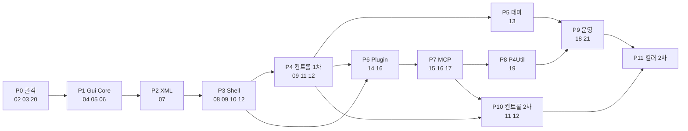

# 22. 로드맵 — 구현 순서와 문서 매핑

> 각 Phase는 "완료 기준"이 충족되면 사용자 확인을 거쳐 다음으로. 기간은 AI 구현 기준 예상이며 사용자 확인 시간은 배제. 문서 번호가 공식 구현 순서이고, 이 표는 그 순서를 Phase로 묶은 것.

## 22.1 Phase 표

| Phase | 문서 | 범위 | 산출물 | 완료 기준 | 예상 |
|---|---|---|---|---|---|
| **P0 골격** | 02, 03, 20(일부) | 리포, tsconfig/ESLint(커스텀 룰 5개(02)), webpack 4개 설정, Electron 빈 창(frame:false), `--test` + `/test/ping|eval|screenshot|tree|click`, 하네스 Launch/Quit/Shot, CI static/unit | 실행되는 빈 앱 | `npm run dev`로 창, `scouter-harness shot`으로 PNG, CI 녹색. **버전 핀 표(03 §3.9) 사용자 확인** | 1d |
| **P1 Gui Core** | 04, 05, 06 | UIElement/UIProperty/RoutedEvent/InputDispatcher, Panel 6종, Control 계층, Window/UIManager/레이어, TextBlock/Button/TextBox 기초 | 하네스 갤러리 1쪽(코드로 구성) | L2 커버리지 90%, 레이어 5개 스크린샷 | 3d |
| **P2 XML/바인딩** | 07 | XmlLoader, ElementCatalog, AttributeApplier, BindingResolver(문법 전부), DataList, LayoutLint, 핫리로드, Layout.schema.json | `ui_channel.xml` 변환 샘플 로드 | sgcl 샘플 XML이 경고 0개로 렌더, 핫리로드가 DataList 보존 | 3d |
| **P3 Shell** | 08, 09(일부), 10, 12(일부) | Settings/Log/EventBus/CommandRegistry/Hotkeys, Shell.xml + ShellWindow, TitleBar/StatusBar/GridSplitter/Toast, Button·TextBox·CheckBox 마무리, oc-2 고정 CSS | 동작하는 빈 Shell | `Ui.SidebarWidth` 변경 즉시 반영, Ctrl+B 토글, 하네스 E2E 5개 | 2d |
| **P4 컨트롤 1차** | 09, 11, 12(일부) | 09 전부 + 11 중 ListBox/ComboBox/ListView+GridView/TabControl/Expander/GroupBox/Popup/ToolTip/Menu없이 + 12 중 VirtualList/LogView/StatusDot/Badge/Spinner/PropertyGrid | 갤러리 2쪽 | **17 McpInspector 화면이 구성 가능한 컨트롤 세트** = 완료 | 5d |
| **P5 테마** | 13 | ThemeLoader/Resolver/Css/Manager, 37 테마 이식, ThemeLint, Monaco 연동 준비, ThemePicker, Theme.Density | 테마 전환 Shell | 37×2 scheme에서 리터럴 색 0건(ThemeLint), CSP unsafe-eval 제거 확인 | 2d |
| **P6 Plugin** | 14, 16(설정 화면) | Plugin.json/검증, Discovery/Bundler(esbuild)/Manager/Context, 권한, Storage/Secrets, 핫리로드, ScouterCore 설정 화면 | `Fixtures/Plugins/Hello` | Hello 복사 → 사이드바 등장 → 권한 다이얼로그 → 화면; 수정 시 핫리로드 | 3d |
| **P7 MCP** | 15, 16(연결·Tool), 17 | McpHttpServer/Session/Auth/Approval/Audit/Upstream, ScouterCore Tool 19개, ConnectSnippets, McpInspector | Claude Code/OpenCode 연결 | sdk Client 통합 테스트, Claude Code에서 `ScouterCore__LayoutSet`로 Shell 수정 성공 | 3d |
| **P8 P4Util** | 19 | Tool 7개, Main.xml, Recipes, P4Runner(fake p4) | P4Util Plugin | fake로 전 Tool 통과 + **사용자 실제 서버 `ExtractFiles 1~40`** | 2d |
| **P9 운영** | 18, 21 | CommandPalette, 트레이/자동시작/업데이트/NSIS/로그 회전/About/설정 내보내기 | 설치 파일 v0.4.0 | 사용자 PC 설치 → 재부팅 → 자동 실행 → Claude Code 재연결 | 2d |
| **P10 컨트롤 2차** | 11(나머지), 12(나머지) | TreeView, DataGrid, Menu/ContextMenu, ToolBar, Slider, ProgressBar, DatePicker, CodeEditor(Monaco), DiffView, MarkdownView, Avatar, Shape | 갤러리 3쪽 | McpInspector가 TreeView/CodeEditor로 교체(XML만 수정), P4Util ContextMenu | 4d |
| **P11 킬러 2차** | (신규 문서 24+) | LogWatch(`LogWatch__Grep/Since`), BuildRunner, Clipboard History(`Clip__Recent`), Notes(`Notes__Append`), SqlPad 중 사용자 선택 2~3개 | Plugin | 각 Recipes 포함, 실사용 1주 | 3d+ |
| **P12 폴리시** | — | Plugin 서명/Registry, two-way 바인딩, Style/Setter, aria, i18n, Worker 격리 재검토 | — | 사용자 요구 기반 | — |

총 P0~P9 ≈ 26d(AI 구현). 매 Phase 마지막에 하네스 스크린샷 배치 + `out/report.json` 전달.

## 22.2 의존 그래프

## 22.3 순서의 이유

- **테스트 경로(20)를 P0에**: 이후 모든 Phase를 AI가 스스로 검증. Test API는 이후 Phase가 각자 라우트를 덧붙인다(20.9).
- **Core(04–06) → XML(07) → Shell(10)**: Shell이 XML로 만들어지므로 바인딩이 선행. Shell이 첫 "진짜 화면"이 되어 프레임워크 결함을 일찍 드러낸다.
- **08 서비스가 10 Shell 직전**: Shell.xml이 `{$settings.*}` 바인딩과 CommandRegistry를 쓰기 때문.
- **컨트롤을 세 문서(09/11/12)로 분리**: P3에 필요한 것, P4에 필요한 것, P10으로 미룰 것이 한 문서에 섞여 있어 v4에서 착수 범위가 불분명했다. 각 컨트롤 표에 Phase 열을 두었다.
- **컨트롤 1차를 테마 앞에**: 토큰 매핑은 컨트롤이 있어야 검증. 단, P1부터 `var(--token)`만 쓴다(oc-2 고정 CSS).
- **P4 완료 기준 = McpInspector 화면**: "어느 컨트롤까지가 1차인가"를 실제 화면 하나로 고정.
- **Plugin(14) → MCP(15)**: MCP가 노출할 Tool이 Plugin에서 나온다. ScouterCore(16)는 설정 화면은 P6, Tool/연결은 P7로 갈림.
- **P4Util(19)을 MCP 다음**: 외부 AI가 Tool로 쓰는 것이 핵심 가치. 매일 쓰는 것이므로 운영(21)보다 앞.
- **CommandPalette(18)를 P9에**: 명령/설정/테마가 모두 있어야 검색 대상이 맞다. 골격은 P3에서 가능.

## 22.4 보류 · 제외

| 항목 | 상태 | 이유 |
|---|---|---|
| 인앱 채팅 | 제외 | D-01 |
| Style/Setter/Trigger, DataTemplate(XML), x:Class | 보류 P12 | 코드문서붙이기 + 테마 토큰로 대체. 반복 패턴 보이면 추가 |
| Two-way 바인딩 | 보류 P12 | D-14. `DataList.Set` 방식이 단순 |
| SharedSizeGroup, Ribbon, InkCanvas, DocumentViewer, FlowDocument, 3D | 제외 | 용도 없음(D-06) |
| 다중 BrowserWindow | 보류 | 레이어로 대체. 모니터 분리 요구 시 검토 |
| Plugin 서명/원격 Registry | P12 | 개인·팀 사용이 먼저 |
| Worker 격리 | P12 | D-17. 신뢰하지 않는 Plugin 설치 요구 시 |
| 상태 변경 p4 Tool | P11+ | D-10 |
| 코드 사이닝 | 보류 | 사용자 확인 |
| 한글 초성 fuzzy | 보류 | 18, 사용자 확인 |

## 22.5 Phase 보고 형식

모든 Phase 마감 시: (1) 완료 기준 체크 결과, (2) `out/gallery/*.png` 스크린샷, (3) 해당 문서 체크리스트 갱신, (4) 미해결 사용자 확인 항목(23 A-시리즈) 목록, (5) 다음 Phase 첫 작업 3개.
